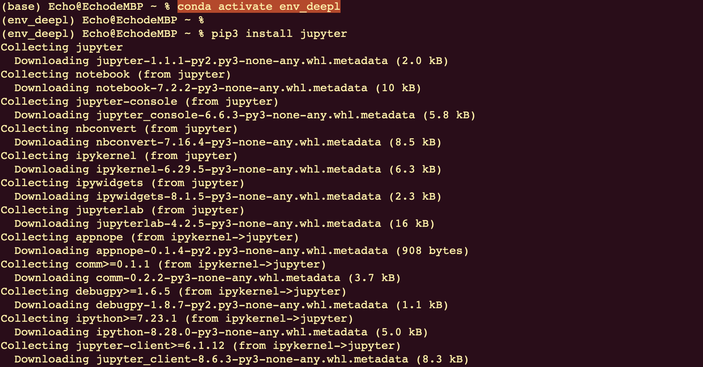
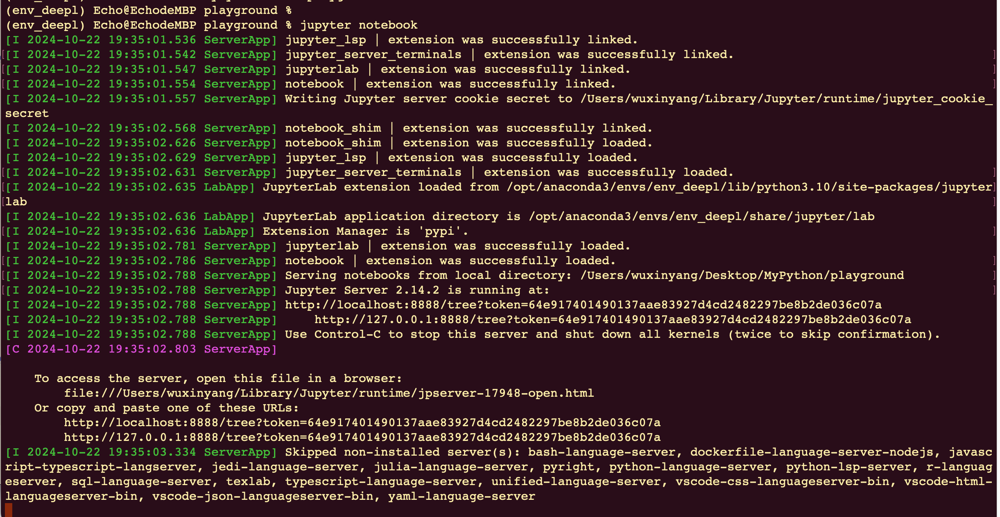
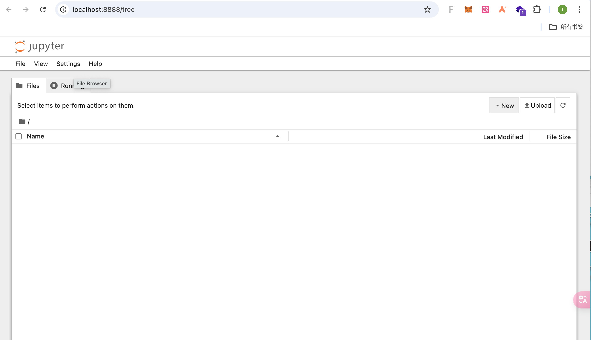
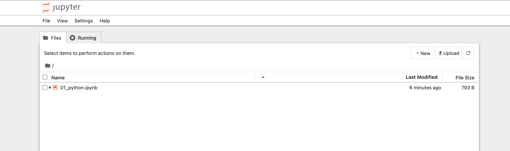

# Jupyter noteBook


在终端命令行中输出如下命令：`conda env list`

然后进入到之前配置的环境中：`conda activate env_customname`

### 安装jupyter

在命令行中输入如下指令：

```
pip3 install jupyter
```

安装时报错，换命令安装`jupyter`，执行`conda install jupyter`


安装界面部分内容如下：



### 运行
在任意目录环境下执行命令：`jupyter notebook`
启动成功如下图：

并且会打开浏览器如下图：



### Jupyter页面介绍


点击页面右上的`New`，在下拉列表中选择`python3(ipykernel)`，就会弹出一个新的页面用于编辑`python`代码。可在`home`页面查看到：



### Jupyter快捷键

注释： `Ctrl + /`
运行： `shift + enter` / `ctrl + enter`


