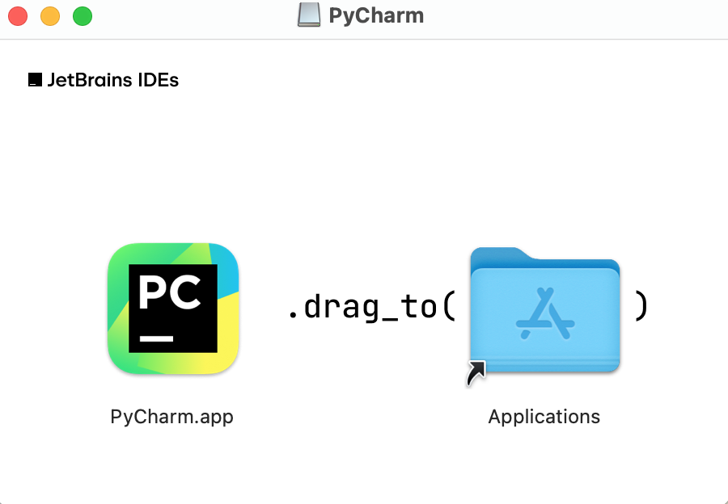
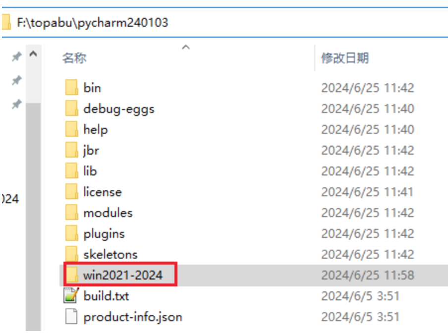
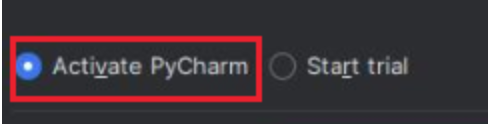
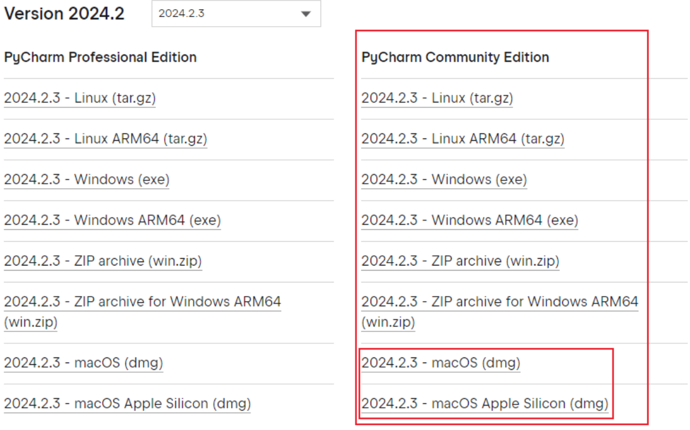

# pycharm

 pycharm使用中文说明：[https://pycharm.net.cn/](https://pycharm.net.cn/)

## pycharm专业版下载
### Win系统
- `windows_x86_64`：[https://download.jetbrains.com/python/pycharm-professional-2024.1.3.exe](https://download.jetbrains.com/python/pycharm-professional-2024.1.3.exe)
- `windows_ARM64`：[https://download.jetbrains.com/python/pycharm-professional-2024.1.3-aarch64.exe](https://download.jetbrains.com/python/pycharm-professional-2024.1.3-aarch64.exe)
### Mac系统
【注意：Mac电脑分intel芯片、M芯片，下载适合自己系统的版本】
- `Mac Intel芯片`：[https://download.jetbrains.com/python/pycharm-professional-2024.1.3.dmg](https://download.jetbrains.com/python/pycharm-professional-2024.1.3.dmg)
- `Mac M芯片`：[https://download.jetbrains.com/python/pycharm-professional-2024.1.3-aarch64.dmg](https://download.jetbrains.com/python/pycharm-professional-2024.1.3-aarch64.dmg)

## pycharm安装
### Mac安装
下载成功以后直接双击打来安装包，将`PyCharm.app`拖拽到`Applications`中即可

### Win安装
- 1.双击打开安装包，直接点击下一步
- 2.安装路径选择：【注意：安装路径中最好不要有空格、中文等特殊字符】，选择好安装路径之后，点下一步
- 3.安装选择：勾选参数项，点击下一步
- 4.选择开始菜单目录：【直接默认就可以】，点击安装
- 5.等待安装完成
- 6.提示是否重启，选择否，点击完成

## pycharm的激活
### Win激活
Win系统：【该链接激活不成功，选择备用】
    [https://lookdiv.com/%E6%BF%80%E6%B4%BB%E7%A0%812020-2024.zip](https://lookdiv.com/%E6%BF%80%E6%B4%BB%E7%A0%812020-2024.zip
)
备用：
    [https://lookdiv.com/%E4%B8%80%E9%94%AE%E6%B0%B8%E4%B9%85.rar](https://lookdiv.com/%E4%B8%80%E9%94%AE%E6%B0%B8%E4%B9%85.rar)

【激活方法在压缩包内，以下是注意的一些地方，仅供参考】
由于不能删除解压出来的文件夹，需要将激活插件，放到一个目录中，这里我放到了pycharm的安装目录中，其他的按照操作教程操作即可。

新版pycharm 和 旧版有些区别：图为旧版

新版中为：`paid license`和`start trial`选择`paid license，activation code`

### Mac激活
Mac系统：[https://lookdiv.com/mac2021-2024.zip](https://lookdiv.com/mac2021-2024.zip)

#### 如出现报错信息：
1、mac Could not set environment: 150: Operation not permitted while System Integrity Protection is engaged
需要关闭下系统的sip：

   - m系列芯片：
        先关机,再一直按住开机键进入恢复模式,在最上方有个地方可以进入终端
        输入:`csrutil disable` 就可以关闭`sip`了
    
   - intel芯片：
        好像是按住`cmd + r`进入恢复模式
        【关闭sip激活pycharm后，有概率导致电脑上安装的其他软件无法正常使用，建议卸载专业版，下载安装社区版】

【社区版下载】[https://www.jetbrains.com/pycharm/download/other.html](https://www.jetbrains.com/pycharm/download/other.html)

2、显示激活码无效，尝试重启电脑，打开pycharm，重新输入激活码激活

