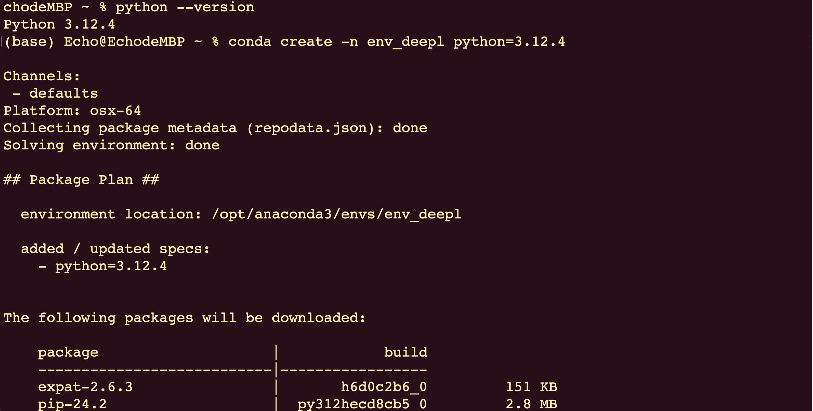
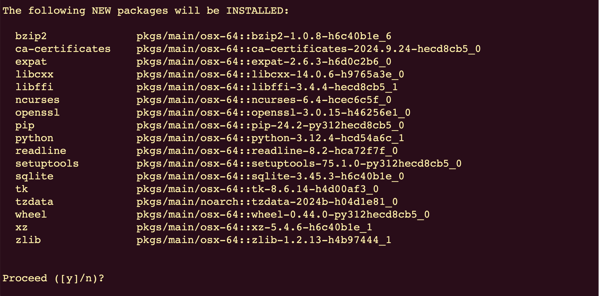
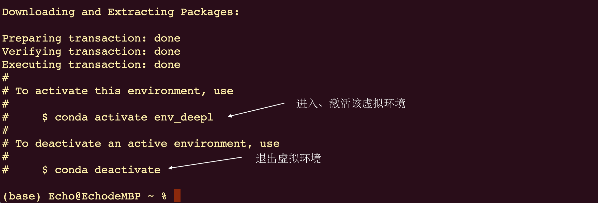
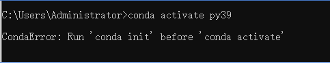

# env-conda创建管理虚拟环境

## conda常用命令介绍
【在命令行窗口中使用以下命令】

- 1.创建虚拟环境
    - a.指定`python`版本创建py虚拟环境：`conda create -n env_customname python=需要的python版本号（比如：3.10）`
    - b.创建指定`python`版本下包含某些包：`conda create -n env_customname python=python版本号 包名1 包名2 包名3`

- 2.查看所有环境
    - a.`conda env list`

- 3.激活、使用、进入某个虚拟环境
    - a.`conda activate env_customname`

- 4.退出当前环境
    - a.`conda deactivate`

- 5.查看当前环境下是否安装了指定的包
    - a.【win】：`conda list | findstr 指定的包名`
    - b.【Mac】：`conda list | grep 指定的包名`

- 6.查看指定环境下是否安装了指定的包
    - a.【win】：`conda list -n env_customname | findstr 指定的包名`
    - b.【Mac】：`conda list -n env_customname | grep 指定的包名`

- 7.安装需要的第三方包（库）【进入到py虚拟环境下】
    - a.`conda install package_name【这种方式的安装，默认安装最新版】`
    - b.`conda install package_name==版本号【安装指定版本号的包】`
    - c.注意：`conda`安装不成功时，尝试`pip`命令（把`conda`替换成`pip`）
    - d.【`pip`指定下载源安装指定版本的包】：`pip install package_name==版本号 -i 源链接`
    - e.【源链接】：`https://pypi.tuna.tsinghua.edu.cn/simple`

- 8.卸载指定的包（库）【进入到py虚拟环境下】
    - a.`conda uninstall package_name`
    - b.注意：如果是通过`pip`安装的包，使用：`pip uninstall package_name`，去卸载

- 9.删除指定的虚拟环境
    - a.`conda remove -n env_name --all`

- 10.删除`Anaconda`镜像源并恢复默认
    - a.`conda config --remove-key channels`

## 创建虚拟环境
- 1.【Win打开cmd】【Mac 打开iTerm / 终端】创建python版本号为3.12.4的虚拟环境

- 2.输入：`y`，回车
 

- 3.成功创建了一个虚拟环境

**PS:**如果出现以下情况

按照提示，执行：`conda init`

之后再次激活环境
如果还提示当前错误，重开一个cmd窗口，在新窗口中执行激活环境的命令！

