# Pycharm中配置conda环境

### Win系统

1. 打开`pycharm`
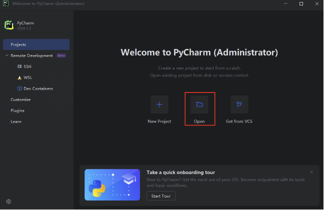

2. 点击`open`【或File、Open】，选择代码文件夹（没有就自己创建一个空的文件夹）：【个人根据自己的情况选择，这里举例选择nlp20文件夹】
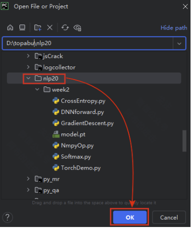

3. 信任目录
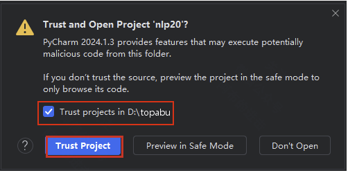

4. 点击四条杠，点击File，Setting
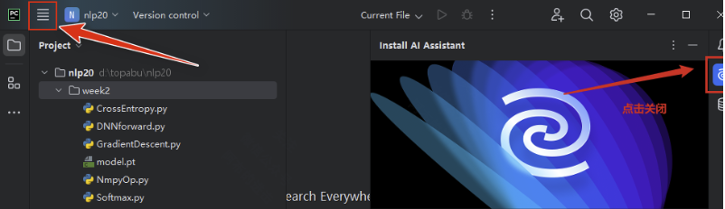

5. 按图中步骤选择
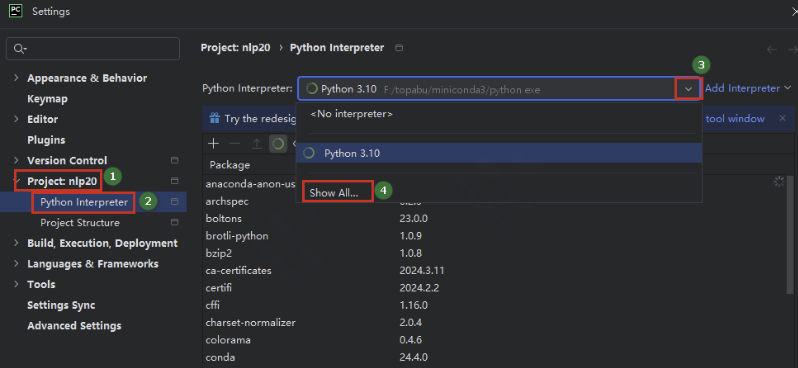

6. 在弹出的框中，点击加号，点击`add local interpreters`：
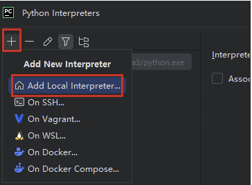

7. 在弹出的框中，按下图步骤选择自己创建的py虚拟环境，一路点击OK
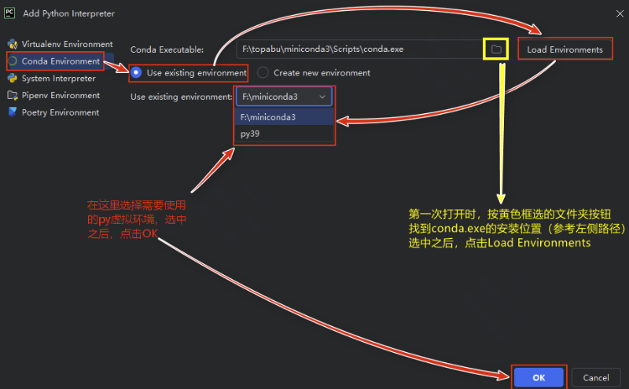

### Mac系统

1. 打开`pycharm`，选择一个`py`项目目录（一个空白的文件夹也行)
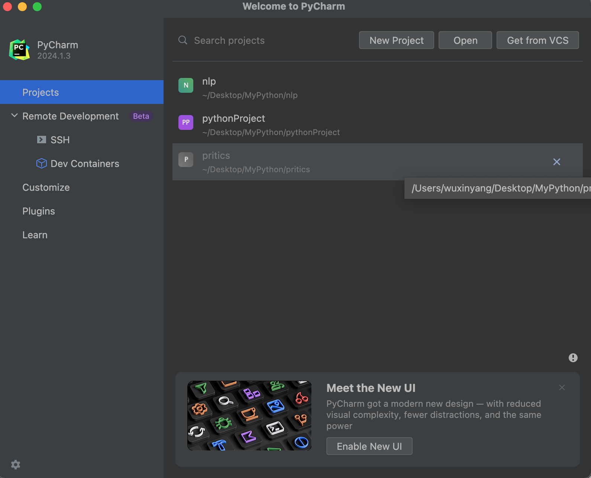
2. 点击左上角的`Pycharm`，选择`Preferences`...
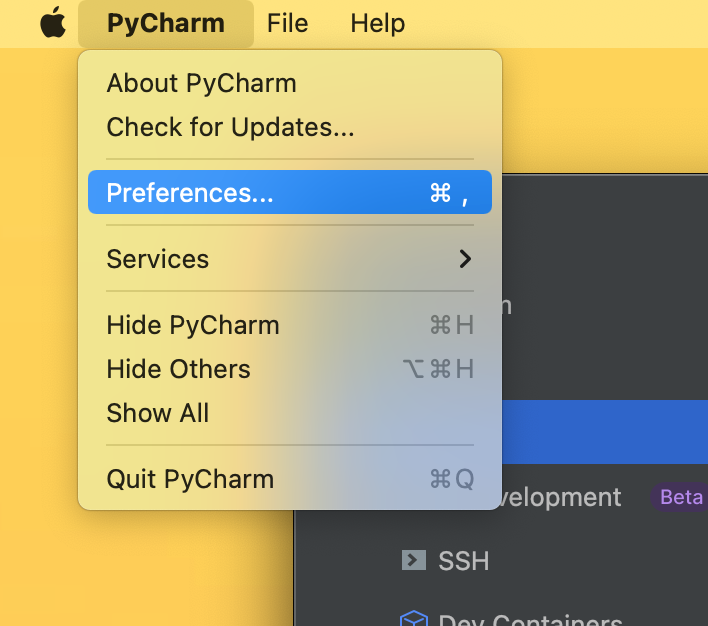
3. 在弹出的框内选择`python`解释器，点击倒三角
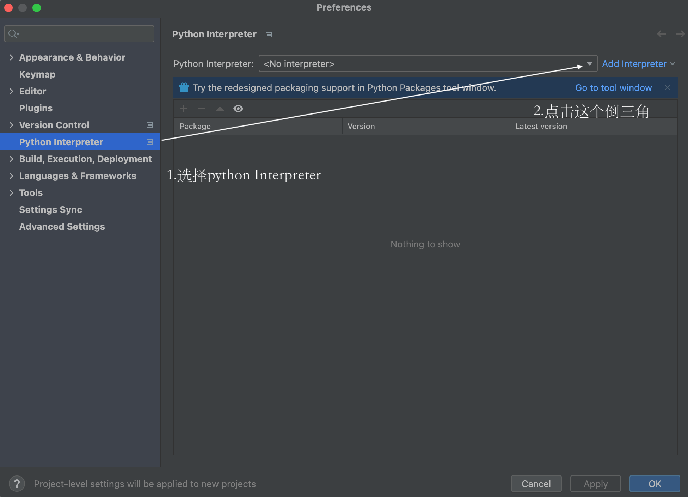
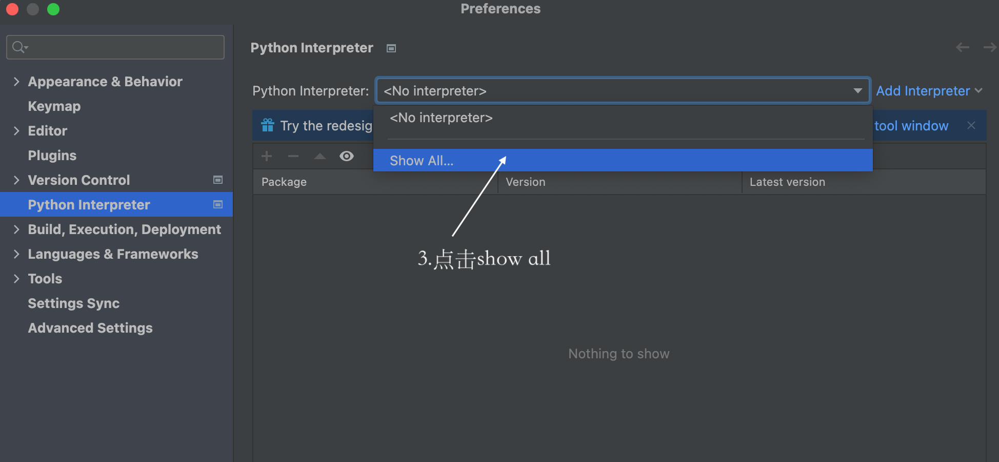
4. 在弹出的框内点击`+`号 
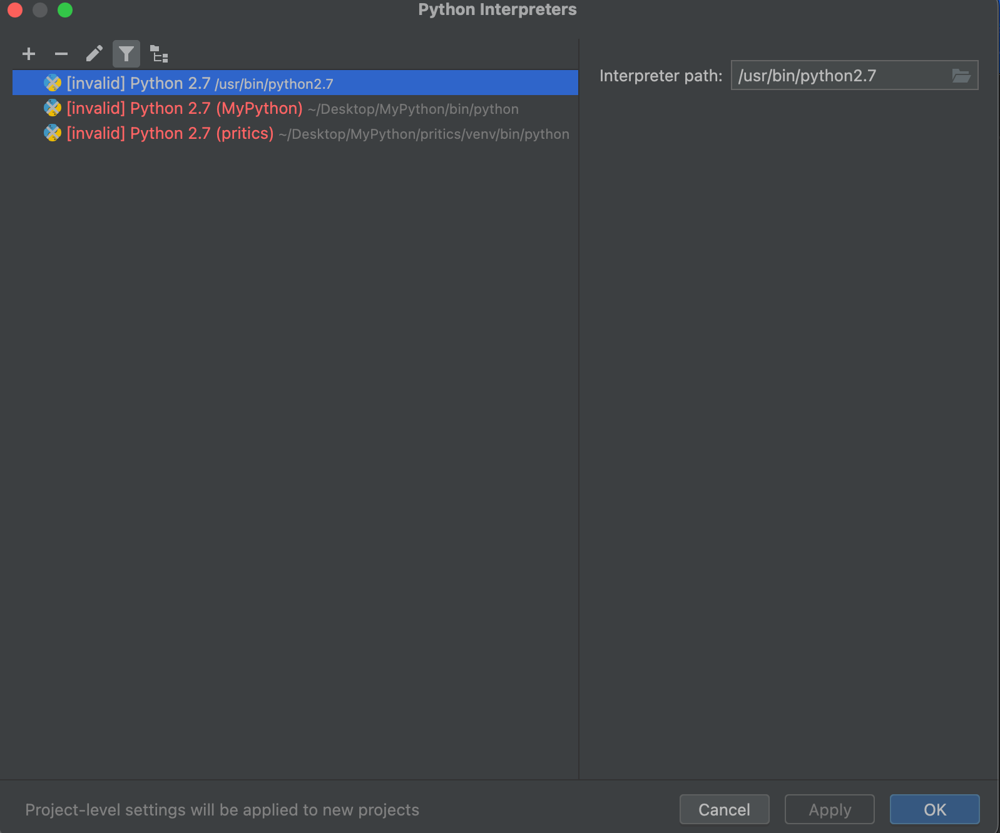
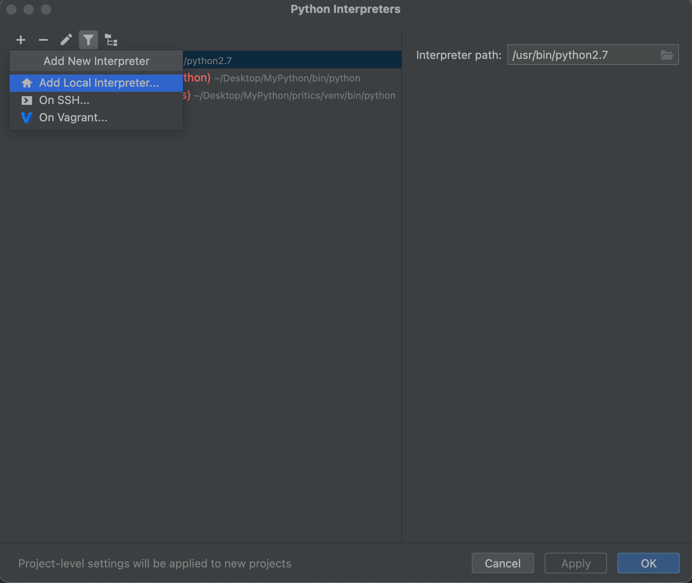
5. 选择`conda environment`（conda环境），选择`conda`可执行文件中`conda`的位置，点击加载环境，选择使用现有环境，点向下箭头，选中需要的py虚拟环境，点确定，这样就完成了`pycharm`和`conda`的配置
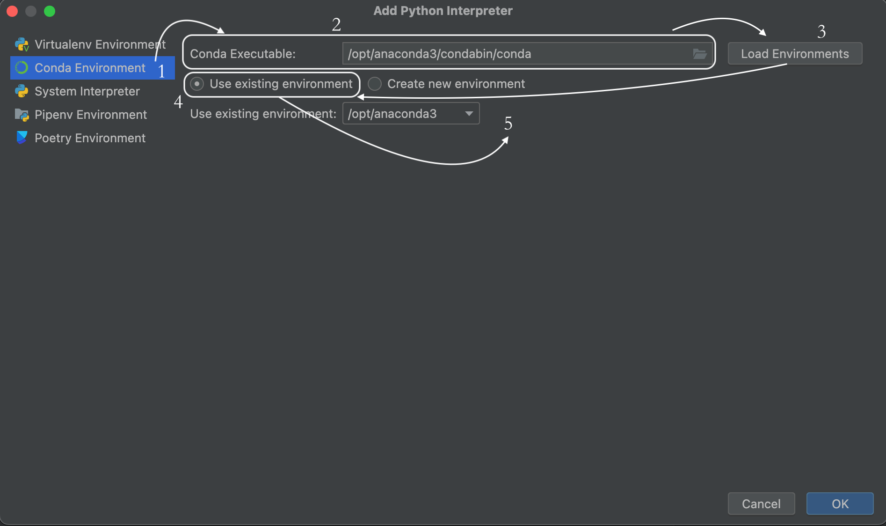

 【新版本的pycharm到这里就已经配置完成】

 【旧版本看第6-7步】

6. 【旧版本pycharm看这里】选择`conda environment`，选择`conda`可执行文件中`conda`的位置，点击加载环境
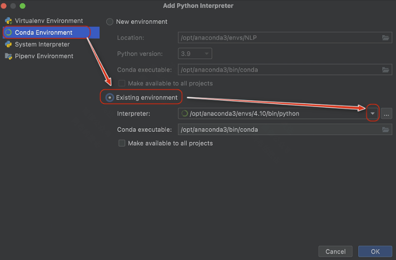

选择创建的虚拟环境（这里还没有创建，使用的是conda默认带的py环境，路径为图中所示）
如果使用创建的其他虚拟环境，可以看第7步
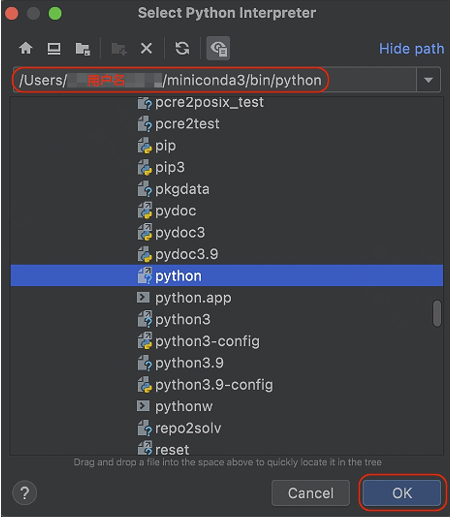

7. 在`conda`的安装目录下的`envs`文件夹下，找到所创建的虚拟环境

例如：/Users/用户名/miniconda3/envs/py39/bin/python
选中该文件，点击OK
至此，Mac系统下，pycharm配置conda环境完成

