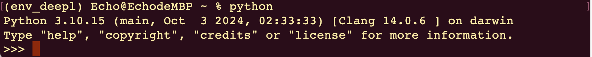
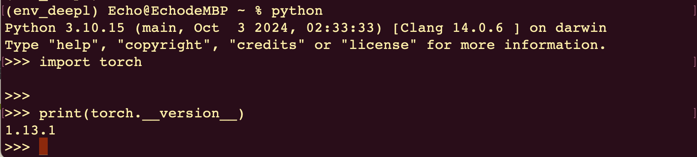

# pytorch安装

## 官网链接
[https://pytorch.org/get-started/previous-versions/#v113](https://pytorch.org/get-started/previous-versions/#v1131)

## 注意事项
1. python版本：python 3.9.18（建议版本3.9~3.10）【注意：安装pytorch，python必须为64位】

2. 进入到之前创建好的`conda`环境,注意：`env_customname`为自定义名称
 
```
<!--进入到终端输入如下指令-->
conda activate env_customname

<!--进入成功后输入如下命令-->
conda install pytorch==1.13.1 torchvision==0.14.1 torchaudio==0.13.1 -c pytorch

<!--并按照提示继续操作-->
```


3. 想要安装`cuda`和`cudnn`的同学注意【建议CPU Only方式安装】「mac可跳过此步骤」
    - 判断自己的显卡可不可以，例如`GTX960mx`，只要后面有`mx`的都不建议安装，`mx250`，`mx350` 同样不建议
    - 如果自己的显卡在`GTX1080ti`或者更高版本，首先在`conda`环境中安装 `gpu`版本的`Pytorch`
    - 在环境中`conda list`下，就会有你需要安装的`cudnn`与`cuda`版本软连接，去官网下载对应版本安装即可
    - 显卡驱动版本与CUDA的版本对应关系：[https://docs.nvidia.com/cuda/cuda-toolkit-release-notes/index.html](https://docs.nvidia.com/cuda/cuda-toolkit-release-notes/index.html)

4. 使用`CPU Only`方式安装：「mac可跳过此步骤」
    - 打开cmd，进入到对应的虚拟环境中：conda activate py39
    - 命令`-1`：pip install torch==1.13.1 -i https://pypi.tuna.tsinghua.edu.cn/simple/
    - 命令-1执行不成功时，使用此命令尝试：pip install torch==1.13.1+cpu torchvision==0.14.1+cpu torchaudio==0.13.1 --extra-index-url https://download.pytorch.org/whl/cpu
    - 注意：pip方式 或 conda 方式都可以，哪个可以安装成功就用哪个

5. 测试是否安装成功，输入`python`，回车，进入到`python`的`shell`中



6. 输入以下代码：


```
import torch
print(torch.__version__)  # __version__：左右各两个"_"
# 如果返回：1.13.1+cpu代表安装成功
```



