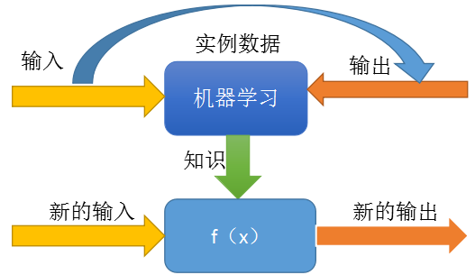
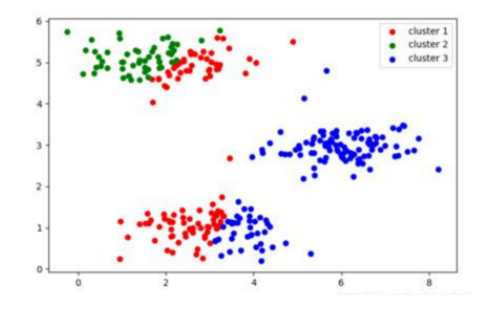
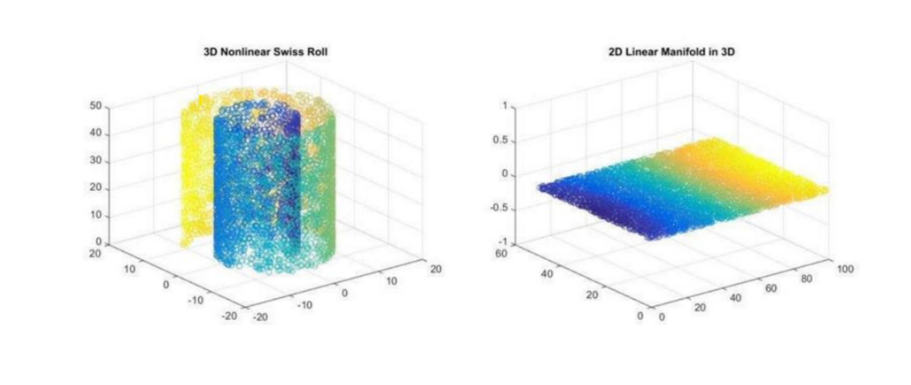
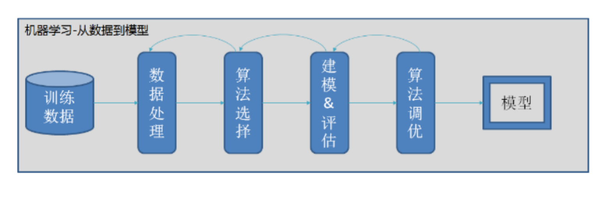

# 机器学习简介

## 1. 机器学习

### 1.1 有监督学习
- **核心目标**：建立一个模型（函数），来描述输入（X）和输出（Y）之间的映射关系
- **价值**：对于新的输入，通过模型给出预测的输出

### 1.1.2 有监督学习要点

- 1.需要有<u>一定数量的训练样本</u>

- 2.<u>输入</u>和<u>输出</u>之间<u>有关联</u>关系

- 3.输入和输出可以数值化表示

- 4.任务需要有预测价值

### 1.1.3 有监督学习在人工智能中的应用

#### 文本分类任务
- 输入：文本         输出：类别
- 关系：文本的内容决定了文本的类别

#### 机器翻译任务
- 输入：A语种文本   输出：B语种文本
- 关系：A语种表达的意思，在B语种中有对应的方式

#### 图像识别任务
- 输入：图像         输出：类别
- 关系：图中的像素排列，决定了图像的的内容
 
#### 语音识别任务
- 输入：音频       输出：文本
- 关系：声音信号在特定语言中对应特定的文本

### 1.2 无监督学习
给予机器的数据没有标注信息，通过算法对数据进行一定的自动分析处理，得到一些结论

- 常见任务: 聚类、降维、找特征值等等

#### 聚类

#### 降维

### 一般流程

### 常用概念

- 1.训练集：用于模型训练的训练数据集合
    
- 2.验证集： 对于每种任务一般都有多种算法可以选择，一般会使用验证集验证用于对比不同算法的效果差异
    
- 3.测试集：最终用于评判算法模型效果的数据集合

- 4.K折交叉验证（K fold cross validation）：初始采样分割成K个子样本，一个单独的子样本被保留作为验证模型的数据，其他K-1个样本用来训练。交叉验证重复K次，每个子样本验证一次，平均K次的结果

- 5.过拟合：模型失去了泛化能力。如果模型在训练集和验证集上都有很好的表现，但在测试集上表现很差，一般认为是发生了过拟合

- 6.欠拟合：模型没能建立起合理的输入输出之间的映射。当输入训练集中的样本时，预测结果与标注结果依然相差很大

- 7.回归问题：预测值为数值型（连续值）

- 8.分类问题：预测值为类别（离散值）或在类别上的概率的分布

- 9.特征：模型输入需要数值化，对于较为抽象的输入，如声音，文字，情绪等信息，需要将其转化为数值，才能输入模型。转化后的输入，被称作特征。

- 10.特征工程：筛选哪些信息值得（以特征的形式）输入模型，以及应当以何种形式输入的工作过程。对于机器学习而言非常重要。模型的输入，决定了模型能力的上限。

- 11.算法假设：一般而言，算法模型是对问题的一种简化。或者说，对于数据事先进行了某种假设，然后在这个基础上，寻找合适的参数，使模型可以拟合数据。即使问题明显不符合假设，并不意味着这个算法就不能用。事实上，很多情况下，这样依然能有不错的结果。但是，“假设”表明了算法的局限性

### 评价指标

为了评价算法效果的好坏，需要找到一种评价模型效果的计算指标。不同的任务会使用不同的评价指标。常用的评价指标有：

- 1）准确率
- 2）召回率
- 3）F1值
- 4）TopK
- 5）BLEU

