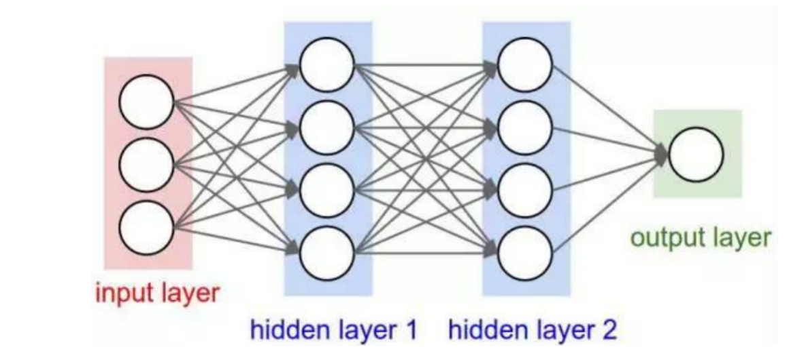
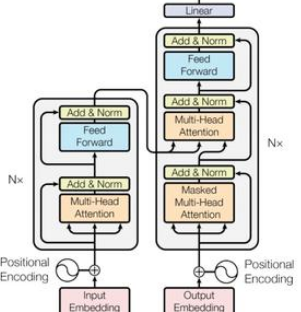
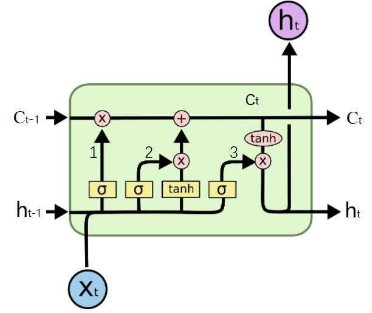
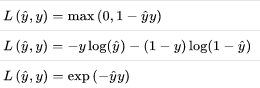
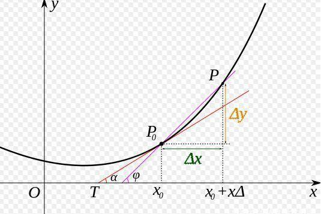
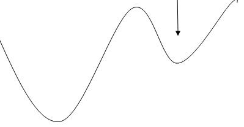
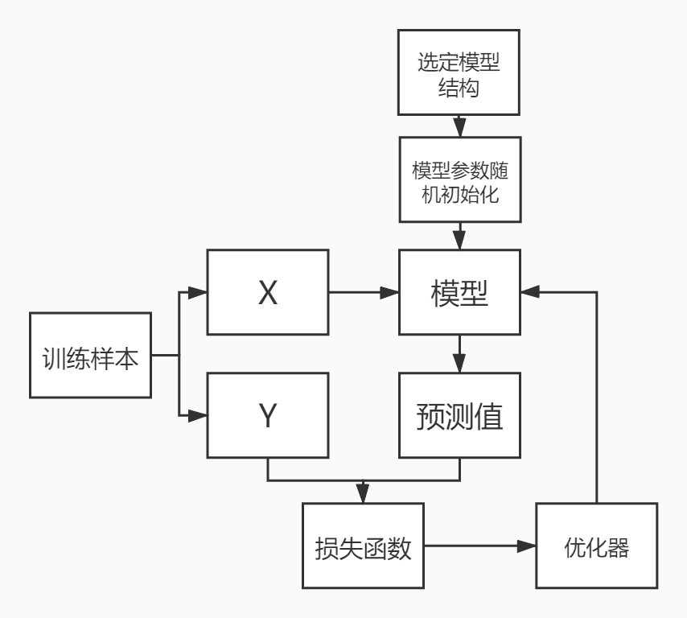

# 深度学习

深度学习是机器学习的一种方法

深度学习的基本思想，是先建立模型，并将模型权重随机初始化，之后将训练样本输入模型，可以得到模型预测值。使用模型预测值和真实标签可以计算loss。通过loss可以计算梯度，调整权重参数。简而言之，“先蒙后调”
 人工神经网络（Artificial Neural Networks，简称ANNs），也简称为神经网络（NN）。它是一种模仿动物神经网络行为特征，进行分布式并行信息处理的算法数学模型。
 

### 隐含层/中间层
神经网络模型输入层和输出层之间的部分，隐含层可以有不同的结构：

- RNN
- CNN
- DNN
- LSTM
- Transformer

它们本质上的区别只是不同的运算公式
 

### 随机初始化

- 隐含层中会含有很多的权重矩阵，这些矩阵需要有初始值，才能进行运算
- **初始值的选取**会影响**最终**的结果
- 一般情况下，模型会采取随机初始化，但参数会在一定范围内
- 在使用预训练模型一类的策略时，随机初始值被训练好的参数代替

### 损失函数
- 损失函数（loss function或cost function）用来计算模型的**预测值**与**真实值**之间的误差。
- 模型训练的目标一般是依靠训练数据来调整模型参数，使得损失函数到达最小值。
- 损失函数有很多，选择合理的损失函数是模型训练的必要条件

### 导数与梯度

- 导数
表示函数曲线上的切线斜率。 除了切线的斜率，导数还表示函数在该点的变化率。

 

- 梯度下降
梯度告诉我们函数向哪个方向增长最快，那么他的反方向，就是下降最快的方向。
    - 梯度下降的目的是找到函数的极小值
    - 为什么要找到函数的极小值？
        - 因为我们最终的目标是损失函数值最小


### 优化器

- 知道走的方向，还需要知道走多远，假如一步走太大，就可能错过最小值，如果一步走太小，又可能困在某个局部低点无法离开。
- 学习率（learning rate），动量（Momentum）都是优化器相关的概念



### Mini Batch

一次训练数据集的一小部分，而不是整个训练集，或单条数据它可以使内存较小、不能同时训练整个数据集的电脑也可以训练模型。
它是一个可调节的参数，会对最终结果造成影响不能太大，因为太大了会速度很慢。 也不能太小，太小了以后可能算法永远不会收敛。

### epoch

我们将遍历一次所有样本的行为叫做一个 epoch

### 训练迭代进行
模型训练好后把参数保存即可用于对新样本的预测

- 要点：

    - 模型结构选择
    - 初始化方式选择
    - 损失函数选择
    - 优化器选择
    - 样本质量数量



 

