## 文本分类

NLP中常见问题的一大类：文本分类

任务描述：预先设定好一个文本类别集合，对于一篇文本，预测其所属的类别

- 例如：
    - 情感分析：
        这家饭店太难吃了 -> 正类
        这家菜很好吃 -> 负类
    - 领域分类：
        今日A股行情大好 -> 经济
        今日湖人击败勇士 ->  体育
### 1.使用场景
1. 文本分类
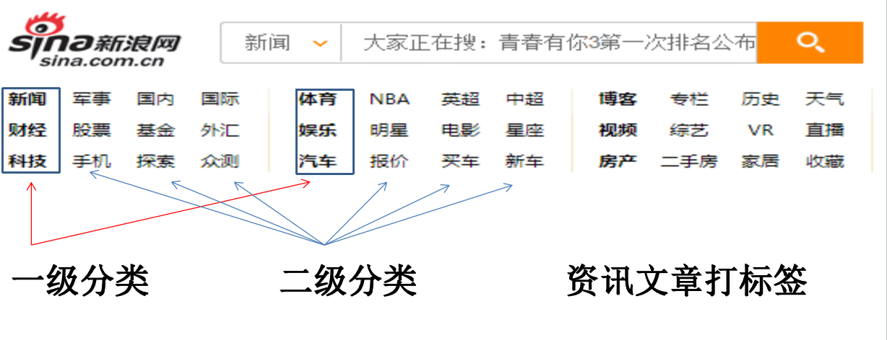
2. 电商评论

3. 违规检测
    涉黄、涉暴、涉恐、辱骂等，主要应用在客服、销售对话质检，或网站内容审查等

4. 自定义类别任务
    类别的定义方式是<u>任意</u>的，只要人能够基于文本能够判断，都可以作为分类类别， 如：
    - 垃圾邮件分类
    - 对话、文章是否与汽车交易相关
    - 文章风格是否与某作者风格一致
    - 文章是否是机器生成
    - 合同文本是否符合规范
    - 文章适合阅读人群（未成年、中年、老年、孕妇等）

### 2. 文本分类 - 机器学习
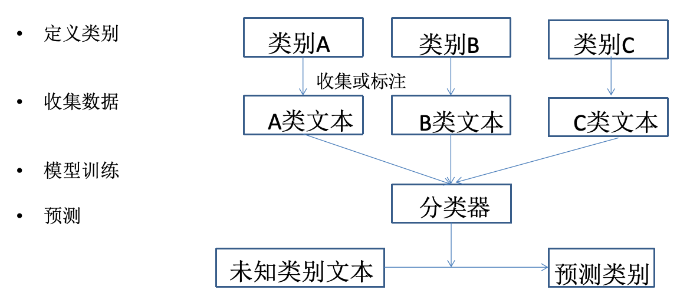
### 3. 传统的机器学习的方法

#### 3.1 贝叶斯算法

##### 3.1.1 预备知识

- 全概率公式：
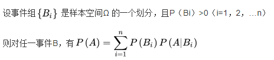
说明：样本空间的划分是一个件事发生有若干种可能，穷举出所有可能发生的情况即为对样本空间的划分。

举例：扔一个正常的骰子
P(B1) = 结果为奇数
P(B2) = 结果为偶数
P(A) = 结果为5
P(A) = P(B1) * P(A|B1) + P(B2) * P(A|B2) = 1/2 * 1/3 + 1/2 * 0

- 贝叶斯公式:
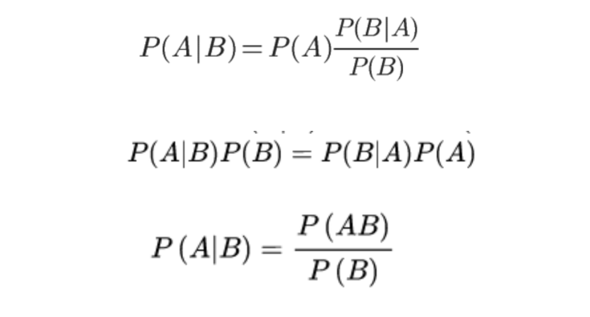
##### 3.1.2 贝叶斯公式的应用
- 求解：如果核酸检测呈阳性，感染新冠的概率是多少？

我们假定新冠在人群中的感染率为0.1%（千分之一）(前置概率 )
核酸检测有一定误报率，我们假定如下：

|            | 检测呈阳性 | 检测呈阴性 |
|------------|------------|------------|
| 感染新冠   | 99%        | 1%         |
| 未感染新冠 | 5%         | 95%        |

P(A) = 感染新冠的概率
P(B) = 核酸检测呈阳性的概率
P(A|B) = 核酸检测呈阳性，确实感染新冠的概率
P(B|A) = 感染了新冠，且检测结果呈阳性
P(B|A) = 未感染新冠，且检测结果呈阳性
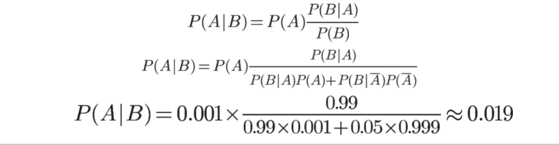
说明：P（A-）是P（A）的反向概率，等于1-P(A)，P(B) = P(B|A)P(A)+P(B|A-)P(A-)全概率，即P(B)发生的概率等于在A发生的情况下B发生和A未发生的情况下B发生的概率之和。

##### 3.1.3 贝叶斯公式在NLP中的应用

用贝叶斯公式处理**文本分类**任务
- 一个合理假设：
    文本属于哪个类别，与文本中包含哪些词相关
- 任务：
    知道文本中有哪些词，预测文本属于某类别的概率

##### 3.1.4 贝叶斯公式-文本分类

假定有3个类别A1, A2, A3；一个文本S有n个词组成，W1, W2, W3....Wn。
想要计算文本S属于A1类别的概率,P(A1|S)  = P(A1|W1, W2, W3....Wn）

- 贝叶斯公式
P(A1|S) = P(W1, W2…Wn|A1)  * P(A1) / P(W1,W2…Wn)  
P(A2|S) = P(W1, W2…Wn|A2)  * P(A2) / P(W1,W2…Wn)
P(A3|S) = P(W1, W2…Wn|A3)  * P(A3) / P(W1,W2…Wn)

说明：1.分母是公共的可以不算；2.P(A1),P(A2),P(A3)在确定了语料信息以后其中的数值即可确定。 

- 词的独立性假设（抛弃了语序信息）
P(W1, W2…Wn|A3)  = P(W1|A3) * P(W2|A3)…P(Wn|A3)

代码实现可参考：[bayes.py](./code/bayes.py)

 
##### 3.1.5 贝叶斯算法的缺点

1. 如果样本不均衡会极大影响先验概率
2. 对于未见过的特征或样本，条件概率为零，失去预测的意义（可以引入平滑）
3. 特征独立假设只是个假设
4. 没有考虑语序，也没有词义

##### 3.1.6 贝叶斯算法优点
1. 简单高效
2. 一定的可解释性
3. 如果样本覆盖的好，效果是不错的
4. 训练数据可以很好的分批处理


#### 3.2 支持向量机
`SVM：support vector machine`,属于有监督学习`supervised learning`,通过数据样本，学习最大边距超平面，1964年提出。
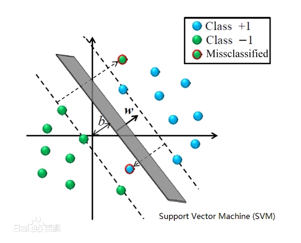
 
尝试区分蓝色球和红色三角
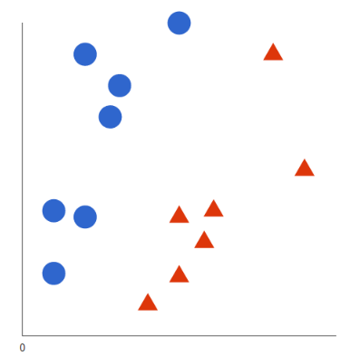
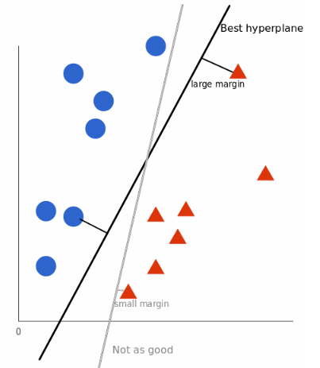
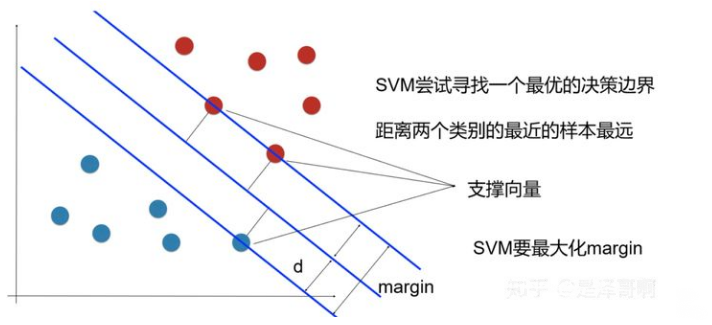
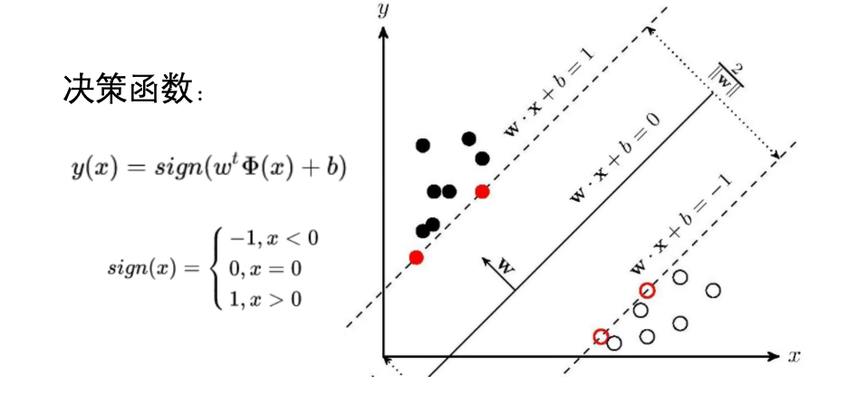
说明：图示中的x并不是一个二维的向量，本身是一个高维的向量，w和b同样是高维的向量，图示仅仅是为了便于展示。

##### 3.2.1 支持向量机 - 线性不可分问题
在某个维度下数据无法很好的通过某个线性公式来将数据很好的区分，以下面左侧图示为例，要想将两种点区分开来需要的是非线性公式(在神经网络中是通过在线性层中添加激活函数来让线性层具备拟合非线性的能力)。`svm`给出的解决办法是：将空间映射到更高维度来分类非线性数据。
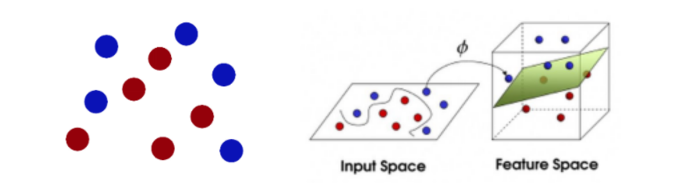
##### 3.2.2 将低纬映射到高维的方法 - 核函数

- 向高维映射如何解决线性不可分问题？

考虑一组一维数据,[-1, 0, 1] 为正样本，[-3, -2, 2, 3]为负样本
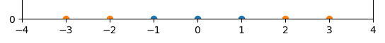
将x映射为[x, x2]后,可以用直线划分
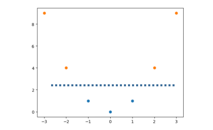

- 为了解决线性不可分问题，我们需要把输入映射到高维，即寻找函数      ，使其输出维度高于x; 例如： x = [X1, X2, X3]

     - 令           =  [X1 * X1,  X1 * X2,  X1 * X3,  X2 * X1,  X2 * X2， X2 * X3,  X3 * X1,  X3 * X2,  X3 * X3]   (对自己做笛卡尔积)这样x就从3维上升到9维

但是这样出现一个问题，维度过高的向量计算在进行<u>内积</u>运算非常耗时，而`svm`的求解中内积运算很频繁,所以我们希望有一种方法快速计算
所谓的**核函数**即为满足条件：
 K(x1, x2) =  的函数统称
 
 说明： 存在一个函数`K`使得将低纬度的x1,x2代入公式计算之后的结果，与将x1,x2通过高维度的映射内积计算之后的结果刚好相等，这个函数`k`即为核函数
 
 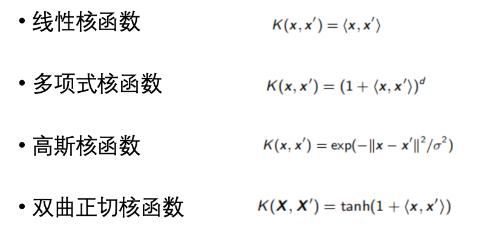

 
 ##### 3.2.3 支持向量机 - 解决多分类
 假设要解决一个K分类问题，即有K个目标类别

- **one vs one方式**
    建立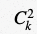-> ` K(K - 1)/2 ` 个`svm`分类器，每个分类器负责`K`个类别中的两个类别，判断输入样本属于哪个类别;对于一个待预测的样本，使用所有分类器进行分类，最后保留被预测词数最多的类别;
    - 假设类别有[A,B,C]   
    X->SVM(A,B)->A 
    X->SVM(A,C)->A
    X->SVM(B,C)->B
    - 最终判断   X->A

- **one vs rest方式**
   建立`K`个`svm`分类器，每个分类器负责划分输入样本属于`K`个类别中的某一个类别，还是其他类别，最后保留预测分值最高的类别。
    -  假设类别有[A,B,C]  
     X->SVM(A,rest)->0.1
     X->SVM(B,rest)->0.2
     X->SVM(C,rest)->0.5
    - 最终判断   X->C

##### 3.2.4 支持向量机-优点
1. 少数支持向量决定了最终结果，对异常值不敏感
2. 对于样本数量需求较低
3. 可以处理高维度数据

##### 3.2.5 支持向量机-缺点
1. 样本数量过多的时候，计算负担很大
2. 多分类任务处理起来比较麻烦
3. 核函数的选取以及参数的选取较为困难


### 4. 深度学习 - pipeline

#### 4.1 项目一般拥有的文件结构及功能

- config.py : 输入模型配置参数，如学习率等
- loader.py : 加载数据集，做预处理，为训练做准备
- model.py : 定义神经网络模型结构
- evaluate.py : 定义评价指标，每轮训练后做评测
- main.py : 模型训练主流程

项目参考路径：./code/nnpipeline
 
#### 4.2 常见的神经网络模型结构

##### 4.2.1 fastText
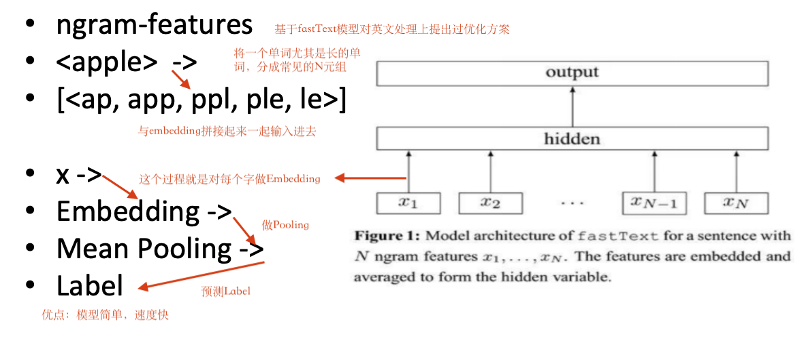
##### 4.2.2 TextRNN
使用RNN（LSTM、GRU）对文本进行编码，使用最后一个位置的输出向量进行分类。Recurrent Neural Network（RNN）循环神经网络,隐向量按时间步向后传递，起到记忆的作用,关于Rnn的详细介绍可参考[4.深度学习出理文本](../4.深度学习处理文本/深度学习处理文本.md) 6.2节的内容 
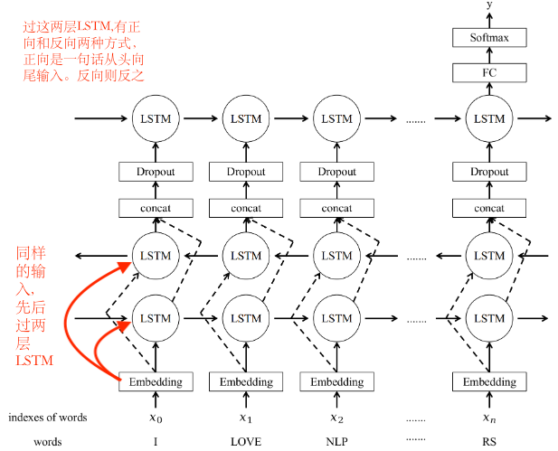
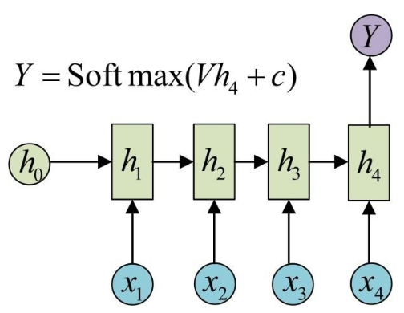

#### 4.2.3 LSTM
（长短期记忆网络，Long Short-Term Memory）是一种特殊的循环神经网络（RNN），专为解决传统`RNN`在处理长序列数据时存在的**梯度消失/爆炸**和**长期依赖** **捕捉困难**问题而设计。LSTM希望建立一种机制使得这个模型可以做到非重要信息的遗忘。每次在一定空间内替换掉一些无用的信息，增加一些关键性信息来保持向量的有效性比较高。将RNN的隐单元复杂化一定程度规避了梯度消失和信息遗忘的问题。

- 计算公式：
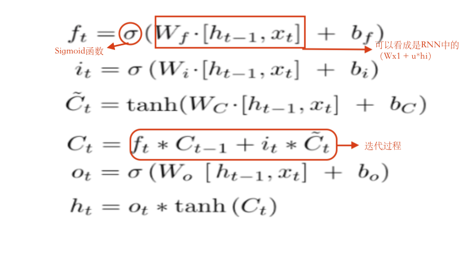
说明：`[h(t-1),x(t)]`表示将前一时刻隐藏状态向量`h(t-1)`与当前时刻的输入向量`x(t)`在特征维度上进行向量拼接操作。(向量拼接即两个向量**按特征维度首尾相连**)

说明：`C(t)~`符号，表示**候选记忆细胞值**（Candidate Cell State），是一个**中间计算值**，代表当前时刻可能加入记忆单元的新信息。

说明：`C(t)`符号表示：最终记忆细胞

说明：计算公式中关于迭代的部分是如何做到可以遗忘不关键信息又加入新的关键信息的？主要是通过两个门： `f(t) -> forget` 遗忘门; `i(t) -> input` 输入门; 将`i(t)`的值乘在正常的rnn即`(tanh(Wc[ht-1,xt] + bc))`上由于`i(t)`是经过`sigmoid`函数的所以会对正常的rnn进行一定的放缩，从结果上看就是正常的rnn的值一部分没有变，一部分被归零还有一部分被削减。同样的`f(t)`是对上一个的`C(t-1)`即记忆进行这样的处理，从结果上看就是遗忘掉了不重要的信息。对于迭代过程后的两个函数，即`o(t)`和`h(t)`，被称为输出门。最后两步可以理解为对抽象的记忆做一次总结。

- LSTM示意图
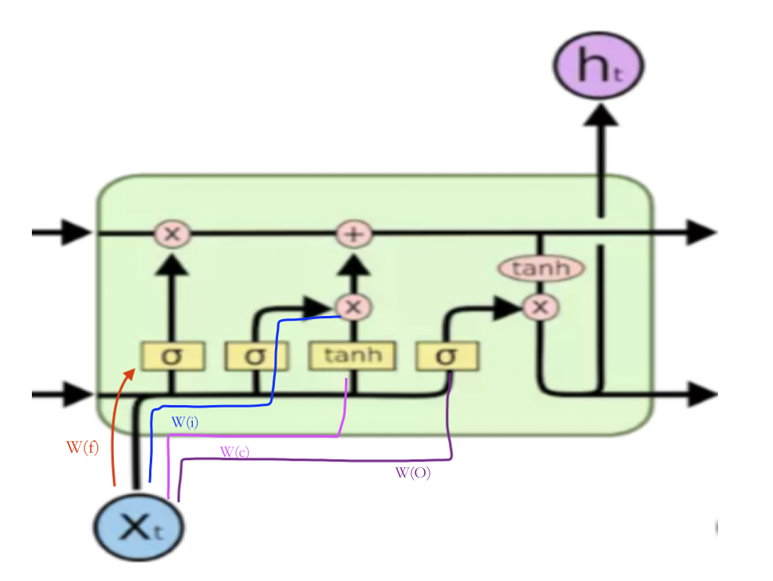

代码参考：[LSTMforward.py](./code/LSTMforward.py)

#### 4.2.4 TextCNN
利用一维卷积对文本进行编码,编码后的文本矩阵通过`pooling`转化为向量，用于分类。一般情况下对文本内容进行卷积采用2-5个字一起进行卷积，不能太多也不能太少，主要是为了希望发现查看卷积中某个局部的信息是否有特定的特点。
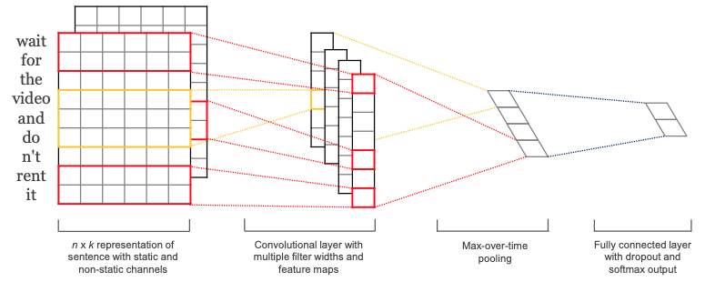

#### 4.2.5 Gated CNN
对CNN的一种改进
- 计算公式
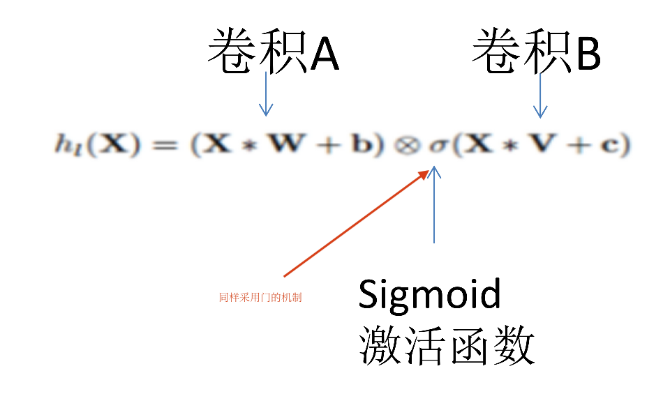
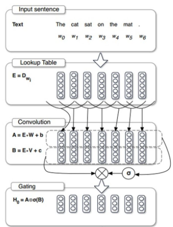

#### 4.2.6 TextRCNN

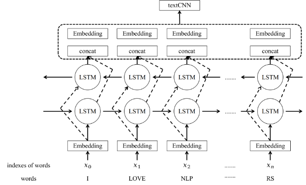

对于**简单且快速**的文本分类而言，可以优先采用`双向LSTM`或`GatedCNN`先试一下效果，如果效果不好就可以试一下`Bert`

#### 4.2.6 Bert
Bert作为Encoder将文本转化为向量或矩阵
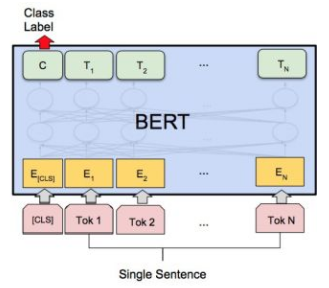
按照`Bert`自身推荐的做法，他建议将`CLS Token`输出的向量`Pooler Output`接一个线性层然后再去做分类，因为`CLS Token`输出的向量也包含全句的向量（self attentation）。这么建议是因为`Bert`在做预训练的时候涉及了一个二分类任务(判断两句话是否为同一句)，做这个二分类任务的时候是拿`CLS Token`向量去做的。

- 对于Bert的编码结果，有多种的使用方式
1. 取`[cls] token`对应的向量
2. 将整句话的向量取`max/average pooling`(目前这种方式也比较常用)
3. 将`Bert`编码后的向量再输入`LSTM`或`CNN`(这种方式实际运行并不比上面的方法强的原因在于`lstm`在预训练过程中是不存在的只能进行随机初始化)
4. 将`Bert`中间层的结果取出加入运算等


### 模型训练的问题和解决方案

#### 1. 数据稀疏问题
训练数据量小，模型在训练样本上能收敛，但预测准确率很低
- 解决方案：
    1. 标注更多的数据（利用大模型进行数据标注）
    2. 尝试构造训练样本（数据增强，图像可以通过拉伸，变形，变换颜色，增加噪音等方法。nlp可以利用大语言模型生成同类型的训练样本）
    3. 更换模型（如使用预训练模型等）减少数据需求
    4. 增加规则弥补 
    5. 调整阈值，用召回率(牺牲一部分样本)换准确率
    6. 重新定义类别（减少类别）

#### 2.标签不均衡问题
部分类别样本充裕，部分类别样本极少
| 类别     | 金融 | 体育 | 科技 | 生活 | 教育 |
|----------|:-----|------|------|:-----|:-----|
| 样本数量 | 3000 | 3200 | 2800 | 3100 | 50   |

- 解决办法：解决数据稀疏的所有的方法依然适用
    1. 过采样：复制指定类别的样本，在采样中重复
    2. 降采样：减少多样本类别的采样，随机使用部分
    3. 调整样本权重：通过损失函数权重调整来体现 
   
#### 3. 多标签分类问题
多标签不同于多分类
- 电影描述： 战斗中负伤而下身瘫痪的前海军战士杰克·萨利（萨姆·沃辛顿 Sam Worthington 饰）决定替死去的同胞哥哥来到潘多拉星操纵格蕾丝博士（西格妮·韦弗 Sigourney Weaver 饰）用人类基因与当地纳美部族基因结合创造出的 “阿凡达” 混血生物……
- 标签：动作，科幻

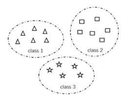

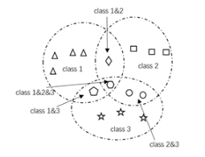

 ##### 3.1 多标签分类
 多标签问题的转化
1. 分解为多个独立的二分类问题(svm处理办法)
 - 原始数据

|    | Class1 | Class2 | Class3 |
|----|--------|--------|:-------|
| x1 | 1      | 0      | 1      |
| x2 | 0      | 1      | 0      |
| x3 | 1      | 0      | 1      |
| x4 | 0      | 1      | 1      |
| x5 | 1      | 1      | 0      |

- 多次二分类

|    | Class1 |
|----|--------|
| x1 | 1      |
| x2 | 0      |
| x3 | 1      |
| x4 | 0      |
| x5 | 1      |

|    | Class2 |
|----|--------|
| x1 | 0      |
| x2 | 1      |
| x3 | 0      |
| x4 | 1      |
| x5 | 1      |

|    | Class3 |
|----|--------|
| x1 | 1      |
| x2 | 0      |
| x3 | 1      |
| x4 | 1      |
| x5 | 0      |

2. 将多标签分类问题转换为多分类问题

|    | c1c2c3 | c1c2 | c1c3 | c2c3 | c1 | c2 | c3 |
|----|:-------|:-----|------|------|:---|:---|:---|
| x1 |        |      | 1    |      |    |    |    |
| x2 |        |      |      |      |    | 1  |    |
| x3 |        |      | 1    |      |    |    |    |
| x4 |        |      |      | 1    |    |    |    |
| x5 |        | 1    |      |      |    |    |    |

3. 更换loss直接由模型进行多标签分类
    - BCELoss 直接更换loss函数
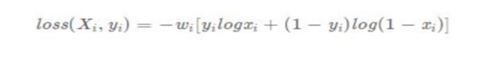

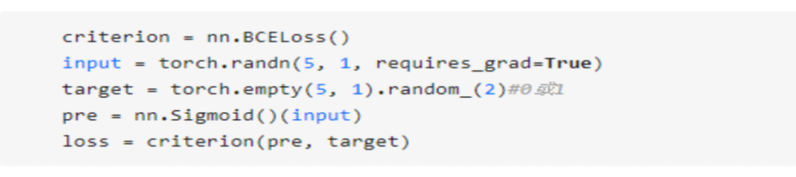

代码示例：[beclost.py](./code/beclost.py)

### 章节练习
- 在数据集文本分类练习数据集.rar (路径`./code/文本分类练习数据集.rar`)上进行：电商评论分类：好评/差评 (接近真实任务)
- 做法步骤：
训练集/验证集划分   
数据分析：正负样本数，文本平均长度等
实验对比3种以上模型结构的分类效果，每种模型对比模型预测速度，总结成表格输出
| Model | Learning_Rate | Hidden_Size | … | acc | time(预测100条耗时） |
|-------|----------------|:-------------|:--|:----|---------------------|
|       |                |              |   |     |                     |
|       |                |              |   |     |                     |


