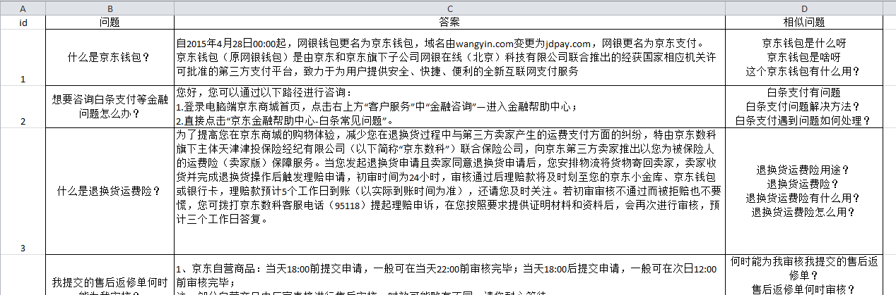
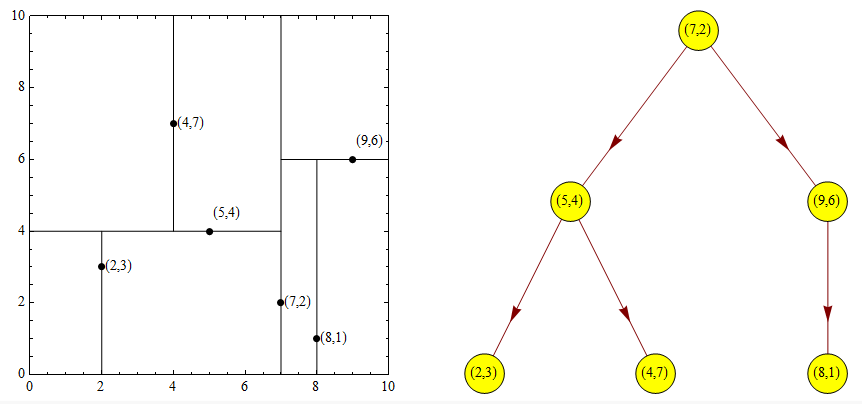

## 文本匹配

NLP任务另一大分类：本文匹配

- 相对狭义上的
任务描述：给定一组文本，判断其是否语义相似
    - 示例：
        今天天气不错   match  今儿个天不错呀    √
        今天天气不错   match  你的代码有bug     ×
        或者以分值形式给出相似度
        今天天气不错   match  今儿个天不错呀   0.9
        今天天气不错   match  这几天天气不错   0.7
        今天天气不错   match  你的代码有bug   0.1 

- 相对广义上的
任务描述：给定一组文本，计算某种自定义的关联度

    - Natural Language Inference
            两句话判断是否有关联、矛盾、中立
        - 示例：明天要下雨  vs  明天大晴天

    - Text Entailment
         给出一段文本，和一个假设，判断文本是否能支持或反驳这个假设
         
    - 主题判断

    - 文章标题匹配内容等
 
 ### 文本匹配的应用 
 
 #### 问答对话
 - 车载导航
 - 手机助手
 - 聊天机器人
 - 智能音箱
 - 智能客服

#### 信息检索
- 搜索引擎
- 视频网站
- 论坛，新闻以及聊天软件等

### 文本匹配任务应用
- 短文本 vs 短文本
     知识库问答 ，聊天机器人等

- 短文本  vs  长文本
     文章检索，广告推荐等

- 长文本  vs  长文本
     新闻、文章的关联推荐等

 ### 智能问答
 #### 智能问答的基本思路
 1. 基础资源
     包括faq库，书籍文档，网页，知识图谱等等
 2. 问答系统
     对基础资源进行了加工处理，形成问答所需要
     索引和模型等
 3. 用户输入问题
 4. 问答系统给出答案
 
 
 #### 智能问答的技术路线
1. 依照<u>**基础资源**</u>划分
  - 1）基于faq知识库的问答（主要以文本匹配来进行）
  - 2）基于文档/网页/书籍的问答 (现在主要采用大模型rng来做)
  - 3）基于图像/视频的问答 (基于多模态的模型来做)
  - 4）基于知识图谱的问答
  - 5）基于表格的问答
  - 6）基于特定领域知识的问答
  - 7）基于人工规则的问答
  - ...

2. 依照<u>**答案产出方式**</u>划分
  - 1）检索式的问答
       答案原文或答案的多个片段
       存在于基础资源中
     
  - 2）生成式的问答
      答案文本不存在于基础资源，
      由问答系统来生成答案
  
  - 3）二者结合

3. 依照<u>**NLP相关技术**</u>划分
  - 1）单轮问答
  - 2）多轮问答
  - 3）多语种问答 
  - 4）事实性问答
  - 5）开放性问答
  - 6）多模态问答
  - 7）选择型问答
  - 8）抽取式问答
  - 9）生成式问答
  - …
#### 智能问答的价值

##### 以智能客服为例

| 人工客服的局限             | 智能客服的优势       |
|----------------------------|----------------------|
| 响应慢                     | 毫秒级响应           |
| 服务时间有限               | 全年24小时在线       |
| 业务知识有限               | 精通所有业务知识     |
| 流动性大，培训新人成本高    | 只需培养管理员       |
| 离职了就带走了业务回答经验 | 保存所有业务回答数据 |
| 回复内容不一样，容易造就矛盾 | 回复内容标准         |

##### Faq知识库问答
Faq = Frequently asked Questions（常见问题/热点问题）

一般的应用场景如图示：
  


列表展示所有常见问题，用户需要自己找到对应的问题，对用户不友好，让用户以自然语言描述自己的问题，算法进行faq库的检索，给出对应的答案


#### 相关名词

1. 问答对
      一个（或多个相似的）问题与它对应的答案
2. faq库/知识库
      很多问答对组成的集合
3. 标准问
      每组问答对中的问题，有多个时，为其中代表
4. 相似问/扩展问
      问答对中，标准问之外的其他问题
5. 用户问
      用户输入的问题
6. 知识加工
      人工编辑faq库的过程


#### Faq知识库示例

基于faq简单的端到端的单轮问答代码实现：[QA_system.py](./code/QA_system.py)

#### 运行逻辑
1. 对用户问进行预处理
2. 使用处理后的问题，与faq库中问题计算相似度
3. 按照相似度分值排序
4. 返回最相似问题对应的答案
 

#### 算法核心
**语义相似度计算**是**faq**问答的核心，一般简称**文本匹配**，`f(x, y)→Score`，相似度分值合理，才可以找到正确的对应问题，计算分值的同时，也要考虑速度



### 文本匹配算法 
#### 1. 编辑距离 
两个字符串之间，由一个转成另一个所需的<u>**最少编辑操作次数**</u>。许可的编辑操作包括将一个字符<u>**替换**</u>成另一个字符，<u>**插入**</u>一个字符，<u>**删除**</u>一个字符。

示例图示：


- 计算公式：

两个字符串完全一致，编辑距离 = 0，相似度 = 1
两个字符串完全不一致，编辑距离 = 较长者长度，相似度 = 0

说明： ED(ab)表示a和b的编辑距离。

##### 1.1 编辑距离-代码

面试题有概率遇到，动态规划思想

##### 1.2 编辑距离-优缺分析
- 优点：
    1. 可解释性强
    2. 跨语种（甚至对于非语言序列）有效
    3. 不需要训练模型
- 缺点：
    1. 字符之间没有语义相似度 
        - 说明：‘我没钱’与‘俺没钱’其实是一个意思，但是使用相似度计算结果是：1- （1/3）= 0.66。
    2. 受无关词/停用词影响大
        - 说明：‘我要办卡’与‘你好我需要办一张卡’，其中‘你好我需要办一张卡’，中的‘你好’，‘需要‘属于无关词，经过相似度计算结果是： 1- （5/9）= 0.5
    3. 受语序影响大
        - 说明：’今天天气不错‘与’天气不错今天‘其实是一句话，但是使用相似度计算分值会很低：0.33
    4. 文本长度对速度影响很大

#### 2. Jaccard相似度
通用表述：根据两个集合中，不同元素所占的比例，来衡量两个样本之间的相似度
用于文本匹配：根据两个文本中，不同的字或词所占的比例，来衡量两个文本之间的相似度

##### 2.1 计算公式：
 
- 示例：
    今天天气真不错 -> 公共字：天、气 
    估计明天天气更好 -> 总字数：(7-1) + (8-1) – 2 = 11;说明：-1 是因为‘天’字重复，再 -2 是因为 ‘天气’重复。
    jaccard相似度： 2 / 11 = 0.18
也可以以词为单位计算。

##### 2.2 代码实现：

    
**说明：**  1. 如果输入字符串，则得到基于字的jaccrad相似度；如果输入词的列表，则得到基于词的。
**说明：** 2. jaccard相似度该用词还是该用字需要看具体的使用场景！
**说明：** 3. 分词是否准确？是否有很多类似名词、缩略词；文本长度等因素，都会影响选择

说明示例： 我去/农行/取钱 -> 我去/农业银行/取钱

    
##### 2.3 Jaccard距离 - 优缺点分析

- 优点：
1. 语序不影响分数（词袋模型）
2. 实现简单，速度很快
3. 可跨语种，无需训练等

- 缺点：
1. 语序不影响分数
2. 字词之间没有相似度衡量
3. 受无关词影响
4. 非一致文本可能出现满分
    
相对于编辑距离而言，jaccard更适用于长文本，在长文本的计算上会将Jaccard优势放大。 
   
#### 3. BM25算法
常用在搜索引擎框架中，用来做文档和搜索问题的匹配。同样也可以用在问答中，做文本匹配。

**核心思想**：假如一个词在某类文本（假设为A类）中出现次数很多，而在其他类别文本（非A类）出现很少，那么这个词是A类文本的重要词（高权重词）。
- 示例：恒星、黑洞 对于 天文领域来说就是重要词

反之，如果一个词在出现在很多领域，则其对于任意类别的重要性都很差。 

- 示例：中国 对于  政治，军事，地理，经济，足球等词汇而言就不是重要词。

##### 3.1 如何用数学刻画

- 一种nlp的经典统计值：TF·IDF
TF：词频。
      某个词在某类别中出现的次数/该类别词总数
IDF：逆文档频率。

**说明：** N代表文本总数；dfi代表包含词qi的文本中的总数；逆文档频率高 -> 该词很少出现在其他文档

- 示例说明：
TF·IDF = TF * IDF
假设有四篇文档，文档中的词用字母代替
A：a b c d a b c d
B: b c b c b c
C: b d b d
D: d d d d d d d

每个词对于每个类别都会得到一个`TF·IDF`值，`TF·IDF`高 -> 该词对于该领域重要程度高，低则相反。

|        | 天文 | 财经  | 生物  | 汽车  |
|--------|:-----|-------|-------|:------|
| 黑洞   | 0.9  | 0.01  | 0.002 | 0.001 |
| 交易   | 0.1  | 0.6   | 0.2   | 0.65  |
| 氨基酸 | 0.02 | 0.001 | 0.95  | 0.01  |
| 发生   | 0.1  | 0.12  | 0.11  | 0.09  |

关于**TF·IDF**的相关知识可查看之前的文章: [6.新词发现与tfidf](../6.新词发现与tfidf/新词发现与tfidf.md)

##### 3.2 BM25是对TF·IDF的一种改进，优化其表示效果
- 计算公式：

     - 参数说明：
     
##### 3.3 优缺分析
- 优点：
1. 通过使用`TF·IDF`弱化了**无关词**的影响，强化了**重要词**的影响，使得效果大幅提升
2. 统计模型计算快，不需要迭代
3. 词袋模型、跨语种等
- 缺点：
1. 依然没有考虑词与词之间的相似性
2. 需要一定量的训练（统计）样本（faq库本身）
3. 对于新增类别，需要重新计算统计模型
4. 分值未归一化

BM25代码实现：[bm25.py](./code/bm25.py )

####  4. word2vec
- 什么是向量？
    指在坐标系(空间)内具有大小和方向的量
    2维向量 [0.1,2.9]  5维向量 [3,1,4,2,5]
- 什么是词向量？
    将每个词或字转换成同一向量空间内的一个向量
- 词向量的特点？
    两个词如果语义相近，则在空间中的向量接近
    
    

- 词向量是如何寻得到的？
        随机初始化，之后通过文本语料进行训练调整

- 如何训练/训练目标？
        基于窗口
        基于语言模型
        基于共现矩阵

- 训练提速技巧？
        层次softmax/Huffman树
        负采样
        
关于词向量的内容可以查看之前的文章：[7.词的向量化](../7.词的向量化/词的向量化.md)        

##### 4.1 如何用于文本匹配？
将文本中的所有词的词向量相加取平均
文本 -> 句向量

句向量维度 = 词向量维度，不论文本长度
文本相似度 = 向量相似度 = 向量夹角余弦值
向量夹角为0，余弦值为1


##### 4.2 优缺分析
- 优点：
1. 两个文本包含语义相似的词，会提高相似度
2. 训练需要的数据简单（纯文本语料即可）
3. 计算速度快，可以对知识库内问题预先计算向量
4. 将文本转化为数字，使后续复杂模型成为可能
- 缺点：
1. 词向量的效果决定句向量效果
2. 一词多意的情况难以处理
3. 受停用词和文本长度影响很大（也是词袋模型）
4. 更换语种，甚至更换领域，都需要重新训练


### 文本匹配 - 深度学习

在文本匹配任务上有两种主要方式：

1. 表示型;

第一种训练方式，对于两个匹配的样本预期输出分值为1，对于两个不匹配的样本，预期输出分值
为0。本质上相当于2分类任务。 如下图：

《Sentence-BERT: Sentence Embeddings using Siamese BERT-Networks》
论文参pdf考：[Sentence-BERT](./code/sentence_bert.pdf)

第二种训练方式：Triplet Loss


- 训练目标：
使具有相同标签的样本在embedding空间尽量接近
使具有不同标签的样本在embedding空间尽量远离

如下图所示：

说明：Anchor 表示锚点;Positive表示 正样本；Negative 表示 负样本; 由于随机初始化的原因锚点可能距离正样本点距离很远而距离负样本很近，通过训练我们希望可以正样本点距离锚点很近而负样本距离锚点很远。

- 计算公式
输入是一个三元组<a, p, n>。a：anchor 原点；p：positive 与a同一类别的样本；n：negative 与a不同类别的样本，在embedding空间中，三元组损失函数如下：

最小化L，则d(a,p)->0，d(a,n)->margin

**说明：**`d`代表向量之间的距离函数，如欧氏距离，cos距离；`a`与`p`为两个文本转成的向量。`d(a,p)`表示两个文本转成的向量之间的距离。`margin`为惩罚项，主要目的是为了防止`d(a,p)`与`d(a,n)`两个值相等而产生的损失值0，这个损失值并不是我们的预期，我们希望将`d(a,n)`与`d(a,p)`有所区别。甚至`d(a,p)`要小于`d(a,n)`。`margin`不要设置的很大，不然会产生模型不收敛的情况。

本方法同样也用于人脸识别模型的训练；

代码实现可参考：[sentence_match_as_sentence_encoder](./code/sentence_match_as_sentence_encoder)

2. 交互型
交互层进行信息融合，常以attention的方式

Embedding层共享

#### 交互型vs表示型

##### 表示型
- 优点：训练好的模型可以对知识库内的问题计算向量，在实际查找过程中，只对输入文本做一次向量化
- 缺点：在向量化的过程中不知道文本重点

##### 交互型
- 优点：通过对比把握句子重点
- 缺点：每次计算需要都需要两个输入

代码实现可参考：[sentence_match_as_similarity_function](./code/sentence_match_as_similarity_function)

### 额外的知识

#### 对比学习
对比学习的目的在于如何训练出来一个合理的编码器，对于一个数据图片或者文本内容给出一个合理的向量。

图像的对比学习示例：

文本对比学习的示例：

### 海量向量查找
假如我们有1亿以上的候选向量，对于一个给定向量，希望查找距离最接近的如何高效的完成？问答，搜索，推荐等场景均会使用。- 使用向量数据库。

- 查找原理：KD树
空间切割

**说明:** 以二维为例，在空间平面中随便给出一个点，需要计算出与这个点距离最近的点是哪个；首先需要构建一棵树，构建这棵树首先需要选择一个顶点，这个顶点的选择首先需要先对所有数据点的两个维度上的值进行计算(方差值)获取方差做大的那个值所在的维度作为切割平面，然后选取是这个维度上所有值的中值进行切割，如上图的。在选取好了顶点（7，2）以后，选择以x轴做切分，所有小于x=7的点都挂在左侧，所有大于x=7的点都挂在右侧。再然后将所有划分在左侧的点在进行一次划分(计算方差找中值)，选中了点（5，4），并且以y=4进行空间切割，左面的空间就进一步被分割成了两半，上面是大于y=4，下面是小于y=4；然后接下来依次去计算查找点并确定空间切割的方式。分别挂在树的左右两侧。依照建索引方式找到最下方叶节点,向上回退，计算到节点距离和到切割平面距离，根据情况判断（当前得到的距离切割的值是否已经有最小值了）是否需要查找平面另一侧节点，回退到根节点为止。


代码实现可参考：[kd_tree.py](./code/kd_tree.py)

- Annoy（Approximate Nearest Neighbors Oh Yeah）
分割过程相当于Kmeans聚类,重复分割过程，直到每个空间内的点个数小于设定值

可以同时在多个接近的分支上查找或通过不同初始划分，生成多个树

### 练习作业
在交互性文本匹配的基础上[sentence_match_as_sentence_encoder](./code/sentence_match_as_sentence_encoder)改造成用Triplet Loss计算的方式实现。