## 序列标注任务

对于序列中的每个时间步做分类，得到每个时间步的标签
- 示例：
对于输入：X1 X2 X3 X4 ….. Xn
预测输出：Y1 Y2 Y3 Y4 ….. Yn

说明：输入X1X2X3X4..是一个序列，其中X1，X2..每个输入项可以看成一个时间步,输出一个等长的序列，这样的任务都称为序列标注任务。  

- 应用场景：
分词，词性标注，句法分析，命名实体识别等

### 1. 序列标注的种类

#### 1.1 中文分词-基于序列标注
- 示例：
    上 海 自 来 水 来 自 海 上
对于每一个字，我们想知道它是不是一个词的边界
    上 | 海 | 自 | 来 | 水 | 来 | 自 | 海 | 上 
     0   1    0   0    1    0    1    1    1
0表示不是词边界，1表示是词边界

序列标注任务不仅仅是只有一种标注方式，如上面的示例内容一样进行0，1标注，也可以判断一个字是否是词的边界还要判断是都是左,右边界等信息。示例如下：
- 示例
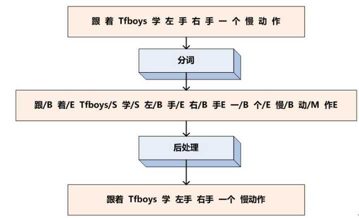
说明：B：词左边界；E:词右边界；M：词内部；S:单字。

#### 1.2 命名实体识别(NER)
命名实体一开始值的内容会比较狭义，如人名，地名，地址，机构等这种有名字的实体。事实上这个概念可以放大,任意信息的抽取都可以称为命名实体。
示例：
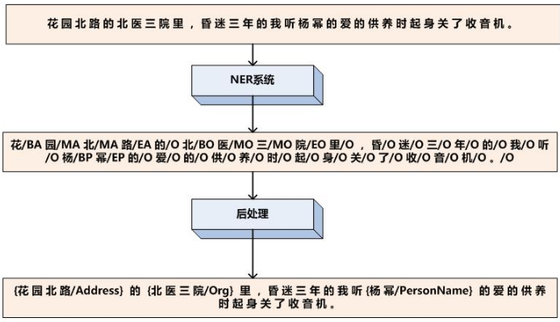

说明：BA:地址左边界；MA:地址内部；EA:地址右边界；BO:机构左边界；MO:机构内部；EO:机构右边界；BP:人名左边界；MP:人名内部；EP:人名右边界；O:无关字。对每个字做10分类。

##### 1.2.1 命名实体识别应用场景
- 抽取地名，机构，人名，时间等信息
- 人机对话任务中抽取必要的输入信息，以人工智能预订机票而言就需要抽取预定时间，出发地和目的，以及航司信息等
- 评价系统中对于具体商品的信息抽取以及评价是正向还是负向

#### 1.3 基于深度学习
通过神经网络将每个token向量化，预测其分类标签
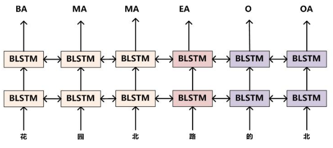

### 2. 序列标注的方法

#### 2.1 CRF 条件随机场
基于当前的强基座(预训练模型，LSTM，Transformer等)情况下，很有可能使用不到`CRF`，但是并不代表就不需要了解下面的内容。

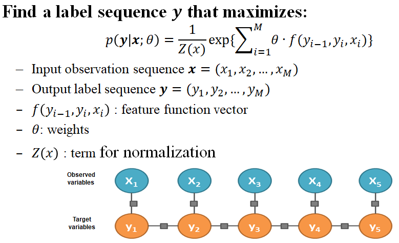
说明：以上面命名实体的标注举例，如果判断了一个字是`BA`那么下一个字的类型几乎不可能是`MO`或者是`MP`，即如果能判断出一个字是地址左边界，那么下一个字大概率是地址内部或者地址右边界，几乎不可能是机构内部或人名内部。因此可以在神经网络层添加约束，因此需要学习另一个矩阵来**控制转移**的概率(转移的概率可以理解为从`BA`转移到`MO`或`MP`的概率或从`BA`转移到`MA`的概率使得模型训练结果更好)

- 安装
    在`conda`的环境下执行`pip install pytorch-crf`

CRF本质就是加入神经网络来学习**转移矩阵**，`shape: label_num * label_num`
转移矩阵示例如下图所示：
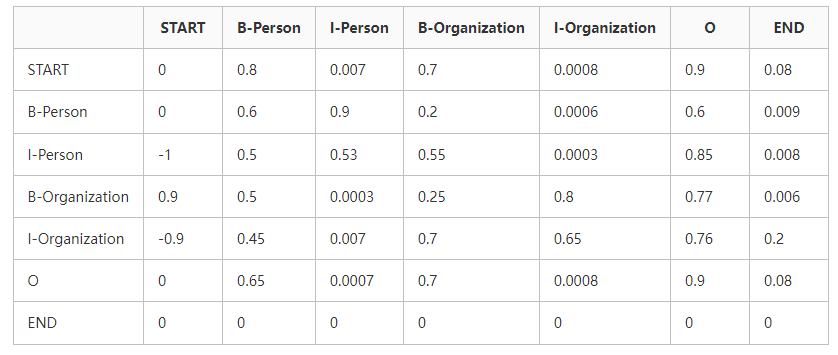
说明：数列表示开始的位置，横列表述转移到的位置。从图标可以看出，从`B-person`大概率会转移到`I-person`而小概率会转移到`I-organization`,这个矩阵模型是可以通过神经网络进行学习的。学习完成以后可以与神经网络组合使用输出更优的序列结果。
    
神经网络输出的每个字的矩阵叫**发射矩阵**：
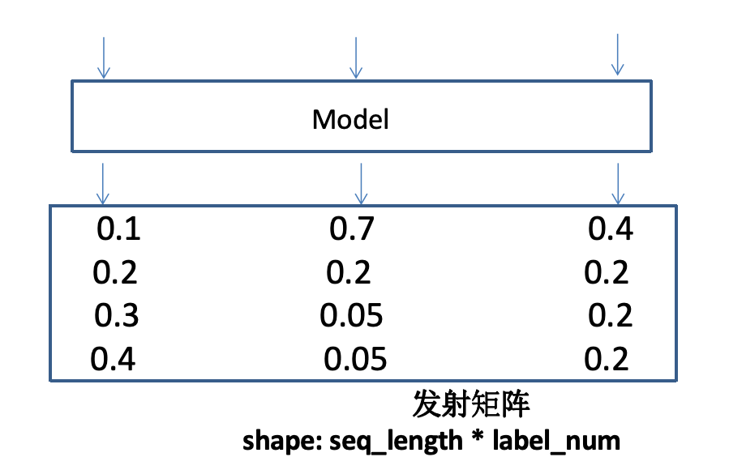
发射矩阵和转移矩阵公同作用。
如何共同作用示例：
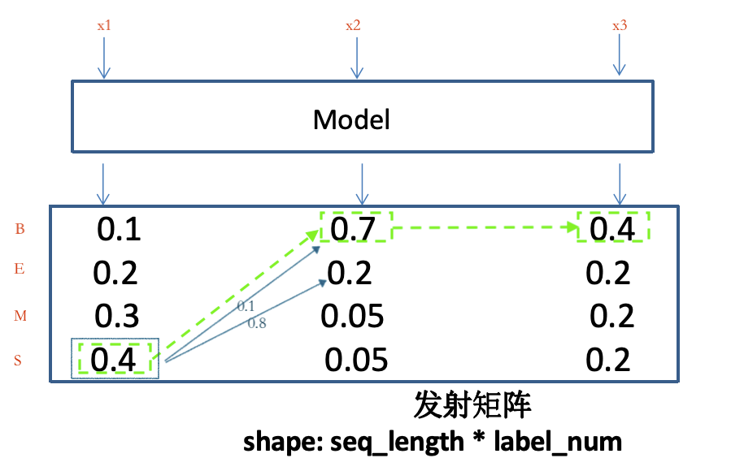
说明：对于普通没有加入转移矩阵的模型输出来说，对文本内容做多分类，根据结果概率分布，文本每个字符对应的类型如图中的绿色框标记的部分  应该是`SBB`。现在我要将转移矩阵加入进去，转移矩阵是从当前字到下个字会有概率值，如上图中的蓝框及蓝线所示，`S[0]`到`B[1]`的概率假设为0.1，而`S[0]`到`E[1]`的概率假设为0.8，那么从计算结果来看：0.4+0.1+0.7 < 0.4+0.8+0.2;也就是说从结果看第二个字符的类型应该是`E`而不是`B`,后面的字符同理。

#### 2.2 CRF - Loss (非主要内容)
输入序列X，输出序列为y的分数：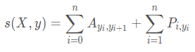

输入序列X，输出序列为y的分数：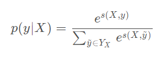
相当于上式做`softmax`,说明：分母代表所有路径概率和，分子代表正确路径的概率 

对上式取log，目标为最大化该值：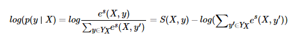

对上式取log，目标为最大化该值：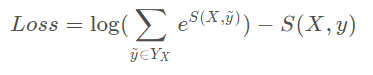

说明:A为转换矩阵，P为发射矩阵；A(yi,yi+1)为转移矩阵中前后连个字转移的概率；P(i,yi)为神经网络里每个字对应的概率输出

代码示例：[ner](./code/ner/model.py)

##### 2.2.1  
根据crf,转移矩阵从上一个字符到下一个字符之间有概率，而模型输出内容本身就有概率，那么寻找最优解的过程就变成了动态规划问题。示意图如下：
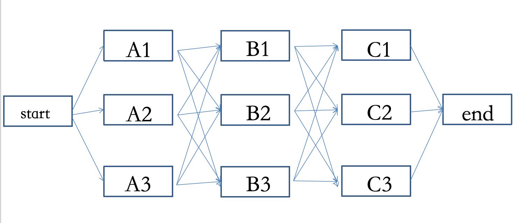

如果没有使用crf那么就不会涉及到篱笆墙问题；

##### 2.2.2 求解办法

###### Beam Search 
首先定义一个最大保留数量`Beam Size`,从开始向第一层节点进行计算，仅保留`Beam Size`条路径(值最大或最小)剩下的路径删除，然后从第一层节点开始向第二层节点开始计算计算`Beam Size` * 节点数量 次，同样保留`Beam Size`条路径，剩余的删除，然后继续往后同理计算。这种算法就叫做`Beam Search`。当`Beam Size`设置为1时，就叫`Greedy Search`。

`Beam Search`算法一般在生成式任务中比较常用；

整个过程如下图所示：
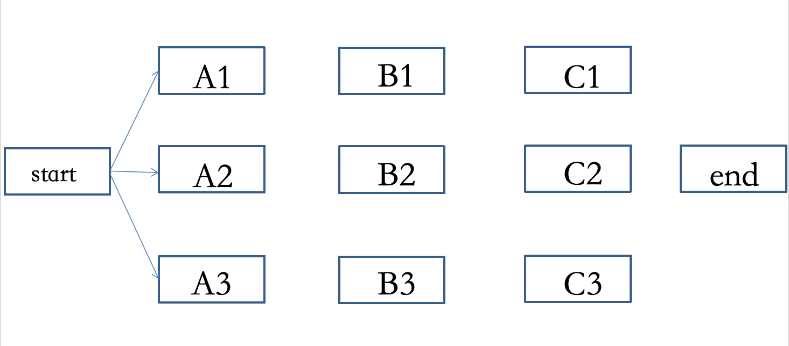
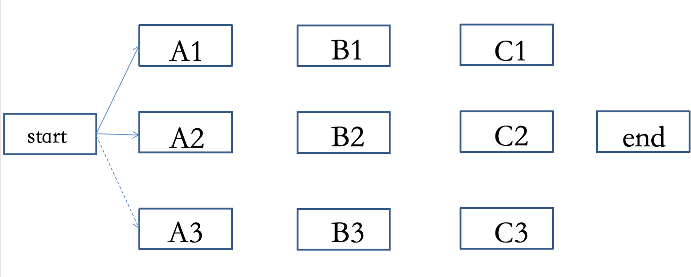
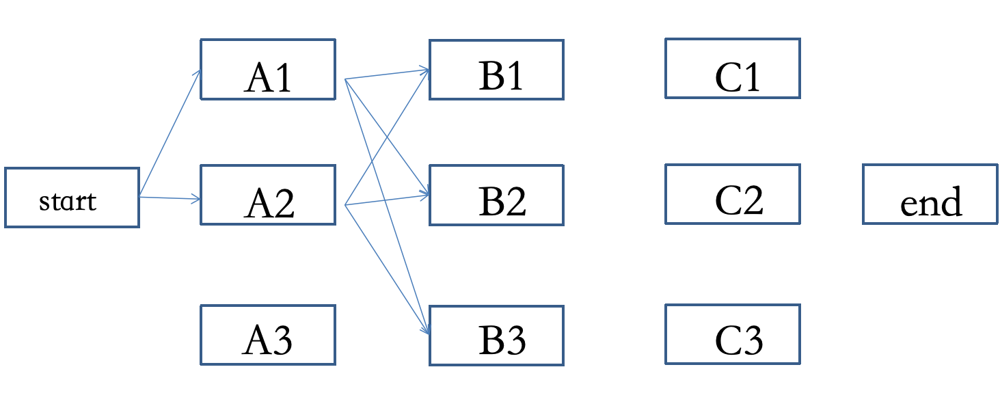
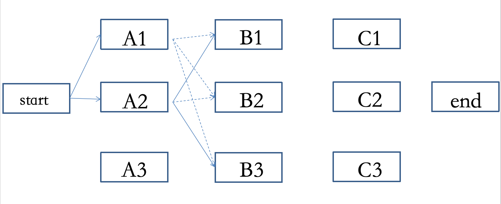

###### 维特比解码
假设从开始到结束的节点个数以及节点层级与`Beam Search`相同，从开始位置到第一层节点的所有路径全都保留，然后在到达第二层节点的时候，进行计算：从开始到`A1`，再从`A1`到`B1`的路径；以及从开始到`A2`,从`A2`到`B1`的路径；再计算从开始到`A3`，从`A3`到`B1`的路径；哪条最优，仅保留第二层级上最优的路径，其他路径删除。从开始到第二层节点`B2`的方式同理。

维特比解码的特点即为：为每个节点都保留了一条路径。在序列表中任务中使用较多

过程示例如图：
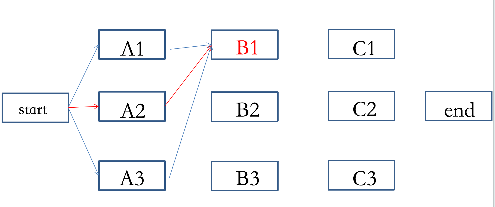
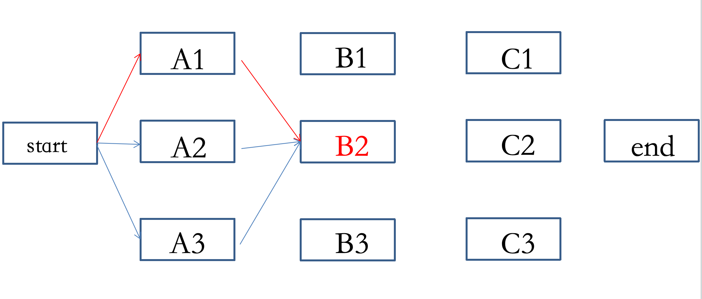
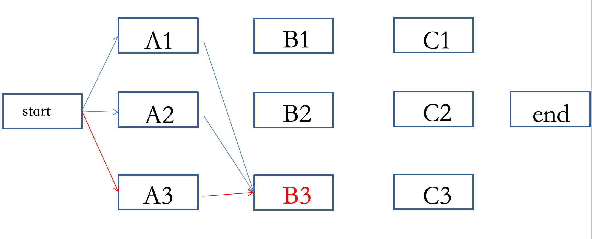

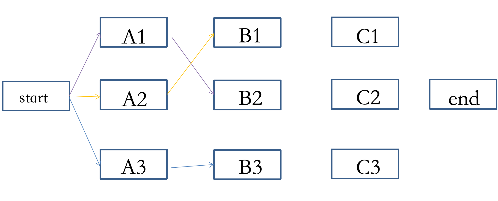

###### 效率对比

假设共有`n`组(列)节点，每一组节点平均数量为`D`:
- 穷举路径计算复杂度为`D`的`n`次方
- 维特比解码复杂度为`n * D的平方`
- BeamSearch解码复杂度为 `n * D * B`,  `B`为`Beam Size`

##### 评价指标
- 序列标注准确率  ≠  实体挖掘准确率 (需要对序列标注中的实体内容进行解码只有解码正确了才能认为是正确的)
- 实体需要完整命中才能算正确
- 对于标注序列要进行解码

代码可参考：[evaluate.py](./code/ner/evaluate.py)

| 真实值\预测值 | Positive           | Negative             |
|---------------|--------------------|:-------------------|
| Positive      | True Positive(TP)  | False Negative(FN) |
| Negative      | False Positive(FP) | True Negative(TN)  |

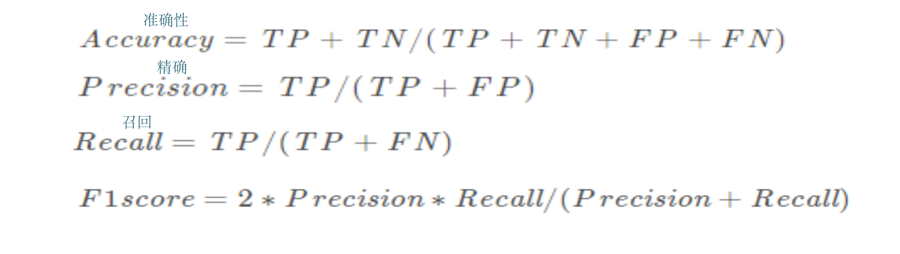
- Macro-F1（宏观）
  对所有类别的F1值取平均(每个类别分别计算准确率和召回率然后用准确和召回计算F1，将每个类别的F1取平均)，更加关注不同类别之间的关系，对于所有类别的结果都比较关注的话可以优先考虑Macro-F1

- Micro-F1 (微观)
  将所有类别的样本合并计算准确率和召回率，之后计算F1(不按照类别，把所有样本放在一起算准确率和召回率，然后再计算F1)，对于数据中最大化抽取内容结果，如果有没抽取出来的信息对结果影响不大的话可以优先考虑Micro-F1

**说明：** 区别在于是否考虑类别样本数量的均衡，同样可以通过Macro-F1与Micro-F1两个值之间的差距是否较大来判断，是否存在样本不均衡的情况

### 3. 基于规则的命名实体识别

#### 3.1 技巧、建议
- 常使用正则表达式来匹配特定句式、词表
- 原则上，规则能处理的好的情况下，尽量不用模型
- 使用规则的方式同样可以计算准确率和召回率
- 规则的顺序有时会影响结果，调试时需注意

#### 3.2 正则表达式
正则表达式(regular expression)描述了一种字符串匹配的模式（pattern），可以用来检查一个串是否含有某种子串、将匹配的子串替换或者从某个串中取出符合某个条件的子串等。

##### 3.3 正则表达式的基本示例

| 字符串 | 描述 | 结果 |
|--------|------|------|
| pattern：ab |检查pattern是否在字符串中出现|      |
| string 1:  babb | re.search(pattern, string)|  True  |
| string 2: bbba |      |   None   |
| string 3: baaa |      |  None |
| string 4: abb |     |  True |
|       | 检查pattern是否在字符串开头出现 |  |
|string 1:  babb| re.match(pattern, string) | None |
|string 2: bbba|        |  None |
|string 3: baaa |       |  None |
| string 4: abb |       | True |

正则表达式使用代码基本参考：[regular_expression.py](./code/regular_expression.py)

###### 3.3.1 元字符
想匹配任意数字或字母
- re.search(“a\d”, “a1”)  True  re.search(“a\d”, “aa”)  None
- re.search(“a\d”, “a2”)  True  re.search(“a\d”, “1a”)   None

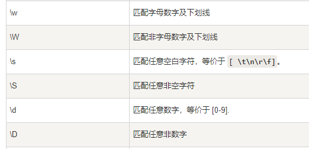

##### 3.3.2 特殊符号
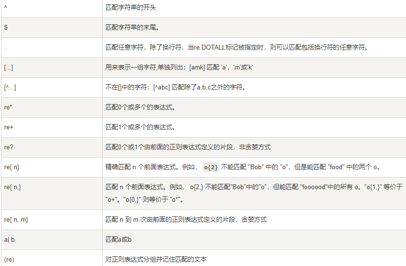

##### 3.3.3 修饰符
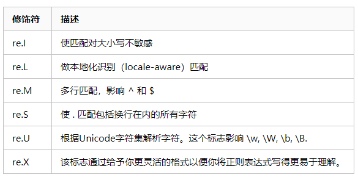

##### 3.3.4 贪婪模式
```python
import re

res = re.search("new.*?w","newnewnew")
print("非贪婪模式：",res.group())

res = re.search("new.*w","newnewnew")
print("贪婪模式：",res.group())

#非贪婪模式：new
#贪婪模式：newnewnew
```

##### 3.3.5 常见pattern写法
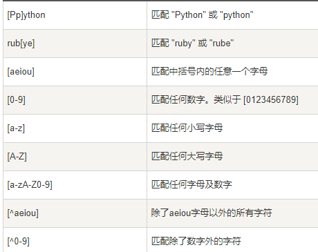

##### 3.3.6 主要函数

- re.search(pattern, string) 文本中匹配
- re.match(pattern, string)  句首匹配
- re.findall(pattern, string)  文本中匹配多次
- re.sub(pattern, repl, string) 替换
- re.split(pattern, string)  切分

### 4. 文本加标点任务
经过语音识别，或机器翻译，可能会得到没有标点符号的文本。此时进行自动文本打标，有助于增强文本可读性。

说明：对于文本加标点任务，是否符合序列标注任务的定义即：输出文本的长度与输入文本长度应该相同。需要说明的是，文本加标点任务并不是输出内容中是加了标点的内容，实际上是文本中每个字后面是否应该加标点符号已经应该添加什么标点符号。

代码参考：[main.py](./code/加标点/main.py)

说明：文本加标注标注的时候可能存在一个问题，即当输入的文本长度过长大于了可接受输出长度的时候，就会对文本进行截断处理，再截断的位置本来并不应该添加标点符号。但是模型训练结果可能认为这是一句话的结尾，而添加了`。`这一标点，对于这种问题，正确的做法是：当发现文本内容超出了输入长度以后，在会后判断出需要添加标点的位置开始进行截断，添加标点以后的文本重新输入。


### 5. 句子级别的序列标注
对于一个段落中的多句话，对每句话进行分类
做法:
- paragraph  ->  sentence  ->  token
- 将每句话进行向量化，之后仅需进行序列标注

代码示例：[sentence_level_sequence_labeling](./code/sentence_level_sequence_labeling/main.py)


### 可能的问题
假如要抽取的实体有标签重叠如何处理？
- 示例：
我周末去了北京博物馆看展览
地点             B  E
机构             B M M M E
- 解决办法：
1. 对于每种实体使用独立模型(即一个模型专门训练Locaction，另一个专门训练Orgnation然后将文本输入两个模型即可)
2. 生成式模型


### 事件抽取

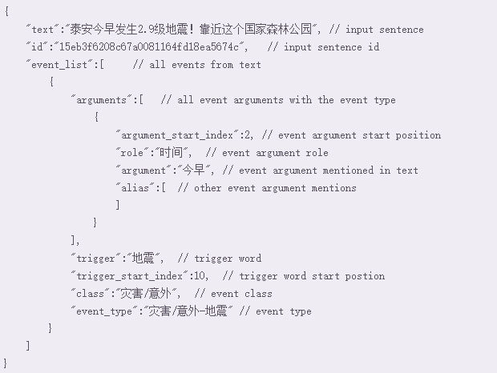

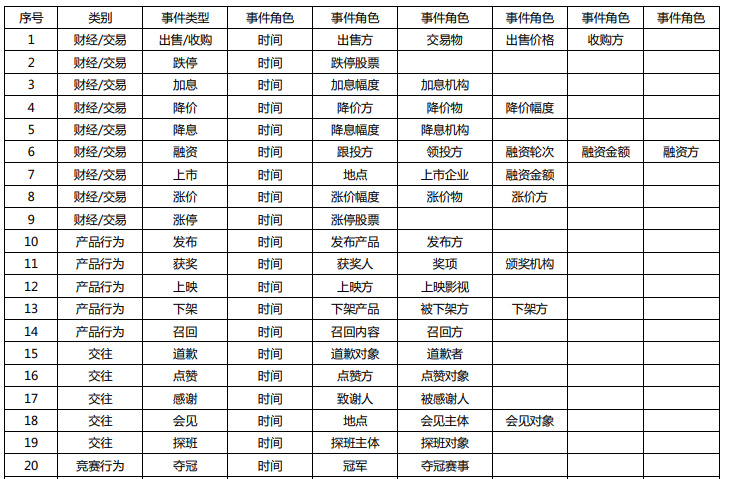


### 远程监督
If two entities have a relationship in a known knowledge base, then all sentences that mention these two entities will express that relationship in some way.
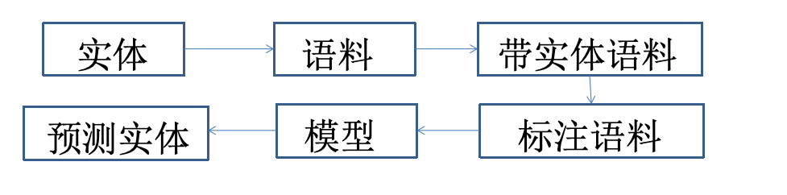

### 练习
将命名实体识别任务代码改造成用Bert来实现。注意：Bert会自动向将文本中添加`[CLS]`和`[SEP]`token会使得句子与Label对不齐的问题。