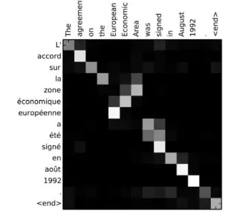
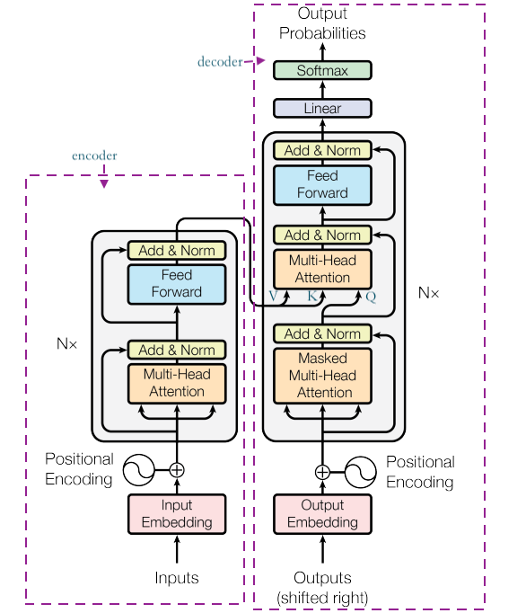
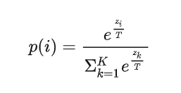

## 文本生成

### 本章重点
- 自回归语言模型
- Attention机制
- encode-decoder与only-Decoder的区别
- 采样策略

### 1. 生成式任务
输出Y没有预设的范围，受输入X影响，在人工智能的各个领域都有，包括很多跨领域任务：
- 图像领域：图像/视频生成, 图像补全等
- 语音领域：语音合成等
- 文本领域：机器翻译等

注：在nlp领域将生成式任务也叫做`seq2seq`任务
特点是输入输出均为不定长的序列，如：机器翻译，机器作诗，自动摘要等


### 2. 生成式任务的做法

#### 2.1 自回归语言模型训练
自回归语言模型的训练目标是用当前字预测下一个字。如下图：

基于语言模型和一段“引言”，生成后续文本，如图所示：

自回归语言模型训练代码参考：[nnlm.py](./code/lstm语言模型生成文本/nnlm.py)

#### 2.2 Encoder-Decoder结构
Encoder-Decoder结构是一种基于神经网络完成seq2seq任务的常用方案，Encoder将输入转化为向量或矩阵，其中包含了输入中的信息，Decoder利用这些信息输出目标值。



#### Attention机制
  


- soft attention机制
代码实现参考：[seq2seq_translation_tutorial.py](./code/传统attention/seq2seq_translation_tutorial.py)
注意：上面代码有些过时，不必完全参考，仅需要关注`AttnDecoderRNN`

相关论文可以参考：[seq2seq+attention.pdf](./code/传统attention/seq2seq+attention.pdf)

- 机器翻译的attention机制示意图如下：

说明：对于当前需要翻译的词，注意力由白向灰递减，即注意力越高越白，注意力越低灰度越高。
 
- 情感倾向
文本中每个词对于结果的影响是不同的，可以认为他们应当被赋予不同的权重，
这种权重也可以称为`attention`。

#### Attention思想
将输入看做key, value组成的键值对，待输出的信息为query
在翻译任务中，key和value一致

- soft-attention

- hard-attention
在one-hot的基础上，将attention向量转换成one-hot形式

### Teacher Forcing
训练过程:
s1:  x1, x2, x3 … xn, 输入 `<sos>` - > y1
s2:  x1, x2, x3 … xn, 输入 `<sos>`,**y1** - >  y2
s3:  x1, x2, x3 … xn, 输入 `<sos>`, **y1**,  **y2** -> y3
粗体部分使用真实标签，则称作`teacher forcing`。

- 问题：
  信息泄漏问题（exposure bias）
- 优点：
  效率高(预测出来的内容无需解码)  

代码实现可参考：[seq2seq_translation_tutorial.py](./code/传统attention/seq2seq_translation_tutorial.py) 第495行左右

### self attention
[《attention  is  all  you  need》](./code/attention_is_all_you_need.pdf)提出transformer结构，用于机器翻译（seq2seq任务）



### Encoder-Decoder 架构

抽象：

#### Mask Attention

- 想要解决的问题：
    在encoder-decoder模型结构中，在Decoder部分存在self-attention计算过程，而在self-attention计算过程中是文本长度 * 文本长度的注意力计算，即每一个文字都见过后续的文字内容，这就导致很严重的信息泄露问题。即我在生成当前字的时候与前面的文本内容计算注意力是合理的，但是不应该与后面还没有生成的文本内容进行计算。为了解决这个问题引入了`Mask Attention`

- 如何解决

说明：图中的`-inf`表示一个负的无穷大的数，即将原本对于文本长度 * 文本长度的矩阵 在不该有值的部分设置成负无穷。

#### 通过Mask控制训练方式
论文：[UniLM](https://arxiv.org/abs/1905.03197) 

说明：通过控制`mask`的形式不同来影响原本是`Decoder`结构向`Encoder-Decoder`或者`Encoder`或`Decoder`转变。

代码实现可参考：[main.py](./code/transformers-生成文章标题/main.py) 

说明：`transformers-生成文章标题`这部分代码是一个文本生成标题的任务，其中引用的模型结构是encode-decoder的很好示例，且包含上面所有的知识点内容的实现。

### 生成式任务的评价指标
#### BLEU
实际上使用了一个真实的样本(可以是人为标注)与模型预测出来的结果做字符级别的匹配算出一个分数，作为这个模型好坏的评估。
- 论文参考：[BLEU.pdf](./code/BLEU.pdf)
- 计算公式
- 使用方法

#### ROUGE

### 生成式任务的常见问题
- 语言模型文本生成结果有时会出现段落不断重复的现象

下图中所示的就是不断重复出现的现象，其原因是语言模型的学习本质上是在学习词与词之间的共现关系，这就意味着当出现某几个字之后(如出现abc)就会出现另外几个字(如def)，那么出现(def)大概率就会出现(abc)。如果模型学习的不到位的话就会出现下面这种内容不断重复的现象。

### 解决办法

1. 模型本身的改建
2. 采样策略相关参数
    - Beam Size
    - Temperature
    - Top K 
    - Top P
    - Repetition Penalty
    - Max memory

#### Beam Size
详细内容可以查看[序列标注任务-2.2.1 篱笆墙解码](../12.序列标注任务/序列标注任务.md)

#### Temperature Sampling
输出每个字的概率分布时，通过参数`T`，对`softmax`部分做特殊处理
temperature越大，结果越随机；反之则越固定。

- 计算公式
    
T值对temperature结果影响的示意图：
    
    
一般情况下T值设置在0.7-1.5之间

#### Top-P/Top-K
- Top – k 采样
采样时从概率最高的K个字中选择

- Top – p 采样（动态）
    采样时，先按概率从高到低排序，从累加概率不超过P的范围内选择，取值范围0-1
    

#### Repetition Penalty（重复惩罚）
Frequency Penalty、Presence Penalty类似，用于限制语言模型输出重复的内容，取值范围 > 1

- 代码实现


#### Max Memory
从后向前，截断送入模型文本，到指定长度
- 示例：
max memory = 3
a   -> model -> b
ab  -> model -> c
abc -> model -> d
bcd -> model -> e
cde -> model -> f


### 指针网络pointer-network
曾经是文本生成任务解决摘要专门使用的方法，摘要任务的特点是：摘要里面的文字一定在原文中出现过，且语种一定相同。 

操作示意图：

### seq2seq预训练
基于seq2seq也可进行模型预训练，bert是一个encoder，采用自编码的方式进行的预训练，seq2seq训练可以得到encoder + decoder。代表：T5


论文参考：[t5.pdf](./code/t5.pdf)

说明：nlp中的所有任务都可以看成是生成式任务

### 章节练习
在bert的基础上传入mask，训练一个语言模型，可基于[lstm语言生成模型](./code/lstm语言模型生成文本/nnlm.py )