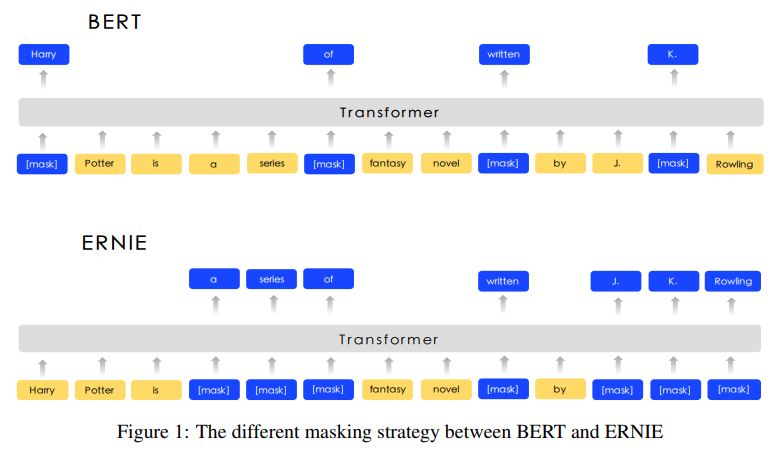
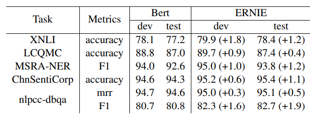

# 大模型

## 1.预训练模型的发展

### 1.1 ELMo
1. 背景
    传统词嵌入模型（如Word2Vec、GloVe）为每个词生成静态向量，无法根据上下文调整词义（例如“苹果”在“吃苹果”和“苹果手机”中含义不同）。ELMo通过动态生成上下文相关的词表示，解决了这一问题。

​2. 模型结构
- ​双向LSTM架构：
ELMo使用双向语言模型，包含两个独立的LSTM：
​前向LSTM：从左到右建模句子，预测下一个词（如根据“I love”预测“coding”）。
​后向LSTM：从右到左建模句子，预测上一个词（如根据“coding”预测“love”）。
- ​多层特征融合：
模型通过叠加多层LSTM捕捉不同粒度的信息：
​底层：语法特征（如词性、句法结构）。
​高层：语义特征（如词义、语境）。
最终，每个词的表示是所有层的线性加权组合（权重可学习），灵活适应不同任务需求。

论文参看：[elmo.pdf](./code/elmo.pdf)
建议的下游任务使用方式：
freeze the weights of the biLM and then concatenate the ELMo vector ELMotaskk with xk and pass the ELMo enhanced representation [xk; ELMotaskk ] into the task RNN

将ELMo向量与词向量拼接输入下游模型

We have introduced <u>a general approach</u> for learning high-quality deep context-dependent representations from biLMs, and shown <u>large improvements</u> when applying ELMo to <u>a broad range of NLP tasks</u>

预训练是一种通用的提升效果的手段

### 1.2 GPT
早于BERT，启用了Transformer作为核心编码器，开始使用特有token连接不同句子。

- 语言模型采取单向(前文预测后文)

- 在语言模型预训练的基础上，增加了有监督任务训练
 基本上实锤了Transformer优于LSTM

- 得出基本结论
    <u>Using unsupervised (pre-)training to boost performance</u> on discriminative tasks has long been an important goal of Machine Learning research. Our work suggests that <u>achieving significant performance gains is indeed possible</u>, and offers hints as to what models (<u>Transformers</u>) and data sets (text with long range dependencies) work best with this approach.

明确指出预训练的是有效的，transformer是好用的

### 1.3 BERT
- BERT与GPT的区别
    - 预训练任务：MASK LM任务(左右预测中间) 
- Next Sentence Predict任务（[cls] xxx [sep] xxx）

证明了MLM预训练强于单向（LTR  left to right）（这个结论的基于当时的尸检结果得出的且并没有针对生成式任务做统计，因此得出的结论有些片面）

- 基本结论：
    Recent empirical improvements due to transfer learning with language models have demonstrated that rich, <u>unsupervised pre-training is</u> an <u>integral</u> part of many language understanding systems.
    Our major contribution is further generalizing these findings to <u>deep bidirectional architectures</u>, allowing the same pre-trained model to successfully tackle a broad set of NLP task

从此以后，预训练就是起跑线

### Ernie-baidu
- 改进措施
    针对于中文而言，bert采用的Mask某个字而言效果并不好，应该Mask某个词更加合理，因此采用： Mask随机token  ->  Mask实体或词组
示意图：


- 改进效果
    在一系列中文数据集上效果强于BERT
  
    以完形填空的方式完成知识问答

  
- 基本结论
    We introduce a new learning processing of language model which masking the units such <u>as phrases and entities</u> in order to <u>implicitly learn both syntactic and semantic information</u> from these units

**这种做法在本质上相当于在预训练中加入了<u>先验知识(词信息)</u>，可以更好的学习该语言**。但是这也意味着对未知语言可能会无法使用该策略

### Ernie- Tsinghua
跟百度撞了名字

Baidu: Enhanced Representation through Knowledge Integration

Tsinghua: Enhanced Language Representation with Informative Entities


- 做法区别
    引入知识图谱，将实体信息融合到预训练任务中
    
    下游fine-tune修改，对于不同实体分类和关系分类引入了两种token来加强模型对实体信息的认知
    

- 基本结论
    It demonstrates <u>extra knowledge helps</u> the model make full use of small training data, which is important for most NLP tasks as large-scale annotated data is unavailable.

**强调了额外知识的重要性**，但是Ernie本身其实缩小了encoder主体模型，还缩短了训练句长，最终并没有很惊艳的效果，只在图谱挖掘相关的任务上有提升。而且这种方法对额外知识的依赖很难满足。可以看做他们对自己图谱工作的一种延伸

### GPT2
论文参看：[gpt2.pdf](./code/gpt2.pdf)
继续使用单向语言模型，继续使用transformer结构（小改)，Bigger model，more data
强调zero-shot（零样本学习）​ 是机器学习中的一种方法，指模型在**从未见过特定任务或类别的训练数据**的情况下，直接完成该任务或识别新类别。其核心思想是**利用模型已有的知识或泛化能力**，通过理解任务描述或属性，泛化到未知场景。任何一个任务，可以看做生成式任务,所有任务可以概括为：
以翻译任务为例，希望语言模型输出：


- 基本结论
    The <u>diversity of tasks </u>the model is able to perform in a <u>zero-shot setting</u> suggests that high-capacity models trained to maximize the likelihood of a sufficiently varied text corpus begin to learn how to perform a surprising amount of tasks <u>without the need for explicit supervision</u>

大规模语言模型可以在不做有监督训练的情况下，完成许多任务


### UNILM
<u>UN</u>Ified pre-trained <u>L</u>anguage <u>M</u>odel，使用Bert的模型结构，同时进行Mask LM，单向LM，和seq2seq训练，使得预训练后模型可以更好的应用在生成式任务上，如机器翻译和机器摘要等。



依靠mask控制哪些词参与context embedding的计算

- 基本结论
    We propose a unified pre-training model, UNILM, which is jointly optimized for several LM objectives with shared parameters. The <u>unification of bidirectional, unidirectional, and sequence-to-sequence LMs</u> enables us to straightforwardly fine-tune the pre-trained UNILM for both NLU and NLG tasks
解决了原生BERT在生成式任务上的短板  

### Transformer-XL & XLNet
#### Transformer-XL
希望解决Transformer的长度限制问题
1. 循环机制  Recurrence Mechanism
 实现方式： 参考了RNN机制，将隐单元向量不断向后传递。在Transformer中，将前一段文本的隐向量与后一段文本印象里拼接之后计算attention
 
 - 计算公式
 

2. 相对位置编码  Relative Positional Encodings

 说明：R(i-j)用于计算位置i到位置j的距离并根据数值表查找该位置的值然后代入进行计算
 
#### XLNet

论文参看：[xlnet.pdf](./code/xlnet.pdf)
##### 前序

- AR语言模型  auto regressive language model
单向预测下一个字
缺点：缺少双向信息
代表：GPT

- AE语言模型 auto encoding language model
双向信息输入，预测中间某个mask的字
缺点：引入了[mask]，但实际任务中不不存在
代表：BERT

##### XLNet做法
AR语言模型与AE语言模型融合Permutation Language Model，调整句子顺序，之后进行单向预测


- 基本结论
    XLNet is a generalized AR pre-training method that uses a <u>permutation language modeling</u> objective to combine the advantages of AR and AE methods
修改训练目标，同时修改模型结构，带来效果提升
MLM -> PLM               transformer -> transformer-xl

### Roberta
论文参看：[roberta.pdf](./code/roberta.pdf)
Robustly optimized BERT approach
模型结构不变，训练方式调整：
1）更多的数据，更大的batch size，更久的训练
2）去掉next sentence prediction 
3）使用更长的样本
4）动态改变mask位置

- 基本结论
    We find that BERT was <u>significantly undertrained</u>, and can match or exceed the performance of every model published after it.

    These results illustrate the importance of these previously overlooked <u>design decisions</u> and suggest that BERT’s pre-training objective <u>remains competitive</u> with recently proposed alternatives. 

**挖掘旧的方法的潜力，有时比创新还要有效**,能够最大限度的发挥一种算法的能力，是算法工程师能力的体现

### SpanBert
论文参看：[spanbert.pdf](./code/spanbert.pdf)
与BERT的主要区别有三个：
1. 去掉了NSP任务
2. 随机mask几个连续的token
3. 新的预训练任务SBO（Span Boundary Objective）


说明：P3表示预测词在mask中所处的位置

- SBO任务
Xs-1代表mask片段之前的第一个token的Embedding
Xe+1代表mask片段之后的第一个token的Embedding
Pi-s+1代表目标token的Position Embedding

- SBO预测层


- Mask片段长度采样分布

- Mask指定实体或名词短语，效果不如mask随机片段
 
NSP作用不大，不如不加，不如SBO

- 基本结论
    While others show the benefits of adding more data and increasing model size, this work demonstrates the importance of <u>designing good pre-training tasks</u> and objectives, which can also have a remarkable impact.

大模型+更多的数据不是唯一出路，改变训练目标也有很大影响

### ALBERT
试图解决Bert模型过大的问题，想办法减少参数量
论文参看：[albert.pdf](./code/albert.pdf)
1. Factorized embedding parameterization
   Embedding层的因式分解
O(V × H)   ->  O(V × E + E × H)
V = 词表大小           30000
H = 隐单元个数         1024
E = 指定Embedding大小  512   （原生Bert无此参数）

参数量
V x H                             = 30720000
V x E + E x H = 15360000 + 524288 = 15884288

2. Cross-layer parameter sharing
    跨层参数共享
跨层参数共享，有多种共享方式：
- 只共享attention部分
- 只共享feed-forward部分
- 全部共享


3. SOP任务替代NSP任务
Sentence order prediction
预测两句话的前后关系，同样是二分类任务
[CLS] 你好啊bert [SEP] 好久不见 [SEP] -> Positive
[CLS] 好久不见 [SEP]你好啊bert [SEP] -> Negative

- 局限性：
1.虽然目的在于缩减参数，但依然是越大越好
2.虽然缩减了参数，但是前向计算速度没有提升（训练速度有提升）

- 基本结论
    Given the importance of model size, we ask: <u>Is having better NLP models as easy as having larger models</u>?
    we are able to scale up to much larger ALBERT configurations that still have fewer parameters than BERT-large but achieve significantly better performance

工程角度讲价值不大，但是证明了参数量并非模型能力的绝对衡量标准

### DistillBert 模型蒸馏技术
论文参考：[distillbert.py](./code/distillbert.py)
小模型从大模型输出的概率分布进行学习

#### KL散度
KL散度是一种衡量两个概率分布（也可简单理解为向量）之间差异的算法。经常作为神经网络的loss函数使用。
与交叉熵计算过程实际非常接近，但交叉熵通常要求target是one-hot形式。

### T5
Text-to-Text Transfer Transformer
Seq2seq理论上可以解决一切NLP问题
 - 分类问题：文本  ->  标签
 - 命名实体识别：文本  ->  实体
 - 摘要、翻译：文本  ->  文本
 - 回归问题：文本 -> 0.1(字符串)


- 翻译
<Translation ZH-EN> 你 好 吗  ->  How are you

- 摘要
 原 文 本…….   ->  摘 要 文 本…

- 分类
<Classification> A 股 市 场…. ->  金 融

通过自定义的token区分任务，共享模型和解码方式

- 预训练任务设计  text corruption

- 基本结论
    Our text-to-text framework provides <u>a simple way</u> to train a single model <u>on a wide variety of text tasks</u> using the same loss function and decoding procedure. We showed how this approach can be successfully applied to <u>generative tasks</u> like abstractive summarization, classification tasks like natural language inference, and even <u>regression tasks</u> like STS-B

迈向NLP的大一统

### GPT3
论文参考：[GPT3.pdf](./code/GPT3.pdf)
1750 亿参数量，是GPT-2的116倍，模型结构与GPT-2相同，继续使用单向语言模型预训练

- 并没有采用Pre-training + fine-tune
理由：
1、fine-tune需要的数据，经常是缺失的
2、fine-tune会涉及对模型进行改造，使其变复杂，并失去泛化性
3、人类学习做新任务并不需要很多样本

- Pre-training + Zero-, One-, Few-shot


- 基本结论
    Aside from pointing to a conceptual limitation in our current NLP techniques, this adaptability has practical advantages – it allows humans to <u>seamlessly mix together or switch between many tasks and skills</u>, for example performing addition during a lengthy dialogue. To be broadly useful, we would someday like our<u> NLP systems to have this same fluidity and generality</u>.

人工智能的目标：像人一样的学习能力

### 从“续写”到“回答”

#### 续写

#### 回答

### InstructGPT

论文参考：[InstructGPT.pdf](./code/InstructGPT.pdf)

#### SFT
SFT 是 ​Supervised Fine-Tuning​（监督微调）的缩写，指在预训练模型的基础上，​**通过有监督的标注数据对模型进行进一步训练**，使其适应特定任务或输出要求。

- ​流程：
1. ​预训练 → ​SFT → 可选的其他优化（如RLHF，基于人类反馈的强化学习）。
2. SFT 通常是模型对齐（Alignment）的第一步，为后续优化提供基础。

- 训练方法：
1. 使用交叉熵损失函数，通过监督学习调整模型参数，使其生成结果匹配标注数据。
2. 通常在小规模（千到百万级）高质量数据上进行，训练轮次较少，避免过拟合。

说明：需要提供足够的问答对，再进行一定的微调即可实现。一般做法是先找一个开源大模型，先进行测试输入问题，查看回答的答案是否符合标准，然后根据自己公司的实际情况提供问答对，在进行训练。

实现上的差别：采用mask，mask形状可以参考unilm的seq2seq的mask形状。

### 章节练习
基于bert的结构尝试使用sft的mask来完成sft的任务，数据可以使用生成式任务中标题加文章的数据。输入文章标题输出文章或输入文章输出文章标题。