# In Context Learning

## 为什么ICL离谱
下图展示的代码片段是传统的机器学习过程：
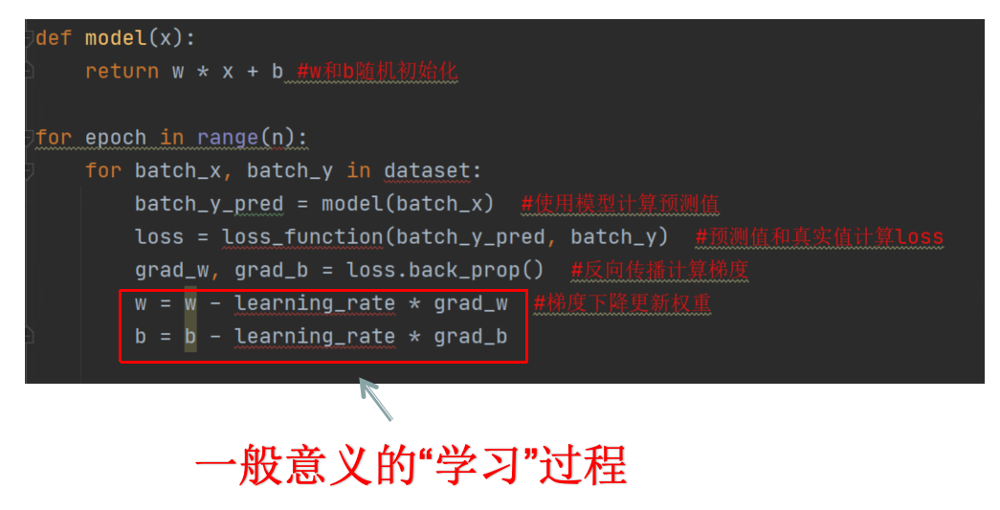
但是ICL的过程相当于在上面代码片段的如下代码中发生：
```
batch_y_pred = model(batch_x) 
```

### ICL优势
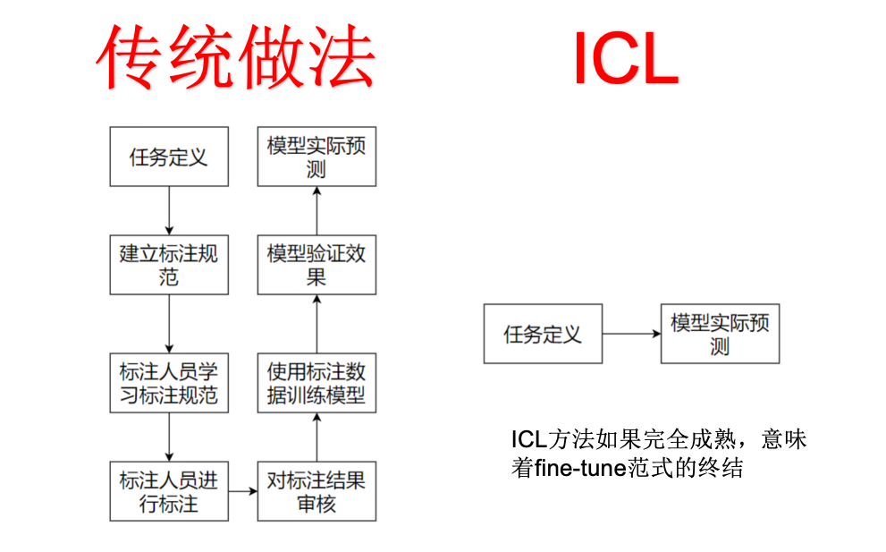

### ICL的相关研究
关于ICL的成因，目前学术界没有被广泛认可的解释，只有若干假说和一些表现分析。一些reference：
- Brown, T. B., Mann, B., Ryder, N., Subbiah, M., Kaplan, J., Dhariwal, P., … & Amodei, D. (2020). Language models are few-shot learners. In Advances in Neural Information Processing Systems (Vol. 33, pp. 1877-1901).  arXiv link: [https://arxiv.org/abs/2005.14165](https://arxiv.org/abs/2005.14165 )
- Akyurek, E., Schuurmans, D., Andreas, J., Ma, T., & Zhou, D. (2022). What learning algorithm is in-context learning? Investigations with linear models. In International Conference on Learning Representations.   [https://arxiv.org/abs/2211.15661](https://arxiv.org/abs/2211.15661)
- Citation: Wang, Y., Si, S., Li, D., Lukasik, M., Yu, F., Hsieh, C., Dhillon, I., & Kumar, S. (2021). Preserving In-Context Learning ability in Large Language Model Fine-tuning. arXiv preprint arXiv:2211.00635.    arXiv link: [https://arxiv.org/abs/2211.00635](https://arxiv.org/abs/2211.00635)
- Jason Wei, Xuezhi Wang, Dale Schuurmans, Maarten Bosma, Brian Ichter, Fei Xia, Ed H. Chi, Quoc V. Le, and Denny Zhou. Chain-of-thought prompting elicits reasoning in large language models. In Proceedings of the 36th Conference on Neural Information Processing Systems (NeurIPS 2022), 2022.    [https://arxiv.org/abs/2201.11903](https://arxiv.org/abs/2201.11903)
- Sang Michael Xie, Aditi Raghunathan, Percy Liang, Tengyu Ma. An Explanation of In-context Learning as Implicit Bayesian Inference. In Proceedings of the 10th International Conference on Learning Representations (ICLR), 2022.  https://arxiv.org/abs/2111.02080
- Qingxiu Dong, Lei Li, Damai Dai, Ce Zheng, Zhiyong Wu, Baobao Chang, Xu Sun, Jingjing Xu, Lei Li, and Zhifang Sui. 2023. A Survey on In-context Learning.   [https://arxiv.org/abs/2301.00234](https://arxiv.org/abs/2301.00234)


### z-s,o-s,f-s属于ICL
Brown et al,,Language Models are Few-Shot Learners,arXiv:2005.14165,2021
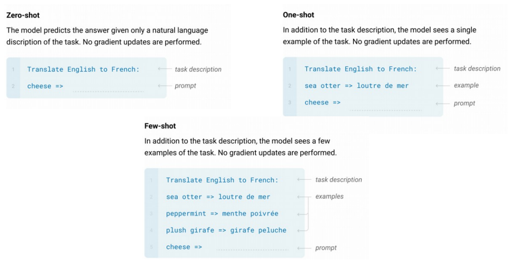

### chain-of-thought属于ICL
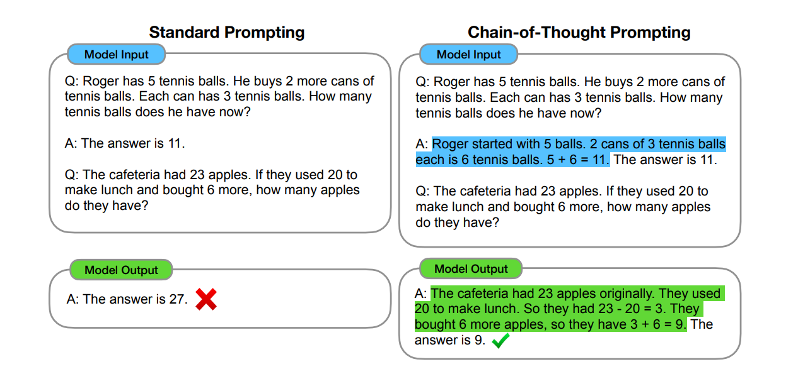
在输入中加入至少一个样本，能大幅提升ICL效果
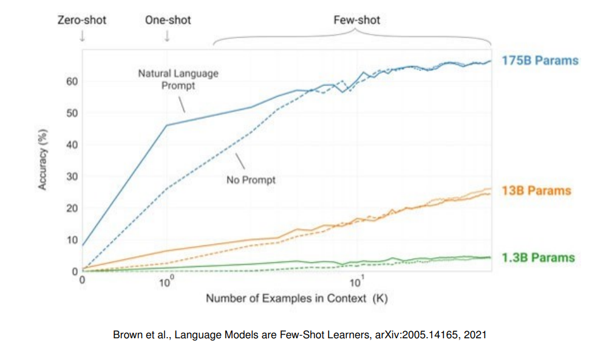

### fine-tune会伤害ICL
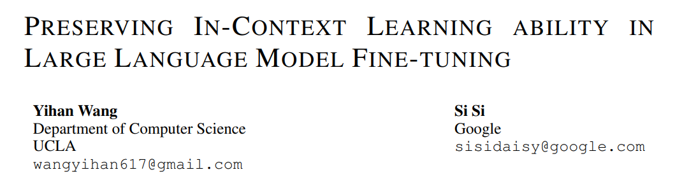
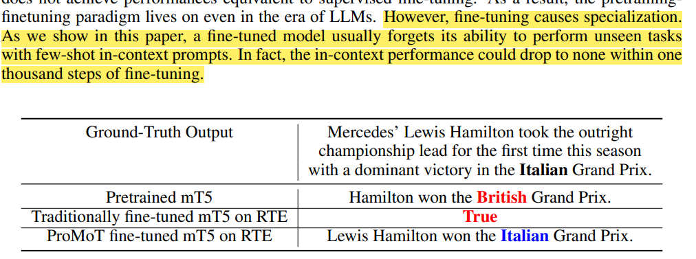


### 精巧prompt设计有可能超过os,fs
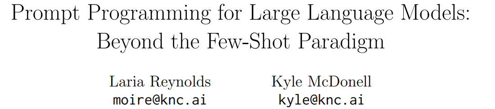
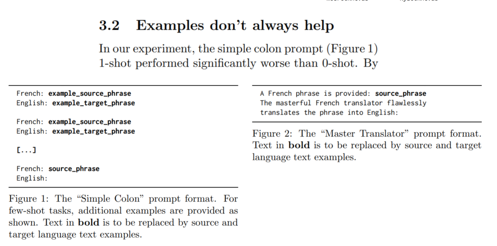

### Magical word
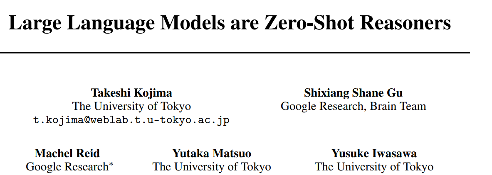

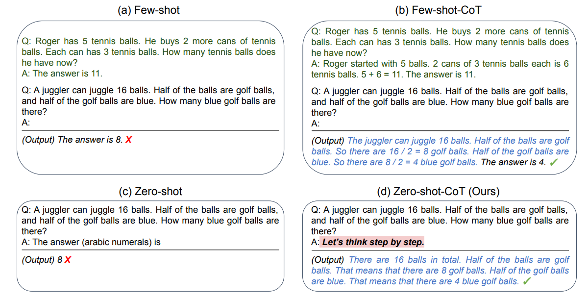
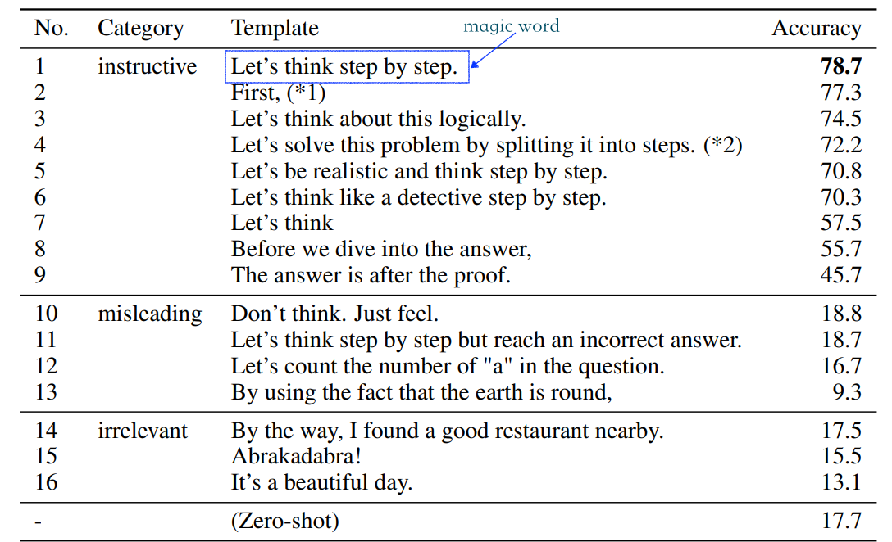


#### ICL时 输入错误样本，不一定影响准确率
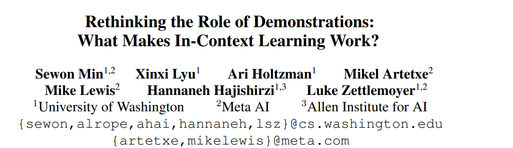
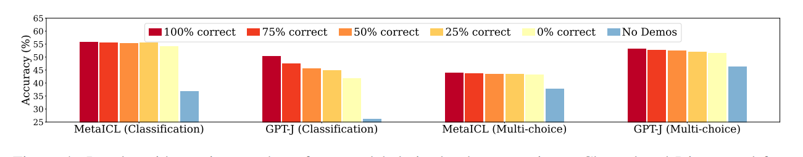
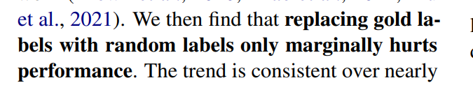

#### ICL可以压倒先验知识

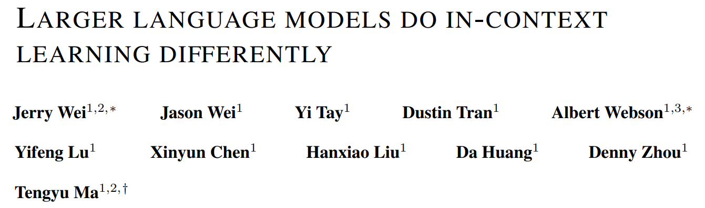
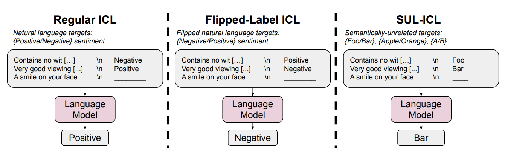

### ICL成因的两种看法
 1. meta learning  大模型能在内部训练小型网络
 2. Bayesian Inference 
 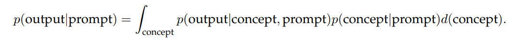
 
### ICL要点
1. 语言模型规模
2. prompt中提供的examples数量和顺序
3. prompt的形式（format）


### fine-tune vs ICL
|        | fine-tune| in context learning |
|--------|---------|---------------------|
| 优点   | 有一定可能从一个相对小的模型中，获得还可以的结果   | 1.除了基础模型之外，不需要其他资源 2.快速落地，快速调整 3.适应各种任务           |
| 缺点   | 1.需要训练数据（以及时间、机器等）2.能力变得局限           | 1.必须是个大模型 2.有context长度限制（研究如何利用LLM调度外部数据是个重点，类似bing，用于规避context长度限制） |
| 共同点 | 1.以预训练模型为基座 2.生成结果不完全可控 3.没有可解释性 |

