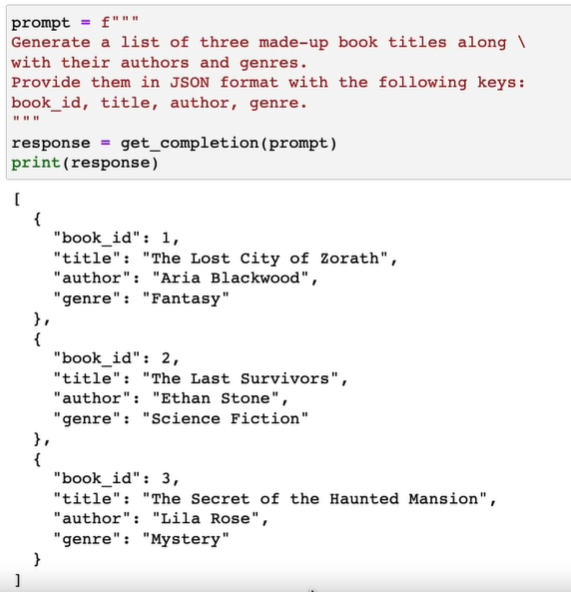

# 提示工程 prompt engineering

## 基本介绍
语言模型Language Model根据上文，计算下一个字的概率分布
不断依照概率选取下一个字，迭代生成文本

- 语言模型生成文本的基本特点：
1. 黑盒
2. 相似的表达，不一定有相似的回复
3. 完全相同的输入，也可以有不同的结果
输入的文本，也称为prompt


### 提示工程 prompt engineering

- 提示工程（Prompt Engineering）是一门较新的学科，关注提示词开发和优化，帮助用户将大语言模型（Large Language Model, LLM）用于各场景和研究领域。 掌握了提示工程相关技能将有助于用户更好地了解大型语言模型的能力和局限性。

- 研究人员可利用提示工程来提升大语言模型处理复杂任务场景的能力，如问答和算术推理能力。开发人员可通过提示工程设计、研发强大的工程技术，实现和大语言模型或其他生态工具的高效接轨。

- 提示工程不仅仅是关于设计和研发提示词。它包含了与大语言模型交互和研发的各种技能和技术。提示工程在实现和大语言模型交互、对接，以及理解大语言模型能力方面都起着重要作用。用户可以通过提示工程来提高大语言模型的安全性，也可以赋能大语言模型，比如借助专业领域知识和外部工具来增强大语言模型能力。

### 提示工程的优势


### 使用注意事项

1. 安全问题
       目前网上的许多类chatgpt项目是以接口方式提供服务，输入问题都会被发送到对方服务器，需要注意数据安全

2. 可信度问题
       1)语言模型的生成结果本身具备一定随机性
       2)语言模型可以生成完全错误，但看起来通顺的文本

3. 时效性与专业性
        脱离网络的语言模型受制于训练数据的时效性，在细分专业领域的回答受数据质量和数量限制 
        
### 应用场景


能  ≠  适合

- 适合使用提示工程来完成的场景，原则建议：
1、自己完全能够完成，但是很花时间
2、自己没有完整思路，但完全能够判断结果的正确性
3、纯创意型场景（没有正确性要求）
 
- 不建议的场景：
1、获取自己不熟悉的领域的信息，或实时性信息
2、数字计算型任务
3、处理分析很大量的数据


### prompt相关技巧

#### 模型相关参数的设置





#### 中英文prompt
 
由于chatgpt是英文训练语料为主，一般来说使用英文会强于中文，但是区别没有想象的那么大
如无特殊需求，中文一般可以满足需要，不必强行配合翻译软件使用

### prompt结构示例


### prompt基础结构示例

### 其他模板示例
#### Role-Task-Format (角色-任务-格式)

- 角色: 指定大模型的角色，比如“你是一个市场营销专家”。
- 任务: 明确任务，例如“你需要制定一个推广策略，为运动品牌推广新的健身服装”。
- 格式: 指定输出格式，如“你的输出应包括品牌核心信息、视觉元素设计、以及定位目标用户的策略等”。

#### Task-Action-Goal (任务-动作-目标)

- 任务: 确定模型的任务，如“评估团队成员的表现”。
- 动作: 描述执行的动作，例如“分析每个团队成员的优势和劣势”。
- 目标: 设定明确的目标，如“提升团队的整体表现，使客户满意度提高”

#### Before-After-Bridge (之前-之后-桥梁)

- 之前: 描述当前状态，如“我们目前在搜索引擎结果页的排名是第50位”。
- 之后: 明确期望结果，如“我们希望在三个月内进入前10名”。
- 桥梁: 描述实现目标所需的步骤，如“制定和执行一个全面的搜索引擎优化策略”。

#### Context-Action-Result-Example (环境-行动-结果-例子)

- 环境: 提供问题或活动的背景信息，例如“为了提升品牌形象，推广我们的环保材料制成的新鞋”。
- 行动: 描述要执行的具体行动，如“通过社交媒体进行一系列营销策划，重点突出鞋子的环保材料”。
- 结果: 预期结果，如“提高消费者对品牌的认识，并增加销量”。
- 例子: 提供类似的成功案例，如“从知名鞋类品牌与环保公司合作的例子寻找灵感。”


#### Role-Input-Steps-Expectation (角色-输入-步骤-期望)

- 角色: 明确大模型的角色，如“你是内容策划人员”。
- 输入: 提供必要的输入信息，比如输入给大模型目标受众的兴趣和行为数据。
- 步骤: 描述必须执行的步骤，如“制定一套详细的内容发布计划”。
- 期望: 设定期望结果，比如“增加我们账号的月访问量，并提升品牌在行业中的地位”。

### Prompt 调优建议方法 

- 设定自己的角色
- 设定chatgpt的角色
- 详细、明确的描述
- 提供背景信息
- 思维引导
- 合理使用分隔符
    
     - 文本摘要Prompt:  
        Summarize the text delimited by triple backticks into a single sentence.
        ```{text}```

- 给模型拒识出口
    如果模型无法完成分配的任务，有时为模型提供一个“出口”会有所帮助。例如，当对一段文本提出问题时，可能加入诸如<u>“如果答案不存在，则用'未找到'回答”</u>之类的内容。这可以帮助模型避免生成错误响应。
    如：命名实体识别Prompt:  
找到文中的提到的人名、地名、机构名，以json形式输出。如果未找到，输出None
```{text}```

- 要求结构化输出
    

- 拆解任务步骤


- 利用一些法则


- 让AI自己提问


- 提供示例 Few shot
        
    - Prompt:
The odd numbers in this group add up to an even number: 4, 8, 9, 15, 12, 2, 1.
A: The answer is False.
The odd numbers in this group add up to an even number: 17,  10, 19, 4, 8, 12, 24.
A: The answer is True.
The odd numbers in this group add up to an even number: 16,  11, 14, 4, 8, 13, 24.
A: The answer is True.
The odd numbers in this group add up to an even number: 17,  9, 10, 12, 13, 4, 2.
A: The answer is False.
The odd numbers in this group add up to an even number: 15, 32, 5, 13, 82, 7, 1. 
A:

  - Answer:
        The answer is True.

- Few shot with Chain-of-Thought

    - Prompt：
The odd numbers in this group add up to an even number: 4, 8, 9, 15, 12, 2, 1.
A: Adding all the odd numbers (9, 15, 1) gives 25. The answer is False.
The odd numbers in this group add up to an even number: 17,  10, 19, 4, 8, 12, 24.
A: Adding all the odd numbers (17, 19) gives 36. The answer is True.
The odd numbers in this group add up to an even number: 16,  11, 14, 4, 8, 13, 24.
A: Adding all the odd numbers (11, 13) gives 24. The answer is True.
The odd numbers in this group add up to an even number: 17,  9, 10, 12, 13, 4, 2.
A: Adding all the odd numbers (17, 9, 13) gives 39. The answer is False.
The odd numbers in this group add up to an even number: 15, 32, 5, 13, 82, 7, 1. 
A:

- 插件
插件可以理解为其他应用或者产品，为AI模型准备的接口，插件称为模型的“眼睛”和“耳朵”，“手”和“脚”，帮助模型获取信息，并完成具体事务

- 插件prompt原理
初始prompt：
  你是一个智能助手，目标是解决用户提出的问题。请根据用户提出问题判断，是否有必要使用以下工具进行辅助：
1、计算工具 （用于完成数值计算类任务，需要给出计算公式）
2、天气查询工具  （查询指定地区的天气情况，需要给出查询地点）
3、写邮件工具   （将一个Email发送给指定对象，需要给出邮件内容及对象）
用户问题：
{user query}

user query:北京明天什么天气？

model: poi = 北京, weather_search(poi) ==》    output: 晴
prompt:{poi}明天的天气情况为{output}, 请将这一信息输出给用户

model:北京明天天气为晴天

