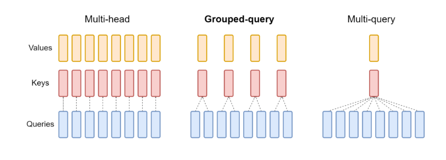
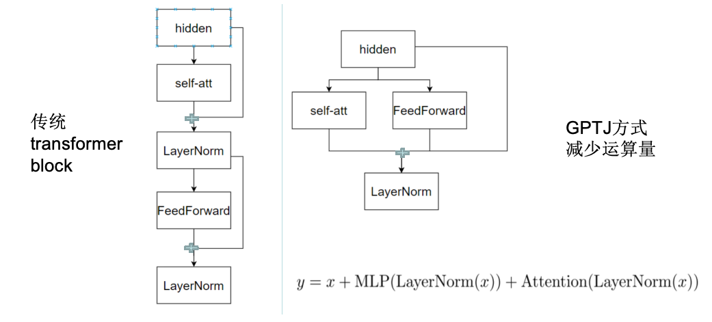
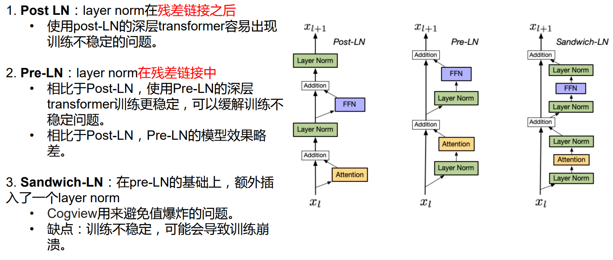
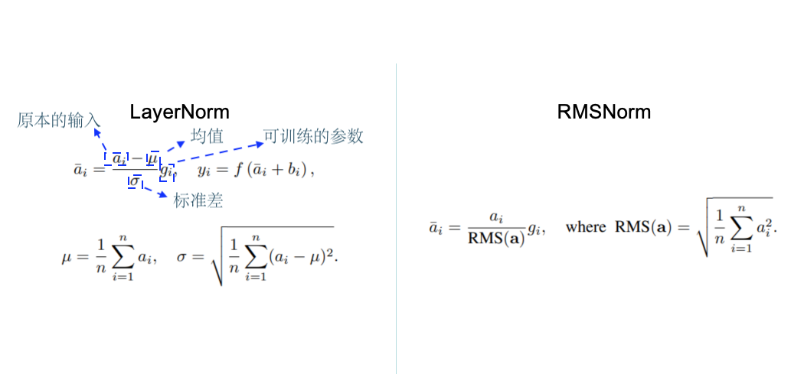
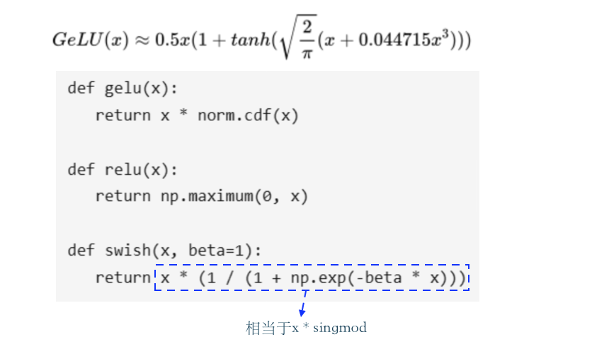
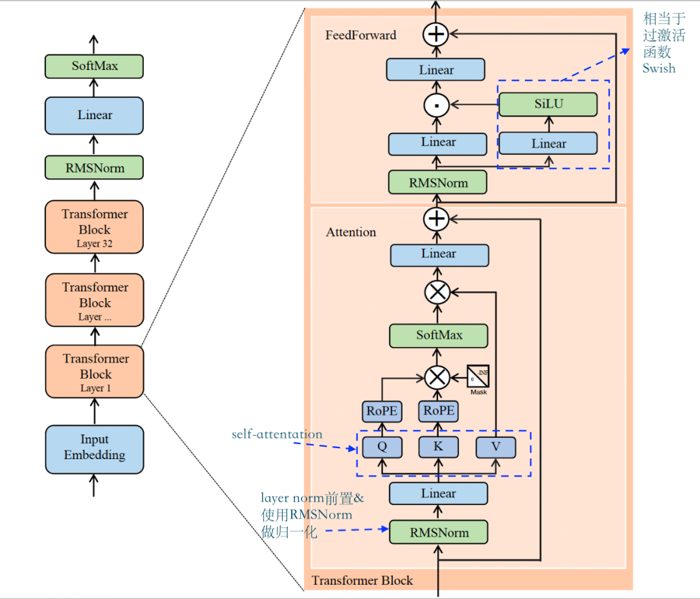
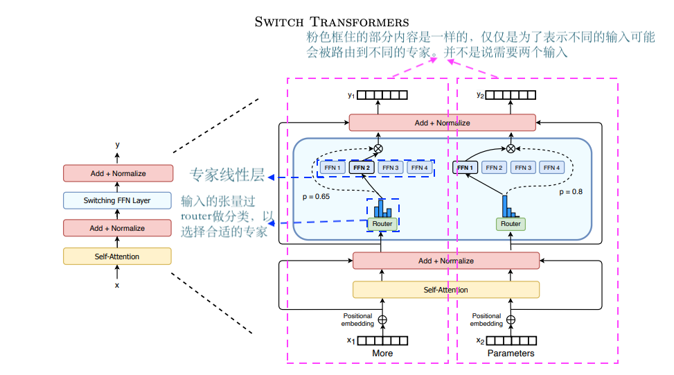
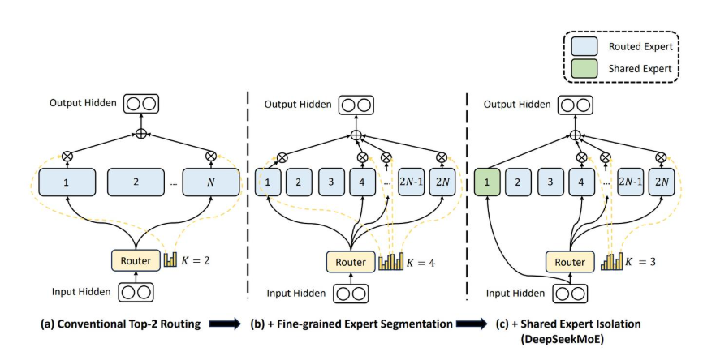
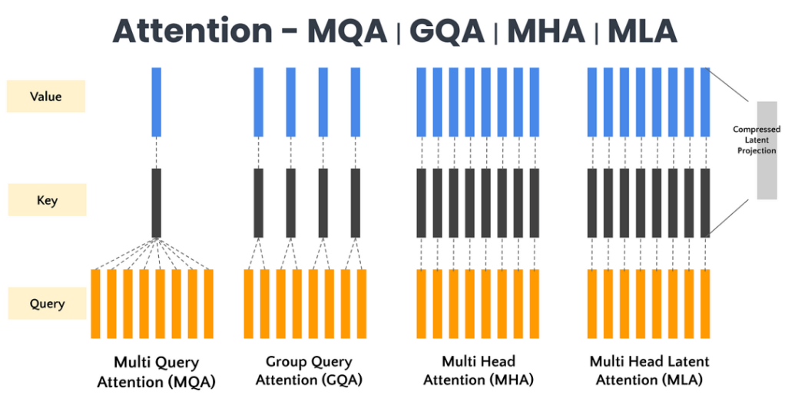
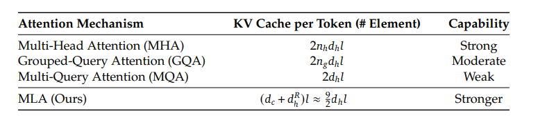

# LLM模型结构上的变化

### multi-head共享
- 目的：减少运算量，加速训练

说明：`multi-query`相较于multi-head拥有12个L（文本长度） *  64（以BERT的参数为例，BERT的形状是L * 768）而言，只保留了一个 L * 64，即图中的中间粉红色部分。做法就是将原来的矩阵(768 * 768)变成（768 * 64）然后与经过emdedding的输入向量（L * 768）进行计算。`Grouped-query`没有`multi-query`那么极端而是保留4个。

### attention结构

GPTJ结构，平行放置attention layer和feed forward layer
moss, palm用的这种结构，目前不算太主流



#### 归一化层位置选择
目前主流做法是将Norm层提前到attention之前，即Pre-LN

#### 归一化函数变化

| ​归一化方法 | 核心思想  | 主要目标     | 适用范围 | 优点 |  缺点 |
|------------|:-------------------------------------------------------------------------------|:------------------------------------------------------|:--------------|:--------------|:--------------|
| Layer Norm | 对每个样本的所有特征维度进行均值方差归一化，保留缩放（γ）和平移（β）参数。            | 稳定各层输入分布，加速收敛                             | 标准Transformer（如BERT、GPT-2）的Post-LN结构（归一化在残差之后）。 | 稳定训练过程，广泛适用于大多数深度模型。 | 在极深层（如100层以上）中容易出现梯度消失或爆炸。 |
| RMSNorm    | 移除Layer Norm的均值中心化，仅通过均方根（RMS）​进行缩放，减少计算量。              | 提升计算效率，适用于对均值不敏感的激活函数（如ReLU）。    | 对计算效率要求高的场景（如T5、LLaMA），或使用ReLU等激活函数的模型 | 减少30%计算量，性能接近Layer Norm。 | 对均值敏感的任务（如语言建模）可能略逊于Layer Norm|
| Deep Norm  | 在Layer Norm基础上，​调整残差连接与归一化顺序，并引入额外缩放因子，增强深层稳定性。 | 解决极深层网络（如千层Transformer）的梯度爆炸/消失问题。 | 超深层Transformer（如微软的DeepNet，包含1000+层）。 | 通过缩放因子 α 缓解梯度消失，允许更深的网络堆叠；调整残差顺序（类似Pre-LN），避免梯度爆炸  |  需要手动调整 α，对浅层模型可能带来过大的梯度波动 |

#### 激活函数变化
目前主流是Swish
### LLama2结构
说明：关于RoPE部分可以参考[位置编码和长度外推性](./位置编码和长度外推性.md)

## Feed forward

### MoE(Mix of Expert)架构 混合专家模型
Mixtral是该架构，据传GPT4也是（不确定）

说明：专家并不是传统意义上的专家，即不是说这个线性层可以专门处理某一类问题。整体还是要当成黑盒来看，设计的初衷还是希望不同的线性层可以专注于不同的任务，具体是什么任务我们不得而知。

### DeepSeek Moe
如下图所示，增加了“共享专家”，总是会使用这个“专家”进行计算，其余的按照传统moe方式由模型自己挑选

 
### DeepSeek MLA

### 章节练习
阅读Code文件夹中的多种模型项目代码并完成[对比](./code/对比.xls)
 