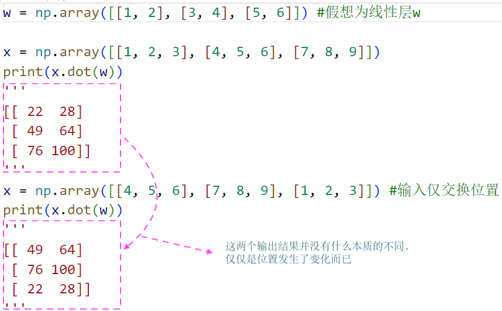
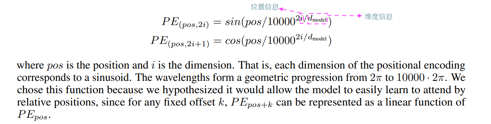
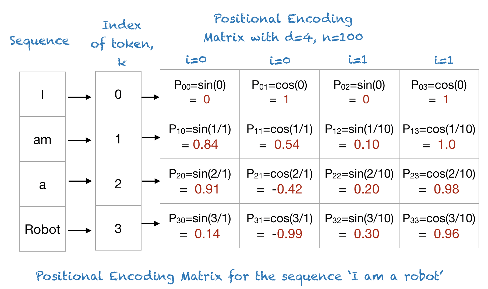
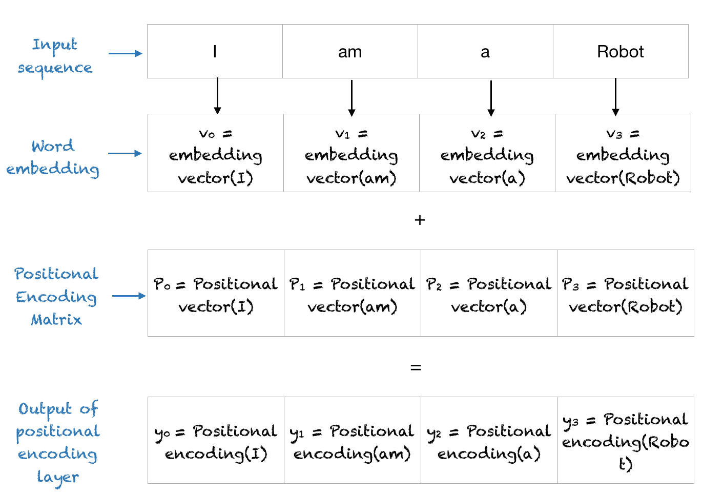
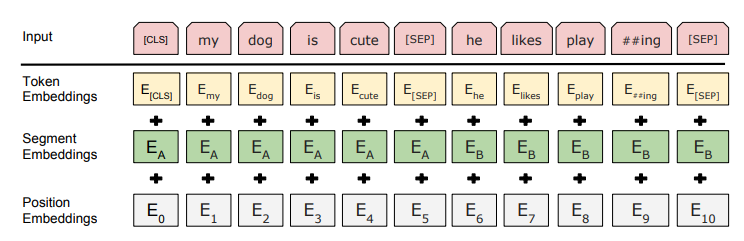
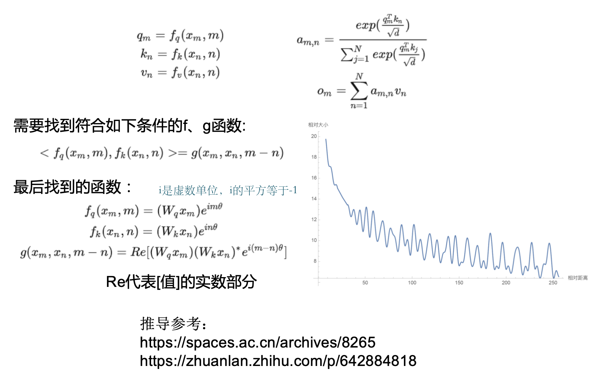
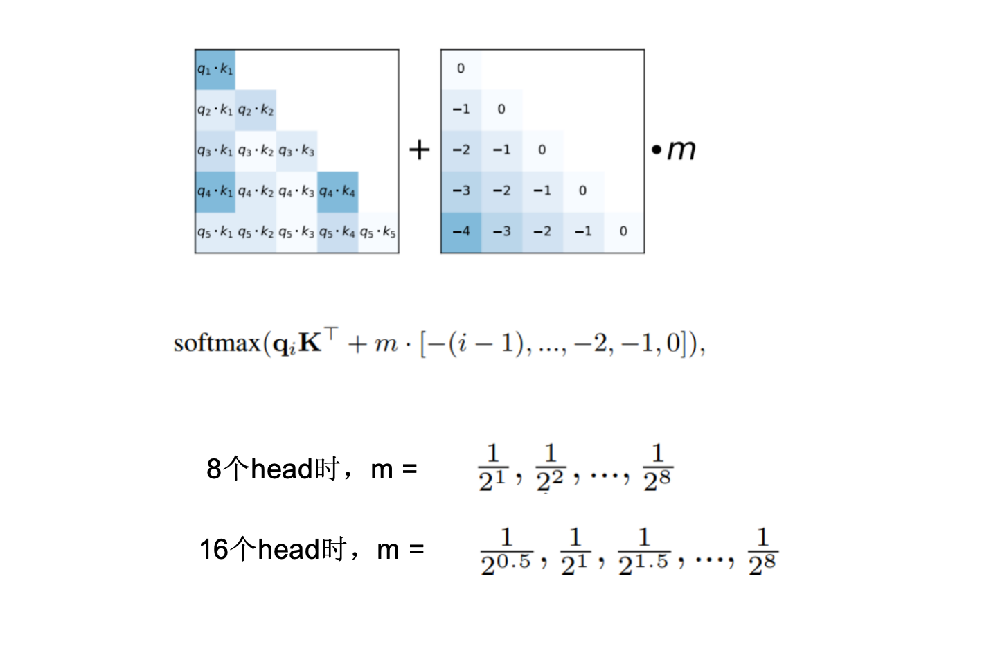
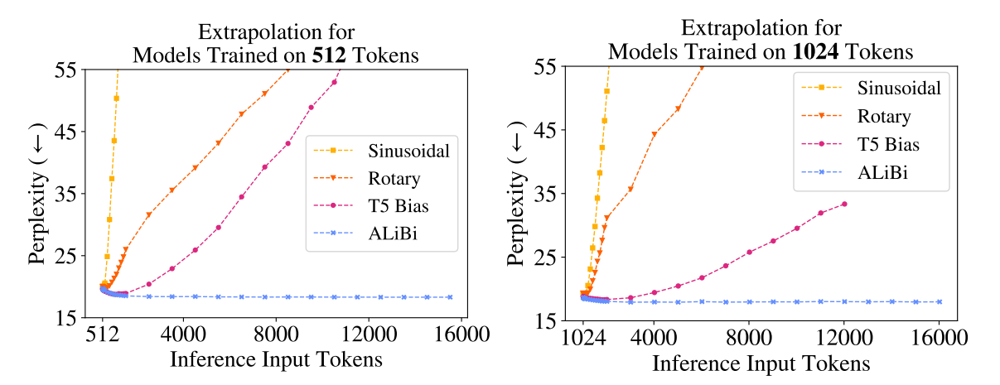

# 位置编码和长度外推性

## 为何需要位置编码
由于transformer中使用的都是线性层，编码过程中没有明显的位置信息，字词位置的交换，仅相当于矩阵中行位置的交换，这带来并行计算的优势，但是也弱化了语序信息，因此需要引入位置编码来弥补。

说明：上面的代码过程展示的就是没有明显位置信息的示例

## 长度外推性
预测时序列长度比训练时候长，模型依然有好的表现，称为有较好的长度外推性。长度外推性是一种理想的性质，并非是必要的
比如：
训练样本最大长度512，预测过程输入样本长度1024。

### 目前的主流位置编码

| 模型               | 位置编码       |
|--------------------|----------------|
| 原始Transformer    | 正余弦位置编码 |
| Bert               | 可学习位置编码 |
| ChatGLM、LLama      | RoPE位置编码  （llm中的主流） |
| Baichuan 13B、Bloom | Alibi位置编码  （llm中的主流）|


#### 正余弦位置编码
在Attention is all you need 论文中提出，本质上是一种查表，将值代入公式中计算出某个位置固定的向量 
- 优点
无须训练，可以外推


#### 可学习位置编码
位置编码向量 + token向量 得到编码后的`embedding`，我们称之为`Positional Encoding`

一般`position embedding`以Bert为代表，如同`token embedding`一样，随机初始化之后，靠梯度反传学习调整，缺点在于无法外推，需要预设最大长度。


- 优点
可学习，更加贴合模型
- 缺点
没有外推性

#### ROPE相对位置编码
论文参看：[rope.pdf](./code/相对位置编码/rope.pdf)
代码实现：[rope.py](./code/相对位置编码/rope.py)

说明：以self-attention来举例说明，self-attention是一个L * L的矩阵，那么每个字都会得到与其他字的关系，那么这个关系如果是和这个两个字相对距离差相关的话，就可以认为携带了一定的位置信息。举例说明：在L * L的矩阵里面，假设第一个字与第四个字之间的注意力值与4-1的差值相关，那么就可以认为携带了位置信息。公式中的`g(x(m),x(n),m-n)`中的`x(m)`可以看成是第一个字embedding之后的向量值，`x(n)`可以看成是第四个字embedding之后的值。我们希望找到这样的函数`f`在输入`x(m)`与其位置信息m在与函数`f`在输入`x(n)`与其位置信息n进行点乘(即计算Q * K.T)的结果与`x(m)`，`x(n)`，以及(m-n)都相关的话就可以了。 

简述实现原理：在Q，K相乘的时候使用，用来解决在Q,K相乘中每两个字计算attention的时候让它的值和相对位置有关，是通过对Q，K各自施加一个变幻来实现的  

#### Alibi位置编码
Alibi（Attention with Linear Biases）是一种高效的相对位置编码方法，专为改进Transformer模型在处理长序列时的性能而设计。以下是其核心要点。

- 1. 核心思想
Alibi通过向注意力分数添加线性偏置项，惩罚远距离位置的查询-键对。其核心假设是：相邻位置的关联性更强，而随着相对距离增加，关联性应线性减弱。

论文参看：[alibi.pdf](./code/相对位置编码/alibi.pdf)
- 效果对比

## 总结
对于文本类任务，位置信息是重要的
- 可学习的位置编码缺点在于没有长度外推性
- 相对位置编码不需要学习，有一定的长度外推性，但是相对位置编码具有天然的远程衰减性
- 目前的主流是RoPE和Alibi两种相对位置编码
