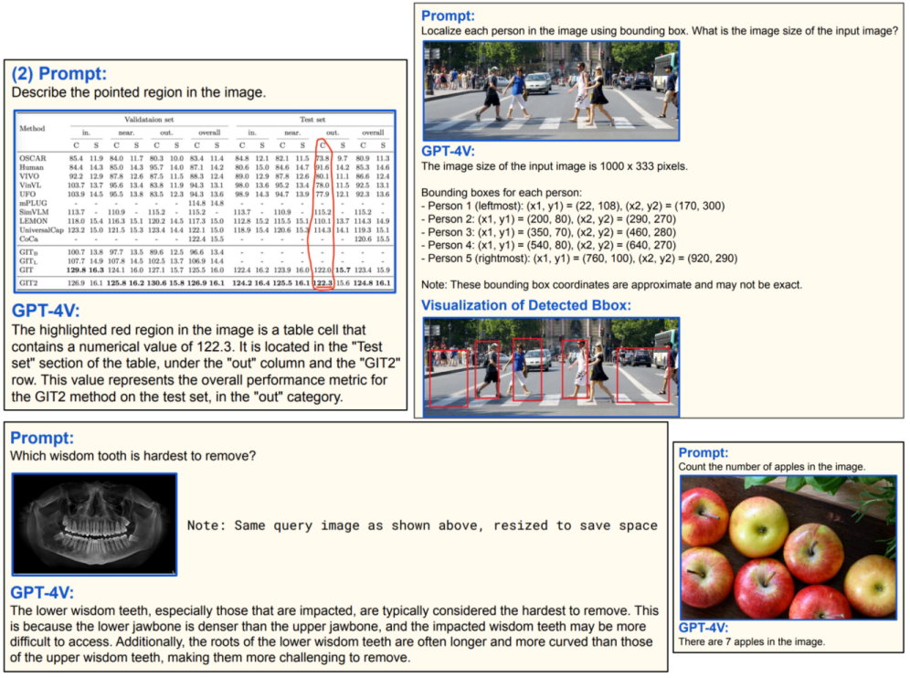
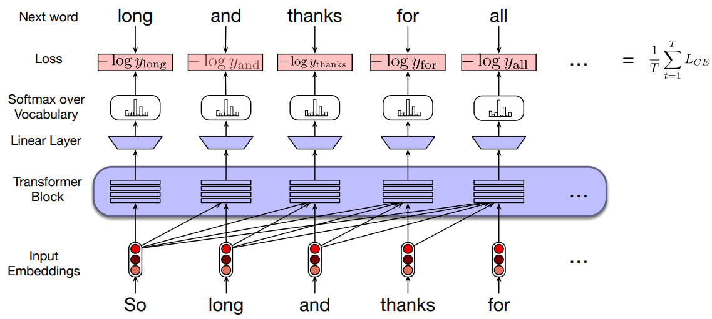
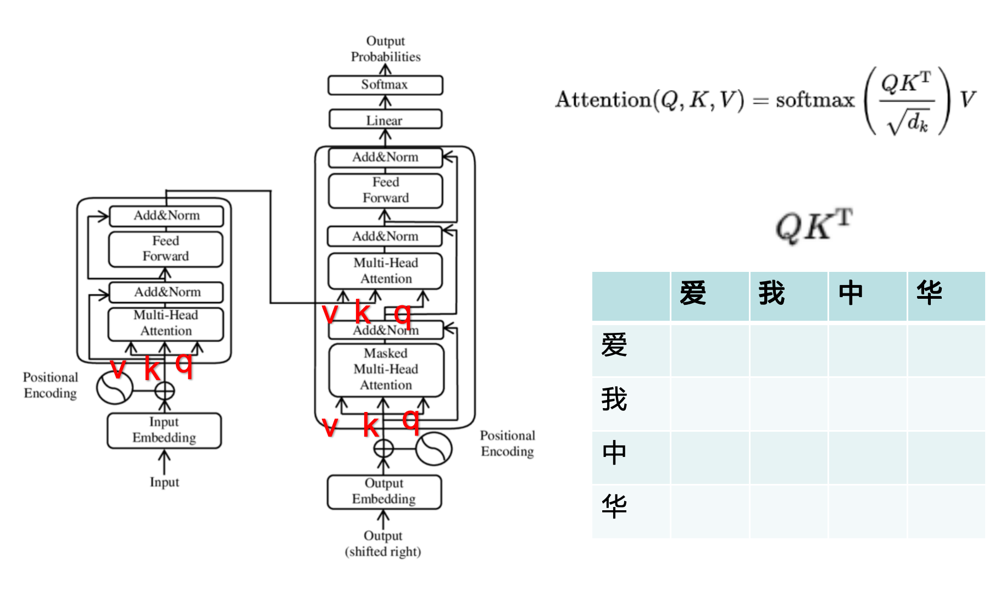
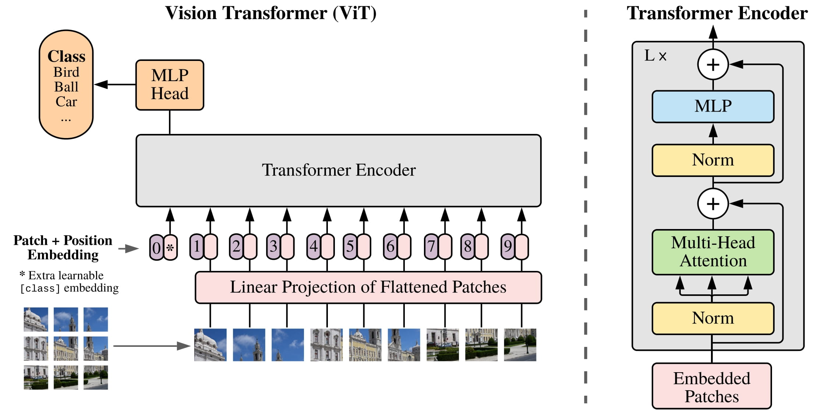
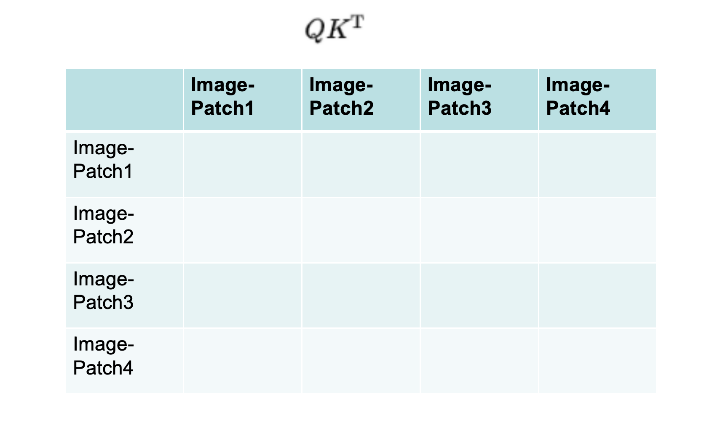
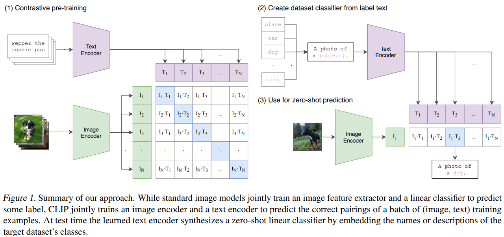
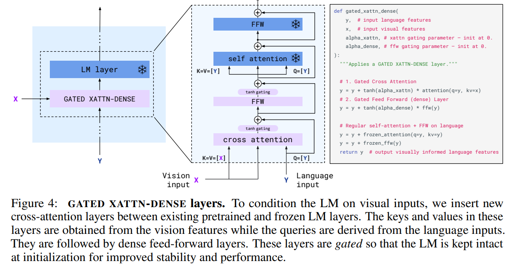
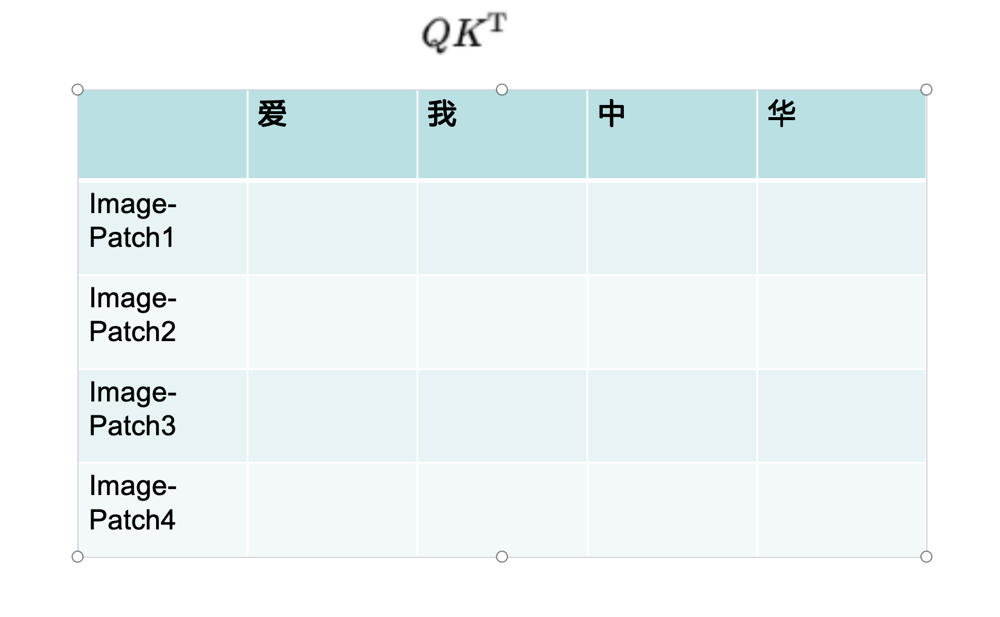
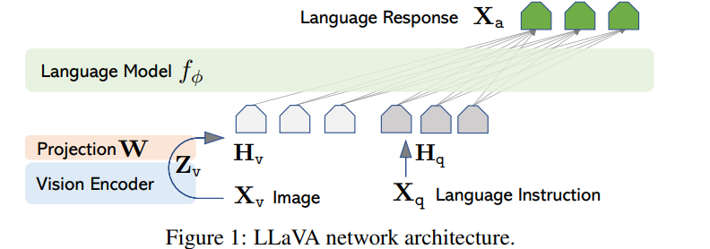
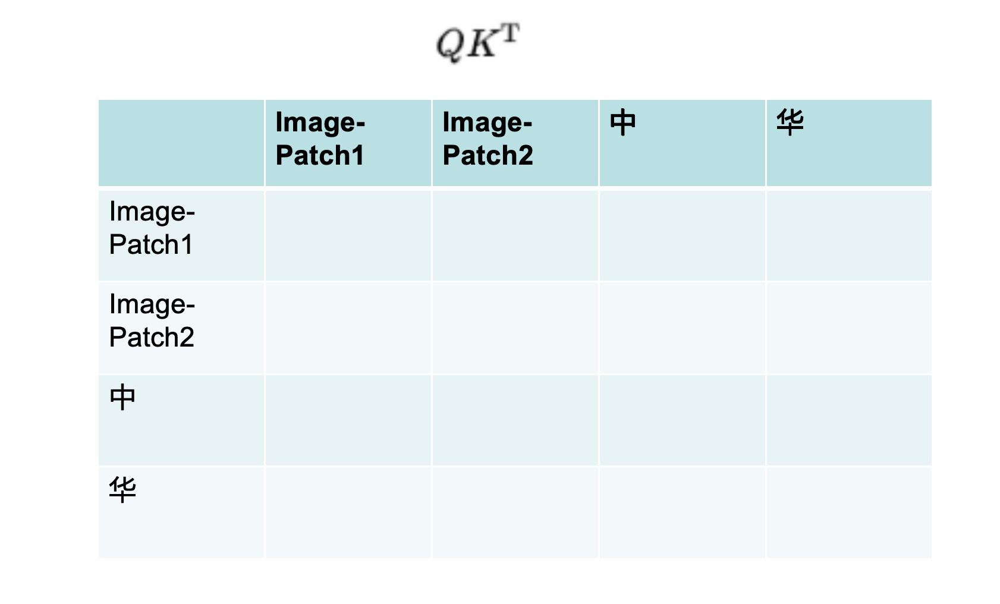

# 多模态大模型

### 模态 modalities

- 常见：
文本、图像、音频、视频、表格数据等
- 罕见：
3D模型、图数据、气味、神经信号等

### 多模态

1. Input and output are of different modalities (e.g. text-to-image, image-to-text)
输入和输出具有不同的模态（例如文本到图像、图像到文本）

2. Inputs are multimodal (e.g. a system that can process both text and images)
输入是多模态的（例如可以处理文本和图像的系统）

3. Outputs are multimodal (e.g. a system that can generate both text and images)
输出是多模式的（例如可以生成文本和图像的系统）


### 为什么需要多模态

1. 许多现实任务是天然的多模态任务
2. 加入不同模态有助于模型提升表现
3. 更加灵活的使用方式和广阔的应用场景

### GPT-4V
 

### 多模态模型要点
1. 文本如何编码
2. 图像如何编码
3. 文本编码与图像编码如何交互


#### Transformer 文本编码器

##### transformer回顾

#### ViT 图像编码器
 
 说明：图像相对于文本来说要简单一些，因为图像本身就是一个矩阵，因此不需要像文本内容一样需要做embedding。
 
##### 图像self-attention

#### 两种编码如何交互
##### CLIP 图文交互

##### 使用对比学习的训练方式

#### flamingo 图文交互

说明：图片的信息以K,V的形式上输入，文本内容已Q的形式输入。然后进行self-attention计算。这个形式的attention计算过程被称为Gated Xatten。

##### flamingo gated xatten

#### LLava 图文交互

说明：将文本矩阵与图片矩阵进行拼接形成一个新的矩阵，然后将新的矩阵送入transformer中

##### LLava attention
本质上就是普通的self-attention
