# 大模型训练相关知识

## 内容概述
 - 大模型训练
 - PEFT
 - 框架库

### 大模型训练两大问题

- 效率问题
   数据量大，如何快速完成训练
   
- 显存问题
   模型太大，如何在GPU上完成运算

#### 并行训练

##### 数据并行 DP
复制模型到多个GPU各自计算梯度后传给某一个卡累加求平均，再反传更新，模型更新完权重以后再将自己的模型复制分发给其余的卡，需要单卡就能训练整个模型（显存够大）
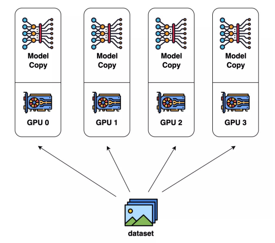

##### 模型并行 PP
将模型的不同层放在不同的GPU上解决单块卡不够大的问题（模型比显存大）
需要更多的通讯时间（卡之间互相传输数据） 
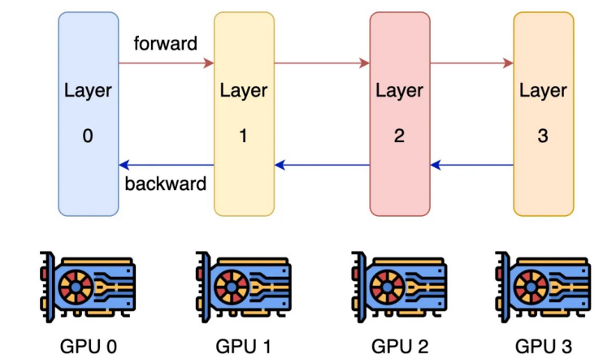

说明：在layer3即GPU上将预测值与真实值计算lost

##### 张量并行 TP

将张量划分到不同GPU上进行运算进一步减少对单卡显存的需求,需要更多的数据通讯
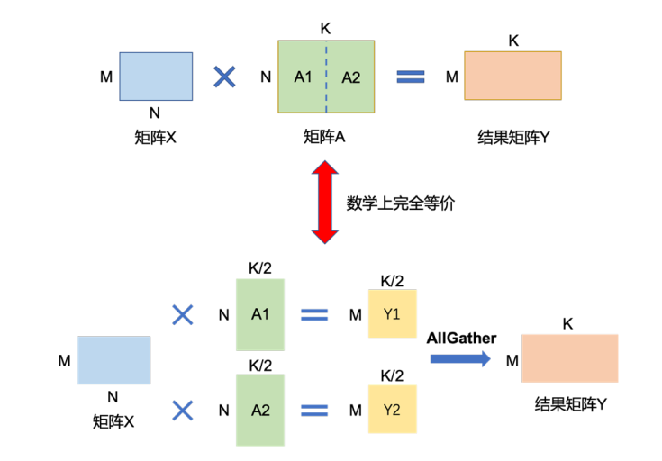

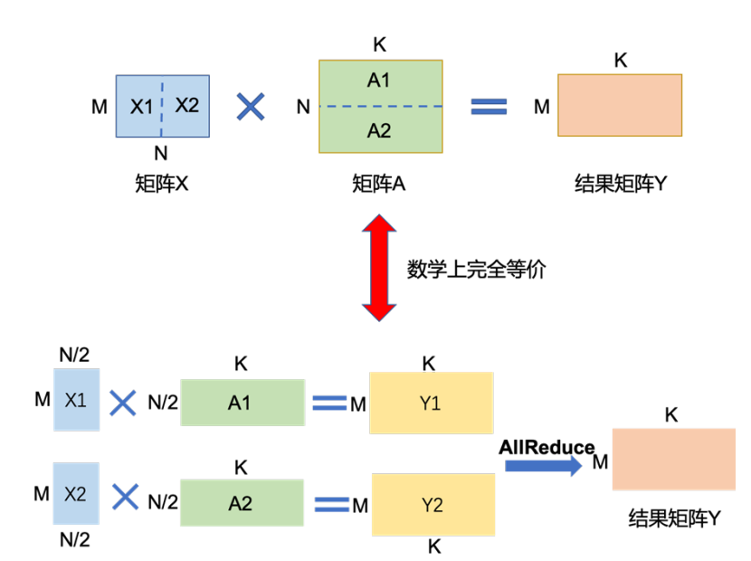

transformer中多头机制，每个头在一个GPU上计算
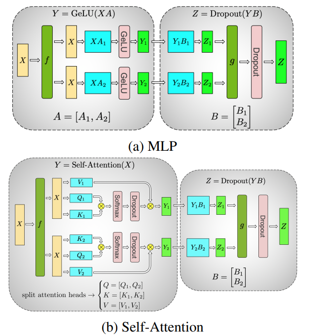

##### 混合并行
BLOOM模型训练时采用的并行计算结构
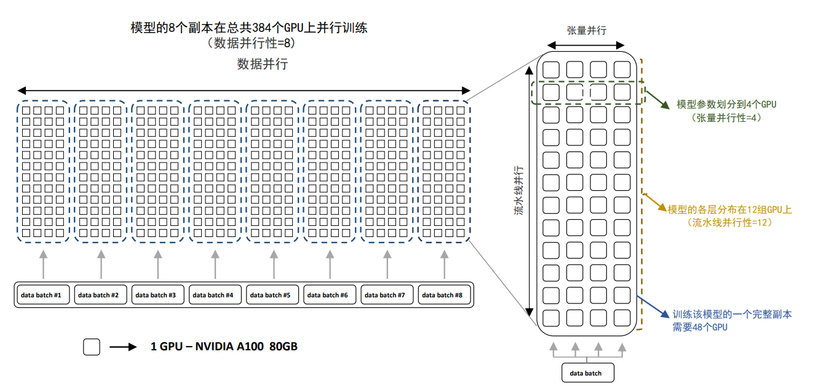

### 混合精度
#### 浮点数类型
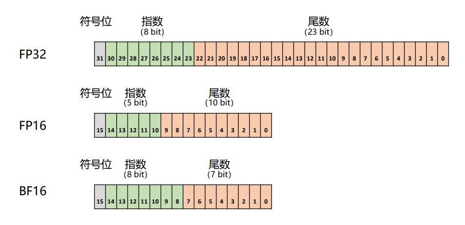
说明：机器学习中使用BF16
##### 浮点数表示方法
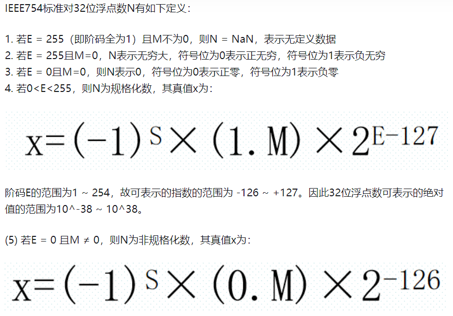

说明：M是位数，E是指数。

例：25.125                                                            D = 十进制  B = 二进制
整数部分：25(D) = 11001(B)
小数部分：0.125(D) = 0.001(B)
用二进制科学计数法表示：25.125(D) = 11001.001(B) = 1.1001001 * 2^4(B)
符号位 S = 0
尾数 M = 1.001001 = 001001(去掉1，隐藏位)
指数 E = 4 + 127(中间数) = 135(D) = 10000111(B)
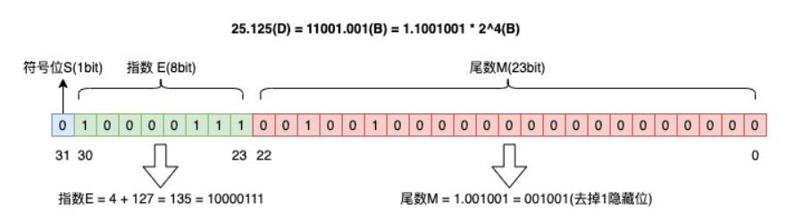

##### 浮点数精度损失
将0.2（十进制）转化为二进制数：
0.2 * 2 = 0.4 -> 0
0.4 * 2 = 0.8 -> 0
0.8 * 2 = 1.6 -> 1
(1.6去掉1)0.6 * 2 = 1.2 -> 1
(1.2去掉1)0.2 * 2 = 0.4 -> 0（发生循环）
...

0.2(D) = 0.00110…(B)
由于浮点数尾数位数有限，最后只能截断，导致精度损失，例如： 0.00..（800个0）..01 + 1 = 1

float32表示范围（折合十进制）：-3.4 * 10^38 ~ 3.4 * 10 ^38
指数位数越多，可以表示的值范围越大
尾数尾数越多，可以表示的值越精确
总位数越多，该数字占空间越大（1字节=8bit)

### 混合精度训练
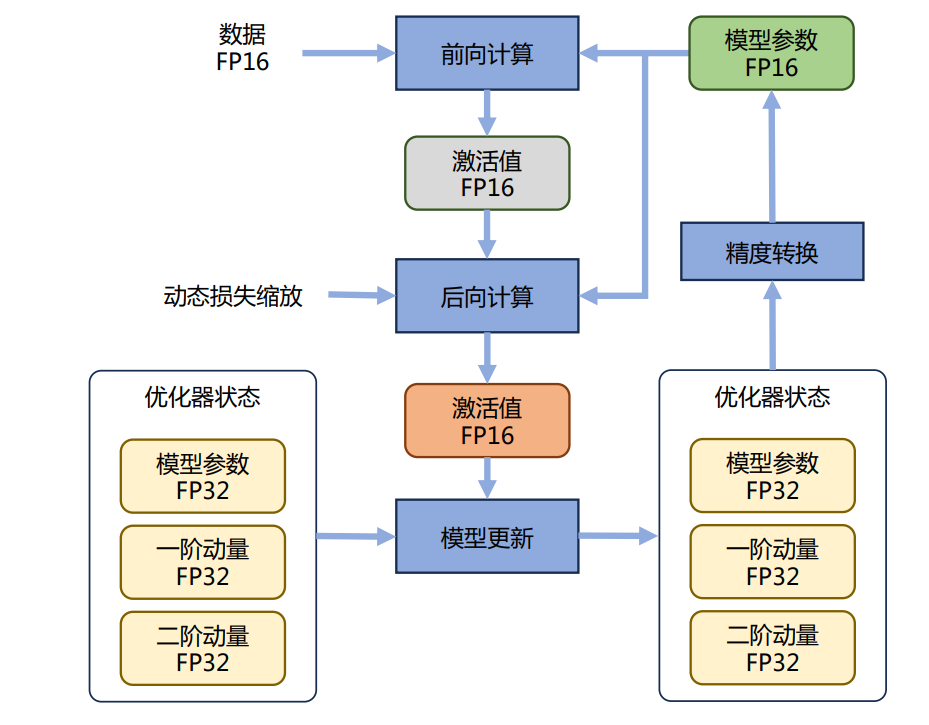

说明：我们在进行权重更新的时候希望精度更高一些，在前向计算的时候用一些低精度的。

### deepspeed
 
 - 零冗余优化器 ZeRO
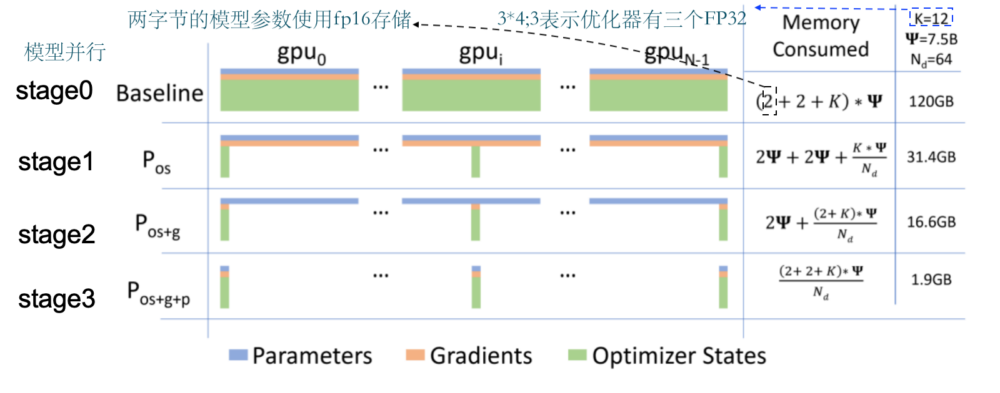
 - ZeRO-offload

把一部分计算放到内存中，用CPU计算,目的是解决显存不足问题
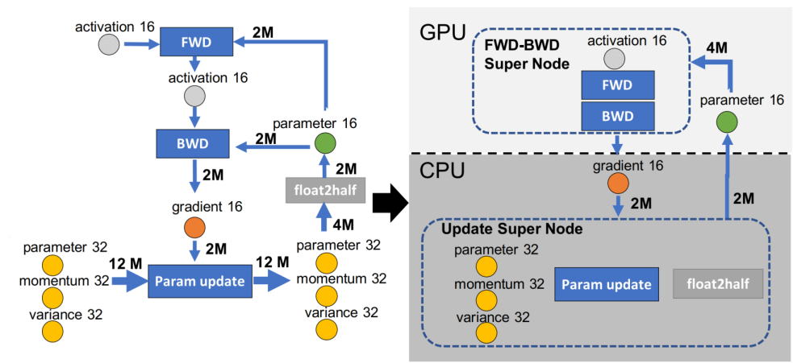

 - 策略对比
       
    - 训练速度
Stage 0  > Stage 1 > Stage 2 > Stage 2 + offload > Stage 3 > Stage 3 + offloads

    - 显存效率（指固定显存下，能够训练的模型大小）
Stage 0  < Stage 1 < Stage 2 < Stage 2 + offload < Stage 3 < Stage 3 + offloads


### PEFT微调
Parameter-Efficient Fine-Tuning,当训练整个大模型不能实现时，可以采取的一种策略，通过最小化微调参数的数量缓解大型预训练模型的训练成本。
**核心思想**是通过调整输入文本的“提示（Prompt）”来引导模型完成特定任务，而无需修改模型的大部分参数。它属于轻量级微调方法，旨在降低计算成本和存储需求，同时保持模型性能。论文参考：[prompt_tuning.pdf](./code/peft训练/papers/prompt_tuning.pdf)
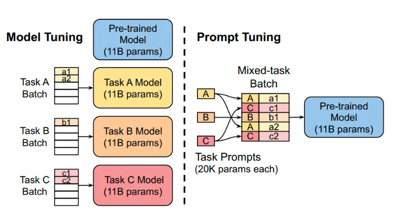

#### Prefix-tuning
论文参考：[prefix_tuning.pdf](./code/peft训练/papers/prefix_tuning.pdf)
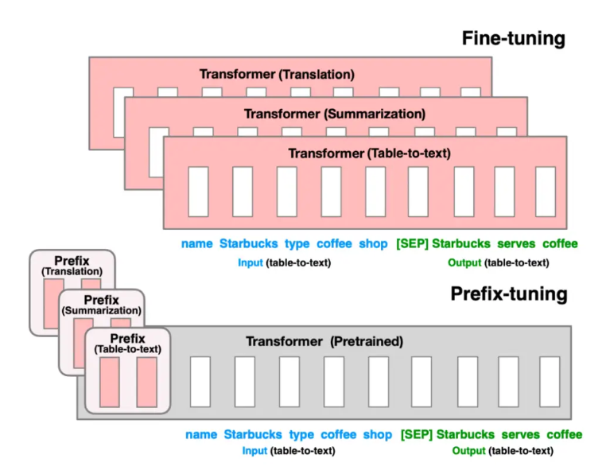

#### P-tuning & P-tuning v2
论文参看：[p_tuning.pdf](./code/peft训练/papers/p_tuning.pdf)
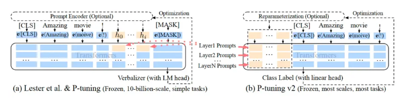

#### Adapter
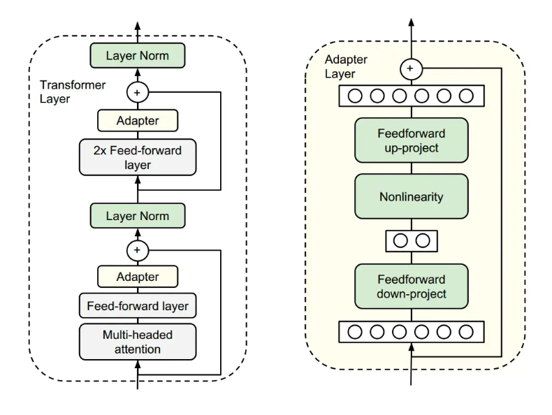

#### LoRA
论文参考：[lora.pdf](./code/peft训练/papers/lora.pdf)
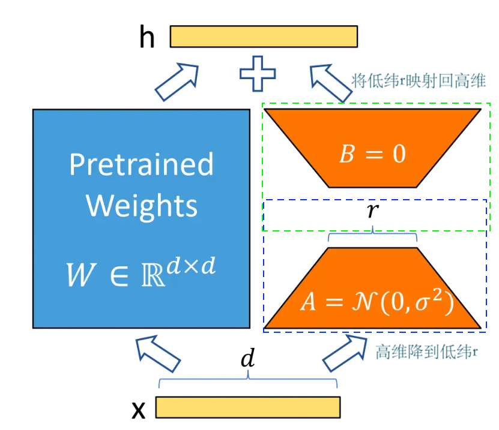
说明：A是随机初始化的，B是全零的，在AB相乘以后结果肯定是全零，就和使用原来的权重一样。在第一批训练数据输入之后得到的结果和预训练的结果相同，在反向传播完成以后A,B就都会进行更新。

使用Lora的代码示例：[main.py](./code/peft训练/main.py)

### TRL
TRL 是一个先进的库，专为训练后基础模型而设计，采用了监督微调 (SFT)、近端策略优化 (PPO) 和直接偏好优化 (DPO) 等先进技术。TRL 建立在🤗 Transformers生态系统之上，支持多种模型架构和模态，并可在各种硬件配置上进行扩展。代码库连接为[https://github.com/huggingface/trl](https://github.com/huggingface/trl)
本地目录：`/code/trl`

### 章节练习 
在NER任务中使用BERT和Lora进行尝试能否跑通。可以基于`/code/peft训练`下的代码进行修改