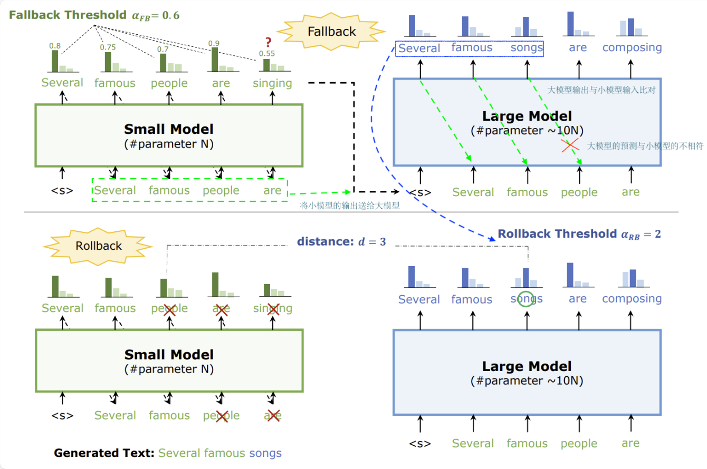
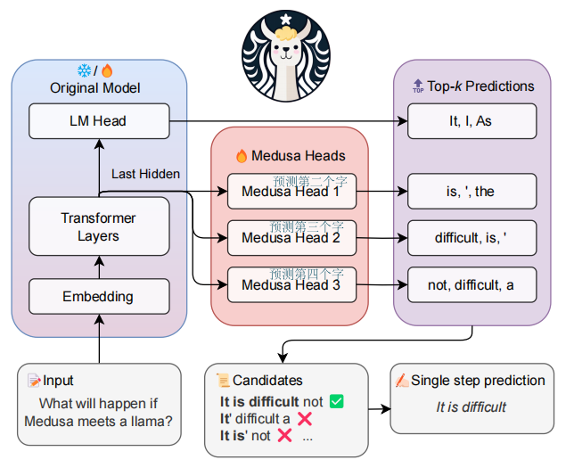
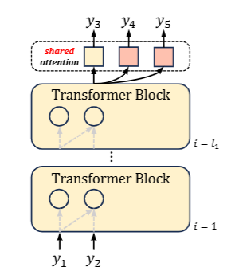
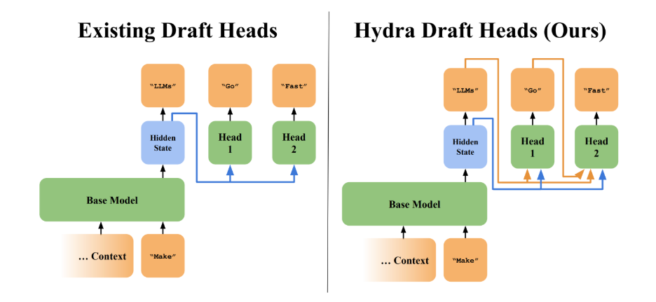
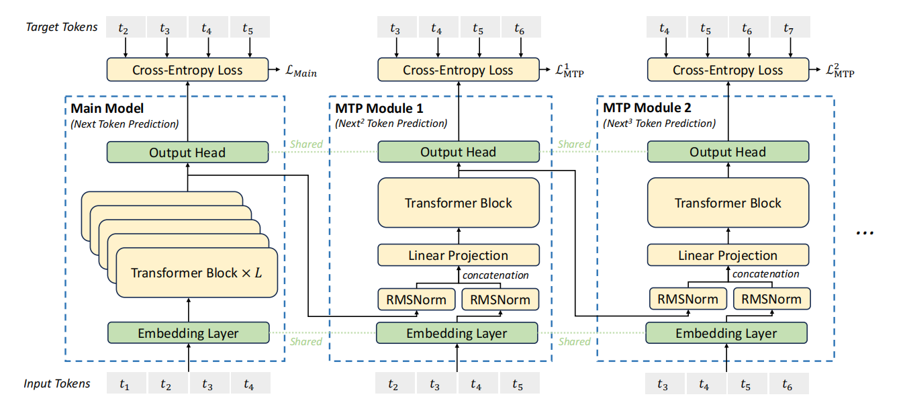

# 投机采样加速推理

想要解决的问题：大模型的输出是基于前文输入然后预测下一个字，每个文字都是这样传出的，然后没生成一个字都需要调用一下大模型。为了能够加速大模型的输出过程。

前提：1.小模型参数量要小于大模型速度快很多
     2.效果上小模型与大模型相差并不大
     

由小模型先生成几个字，然后交给大模型，由大模型一次输出内容并逐字判断判断小模型的内容是否正确。如果都正确是最理想的结果。如果有不同的结果，以大模型的结果为准，将小模型出错的字后面的文字都拒绝，将就正好的内容送给小模型，再去生成。

#### 美杜莎模型
打草稿这样的事情一定需要小模型来做么？其实不一定。模型自带多个头，代替draft model (small model) 起到打草稿的目的。
设定的一种假设是可不可以在大模型线性层后面接很多个头(即线性层)，第一个线性层输出第一个字，第二个线性层输出第二个字，第三个线性层输出第三个字。。。

说明：由多头一次性生成了y3,y4,y5。但是我们不太敢相信y4,y5的准确性。因此将y1,y2,y3,y4,y5再输入一次大模型让大模型逐一字符进行比对，然后再生成y6,y7,y8...

前一个头的输出，作为后一个头的输入的一部分


由于第一个字对第二个字的输出有很大的影响，因此我们进一步在生成多头的时候将第一个字的信息进一步的传给第二个字。把第二个头的信息一定程度上传给第三个字。(使用的是上一个字的概率分布)

### deepseek即采用上面的方式

好处：提升了训练的难度使得模型能够学到更多地东西。采用投机采样的方法解码更快速。  