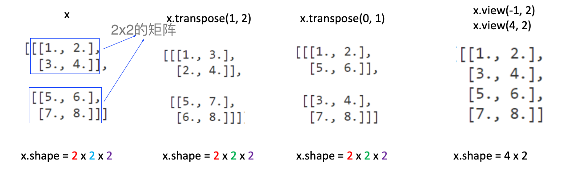
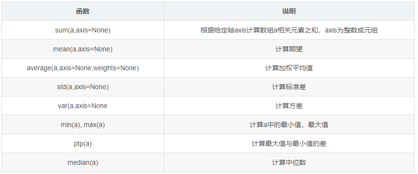
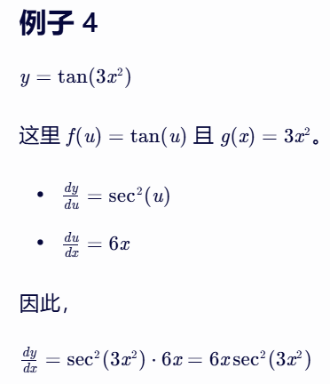

# 深度学习原理

## 1.数学基础

### 1.1 线性代数-标量和向量

#### 1.1.1 标量Scalar
一个标量就是一个单独的数

#### 1.1.2 向量Vector

一个向量是一列数，可以把向量看做空间中的点，每个元素是不同坐标轴上的坐标。向量中有几个数，就叫几维向量。


### 1.2 线性代数-向量运算

- 向量加和:  A +B = B + A;需要维度相同
    - [1,2] + [3,4] = [4, 6]
- 向量内积:  A * B = B * A;需要维度相同
    - [1,2] * [3, 4] = 1 * 3 + 2* 4 = 11
- 向量夹角余弦值;需要维度相同
    - Cosθ = A * B / |A|·|B|
- 向量的模
    - $|A| = \sqrt{x_{1}^{2} + x_{2}^{2} ...x_{n}^{2}}$

### 1.3 线性代数-矩阵
矩阵是一个二维数组。矩阵中的每一个值是一个标量，可以通过行号和列号进行索引

- 2*2的矩阵 

```math
\begin{bmatrix} 1&2 \\ 3&4 \\ \end{bmatrix}
```

- 3 * 2 的矩阵  

```math
\begin{bmatrix} 1&3 \\ 2&4 \\ 3&5 \\ \end{bmatrix}
```

- 矩阵加法，需要维度相同

```math
\begin{bmatrix} 1&2 \\ 3&4 \\ \end{bmatrix} + \begin{bmatrix} 4&2 \\ 3&1 \\ \end{bmatrix} = \begin{bmatrix} 5&4 \\ 6&5\\ \end{bmatrix}

```

- 矩阵乘法，不满足交换律 A * B != B* A，当左矩阵A的列数等于右矩阵B的行数时，A与B可以相乘。**M x N 矩阵乘以 N x P矩阵得到M x P维度矩阵**

```math
A=\begin{bmatrix}a_{1,1}&a_{1,2}&a_{1,3}\\ a_{2,1}&a_{2,2}&a_{2,3}\\ \end{bmatrix}
```
```math
B=\begin{bmatrix}b_{1,1}&b_{1,2}\\b_{2,1}&b_{2,2}\\b_{3,1}&b_{3,2}\\ \end{bmatrix}
```

```math
C=AB=\begin{bmatrix}a_{1,1}b_{1,1}+a_{1,2}b_{2,1}+a_{1,3} b_{3,1},&a_{1,1}b_{1,2}+a_{1,2}b_{2,2}+a_{1,3}b_{3,2}\\a_{2,1}b_{1,1}+a_{2,2}b_{2,1}+a_{2,3}b_{3,1},&a_{2,1}b_{1,2}+a_{2,2}b_{2,2}+a_{2,3}b_{3,2}\end{bmatrix}
```

#### 1.3.1 线性代数-矩阵

- 符合分配率：A * ( B + C ) = A * B + A * C
- 符合结合律：A * ( B * C ) = ( A * B ) * C 
- 矩阵点乘，两矩阵必须形状一致：

```math
\begin{bmatrix}1&2\\3&4\end{bmatrix} · \begin{bmatrix}1&2\\0&-1\end{bmatrix} = \begin{bmatrix}1&4\\0&-4\end{bmatrix}
```

#### 1.3.2 常见矩阵操作

- 矩阵转置(行列互换traspose)

```math
\begin{bmatrix}1&2\\3&4\end{bmatrix}^{T}=\begin{bmatrix}1&3\\2&4\end{bmatrix}
```
```math
\begin{bmatrix}1&2\\3&4\\5&6\end{bmatrix}^{T}=\begin{bmatrix}1&3&5\\2&4&6\end{bmatrix}
```

- 向量 与 矩阵 的互相转换

```math
[1 \quad 2\quad  3 \quad 4] --reshape 2 * 2 --> \ \begin{bmatrix}1 & 2 \\ 3 & 4\end{bmatrix}
```

```math
[1 \quad 2 \quad 3 \quad 4 \quad 5 \quad 6] --reshape 3*2 --> \begin{bmatrix}1&2\\3&4\\5&6\end{bmatrix}
```

```math
\begin{bmatrix}1&2\\3&4\\5&6\end{bmatrix} --flatten--> [1\quad 2\quad 3\quad 4\quad 5\quad 6]
```

### 1.4 线性代数-张量
**张量(tensor)是神经网络的训练中最为常见的数据形式。所有的输入，输出，中间结果，几乎都是以张量的形式存在。**

- 将3个2x2的矩阵排列在一起，就可以称为一个3x2x2的张量。
- 将4个3x2x2的张量排列在一起，就可以成为一个4x3x2x2维度的张量


### 1.5 常见张量操作

> 红色为第0维度
> 绿色为第1维度
> 紫色为第2维度




### 1.6 numpy常量操作
 
 
 


具体代码细节可参考：[NmpyOp.py](./code/NmpyOp.py)


## 2.导数 

```math
f^{'}(x_{0}) = \displaystyle \lim_{\Delta x \to 0}{\frac{\Delta y}{\Delta x}} = \lim_{\Delta x \to 0}{\frac{f(x_{0}+ \Delta x) - f(x_{0})}{\Delta x}}
```

导数表示函数变化的方向


### 2.1 常见导数

 


### 2.2 求导法则

- 加（减）法则：[f(x) + g(x)]' = f(x)' + g(x)'
- 乘法法则：[f(x) * g(x)]' = f(x)' * g(x) +g(x)' * f(x)
- 除法法则：[f(x) / g(x)]'= [f(x)' * g(x) -g(x)' * f(x) ] / g(x)^2
- 链式法则：若 h(x) = f( g(x) )，则 h'(x) = f'( g(x) ) g'(x)

- 链式求导示例

<div style="display: flex; gap: 10px;">
  
  
</div>

<div style="display: flex; gap: 10px;">
  
  
</div>


### 链式求导过程示例demo

[GradienDescent.py](./code/GradientDescent.py)