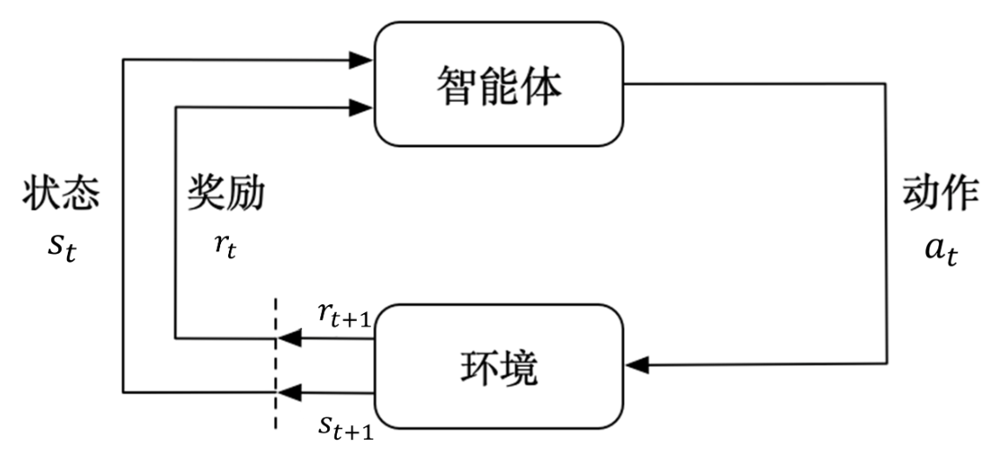
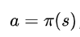
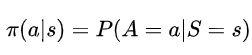
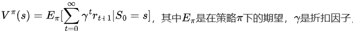
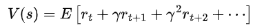
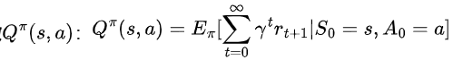
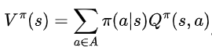
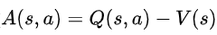
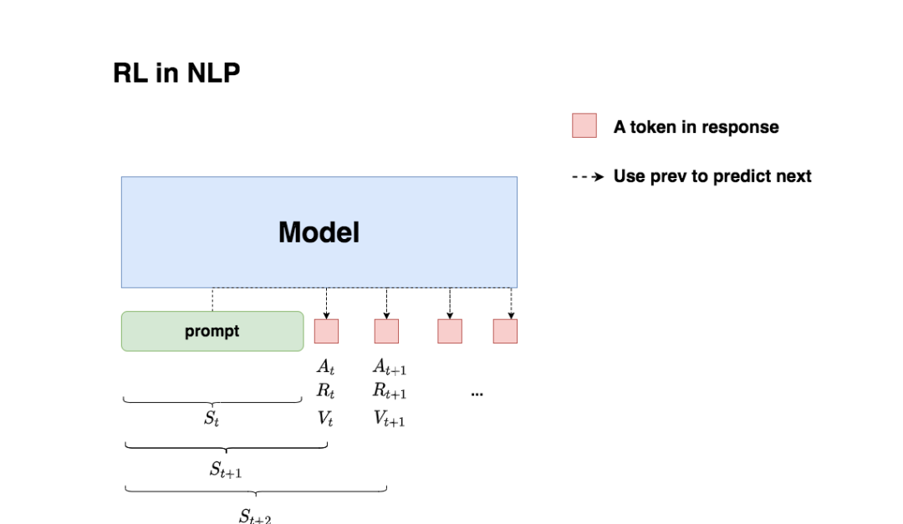

# 强化学习与NLP

### 强化学习

强化学习和监督学习是机器学习中的两种不同的学习范式

- 强化学习：
  目标是让智能体通过与环境的交互，学习到一个最优策略，以最大化长期累积奖励。例如，在机器人导航任务中，智能体需要学习如何在复杂环境中移动，以最快速度到达目标位置，同时避免碰撞障碍物，这个过程中智能体要不断尝试不同的行动序列来找到最优路径。

- 监督学习：
  旨在学习一个从输入特征到输出标签的映射函数，通常用于预测、分类和回归等任务。比如，根据历史数据预测股票价格走势，或者根据图像特征对图像中的物体进行分类，模型通过学习已知的输入输出对来对新的未知数据进行预测。
 
 
 ### 强化学习重要概念
- **智能体**是个很宽泛的概念，可以是一个深度学习模型，也可以是一个实体机器人

- **环境**可能随智能体的动作发生变化，为智能体提供奖励


以一个围棋智能体为例，围棋规则即是环境
- 状态（State）
当前的盘面即是一种状态

- 行动（Action）
接下来的下法是一种行动

- 奖励（Reward）
输赢是一种由环境给出的奖励

##### 智能体要学习的内容
- 策略（Policy）
用于根据当前状态，选择下一步的行动；以围棋来说，可以理解为在当前盘面下，下一步走每一格的概率，策略 π 是一个输入状态（state）输出动作（action）的函数
 或 
或者输入`状态+动作`，输出概率的函数有了策略之后，就可以不断在每个状态下，决定执行什么动作，进而进入下一个状态，依次类推完成整个任务
s1 -> a1 -> s2 -> a2 -> s3....这就是所谓的**马尔可夫决策过程 MDP**

说明：在上面的策略函数中只包含了`state`以及`action`，但是并没有包含奖励，状态，动作是如何与奖励联系起来的与**价值函数**有关。

- 价值函数（Value Function）
基于策略π得到的函数，具体分为两种：
1. 状态价值函数   V(s)
    - 表示从状态s开始，遵循策略π所能获得的**长期累积**奖励（rt）的期望

说明：有监督的学习反馈是实时的，但是强化学习必须要按照某种策略一直执行下去直到产生一个确定的结果。因此需要长期累积。(rt)是当前步的奖励，(rt+1)是下一步的奖励，gamma是折扣因子
    - 折扣因子∈[0,1]，反映对于未来奖励的重视程度

2. 动作价值函数   Q(s,a)
    - 表示在状态s下采取行动a，遵循策略π所能获得的长期累积奖励的期望

     - 二者关系

- 优化目标：优势估计函数

Q和V都是基于策略π的函数，所以整个函数也是一个基于π的函数，策略π可以是一个神经网络，要优化这个网络的参数训练过程中，通过最大化优势函数A(s,a)，来更新策略网络的参数，也就是说优势估计函数的作用类似于loss函数，是一个优化目标。可以通过梯度反传来优化，这是强化学习中的一种方法，一般称为**策略梯度算法**


#### NLP与强化学习
将文本生成过程看作一个序列决策过程
state = 已经生成的部分文本
action = 选择下一个要生成的token



### PPO算法
