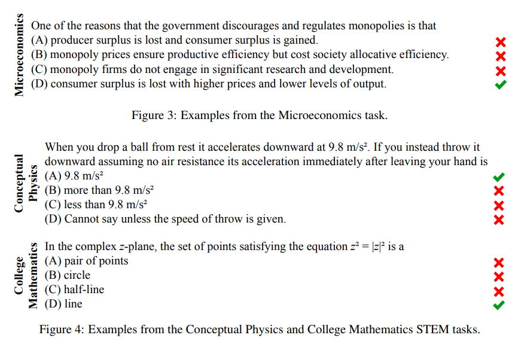

## LLM通用能力评价方式

### MMLU
MEASURING MASSIVE MULTITASK LANGUAGE UNDERSTANDING

The test covers 57 tasks including elementary mathematics, US history, computer science,law, and more. To attain high accuracy on this test, models must possess extensive world knowledge and problem solving ability.

题目示例：

### CMMLU

### CEVAL

### GSM8k
Grade School Math

### HumanEval


### GPQA

### MATH

### Chatbot Arena

### GPT4评价

将不同LLM给出的答案送入GPT4
让GPT4对于结果好坏进行排序

优点：可自动化
缺点：对于事实性问题判断不准
