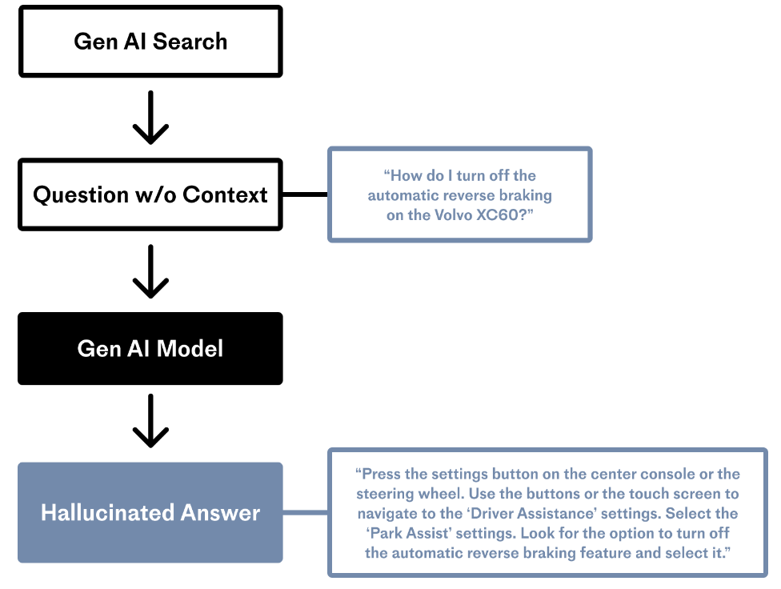
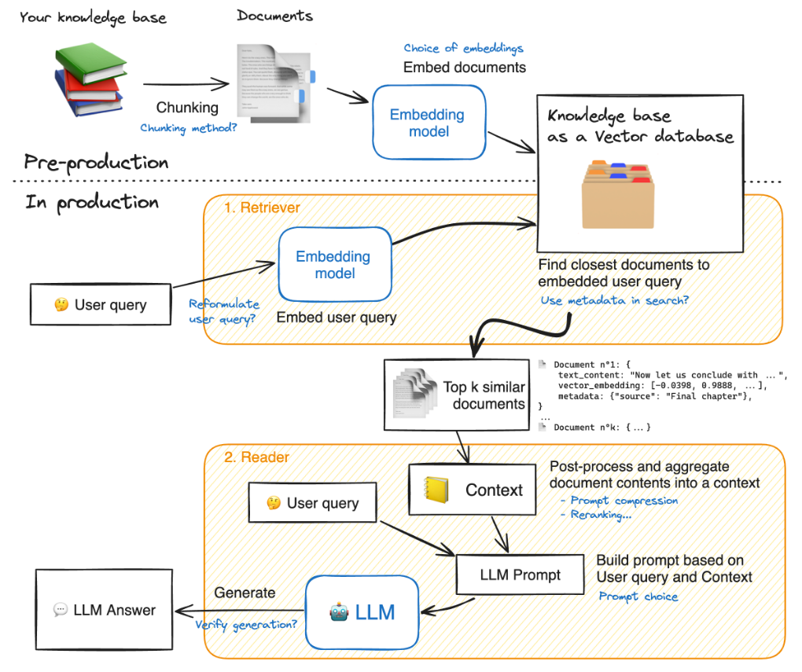
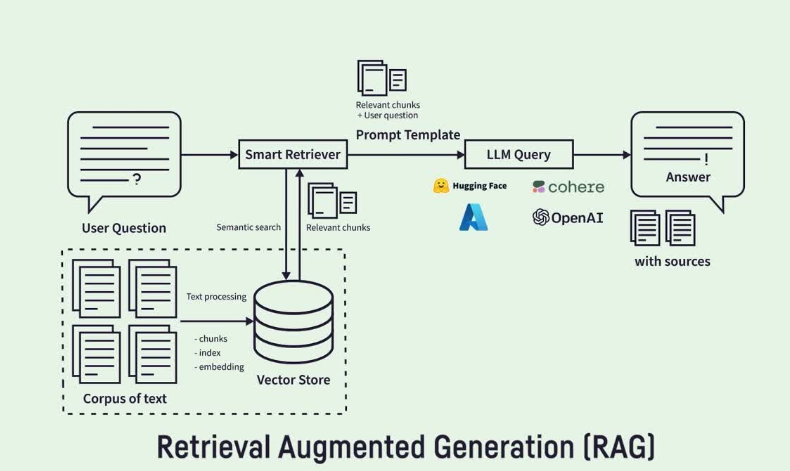
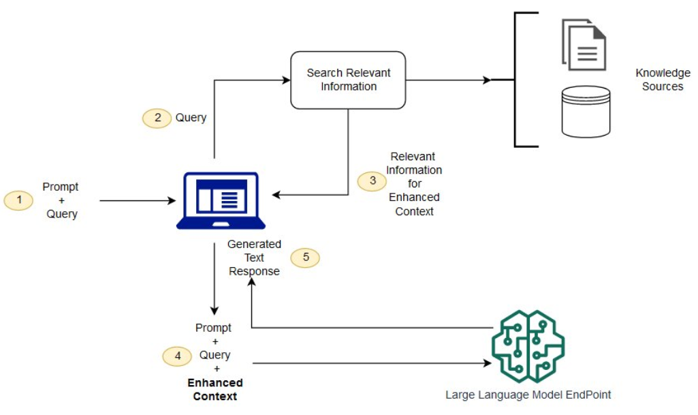
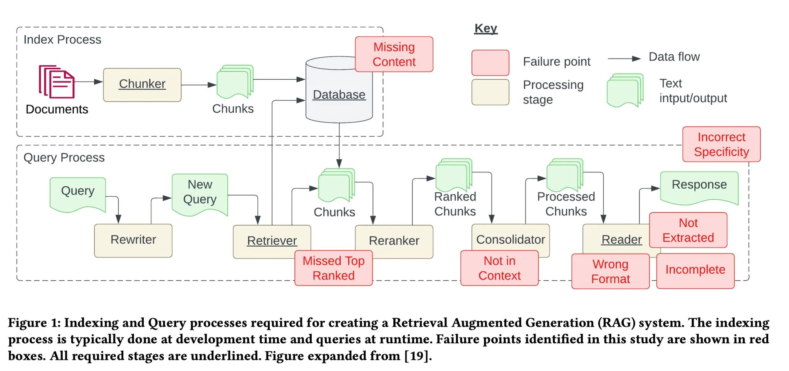
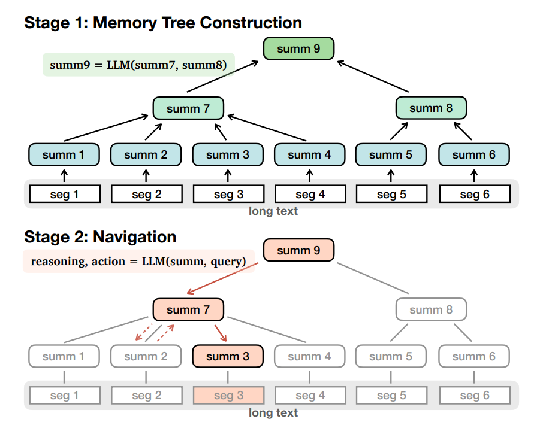
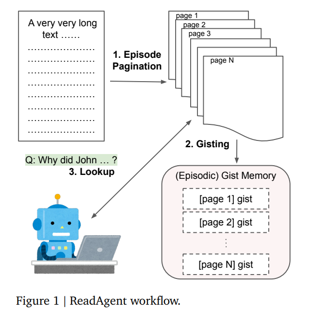
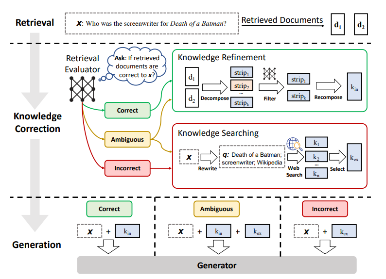
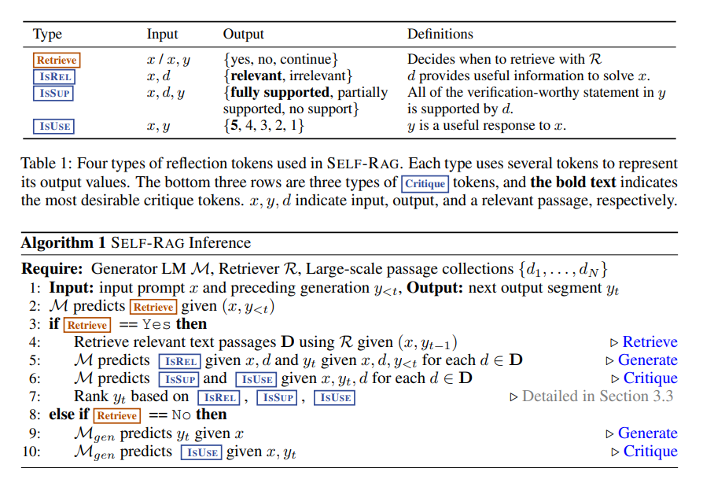
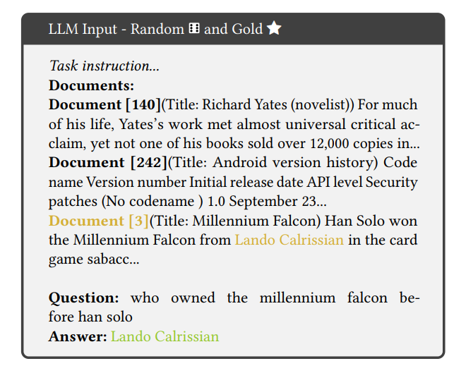

## RAG

### 模型幻觉问题

### Retrieval Augmented Generation


### RAG

#### RAG优势

（1）可扩展性：减少模型大小和训练成本，并能够快速扩展知识。

（2）准确性：模型基于事实进行回答，减少幻觉的发生。

（3）可控性：允许更新和定制知识。

（4）可解释性：检索到的相关信息作为模型预测中来源的参考。

（5）多功能性：RAG能够针对多种任务进行微调(提示词微调)和定制，如QA、Summary、Dialogue等。

#### RAG难点

### RAG代码的简单实现
[dota2英雄介绍-byRAG](./code/dota2英雄介绍-byRAG/SimpleRag.py)

### RAG的延伸

#### MemWalker

论文参考：[MemWalker.pdf](./code/MemWalker.pdf)

说明：先将文本随便分割(seg1,seg2,seg3...)，然后让大模型生成总结(summ1,summ2..),再将总结放一起生成总结的的总结(summ7),具体哪些总结汇总在一起通过大语言模型自己判断。最终会形成一种树状结构。当用户提问的时候，会将问题与总结进行对比哪个更接近，如果summ7更接近那么就继续向下检索是否有更接近的关键词。

#### Read Agent

说明：提供一段文章给read agent，让他做标记在哪里适合断开。例如：`<57>`是个比较好的快开点的话，就回答”断开点: `⟨57⟩\n`因为 ...“。有了断开信息之后在生成<u>摘要</u>。在实际查找的时候会提供每一段的摘要，让模型决定是否展开查看某一段。

论文参看：[ReadAgent.pdf](./ReadAgent.pdf)

#### Corrective RAG
说明：先进行本地知识库检索，然后让大模型对检索的结果标注是否与搜索相关，如果相关就正常的加入rag的过程，不相关，则进行网络检索的过程。如果比较模糊则RAG和网络检索同时进行。

论文参看：[Corrective RAG.pdf](./code/Corrective_RAG.pdf)

#### self RAG

说明：与`Corrective RAG`有些类似，但也有不同，不同的地方在于：输入一个问题之后先判断一下是否<u>需要做召回</u>，因为有些问题大模型是知道的(训练的比较好的大模型具备一定的常识)，如果判断需要做召回，那么就进行RAG(Corrective RAG的RAG过程)。如果不需要检索则直接输出答案，然后将答案交给大模型判断一下是否合理。

论文参看：[self-RAG.pdf](./code/self-RAG.pdf)

#### Power of Noise

论文参看：[The_Power_of_Noise.pdf](./code/The_Power_of_Noise.pdf)
