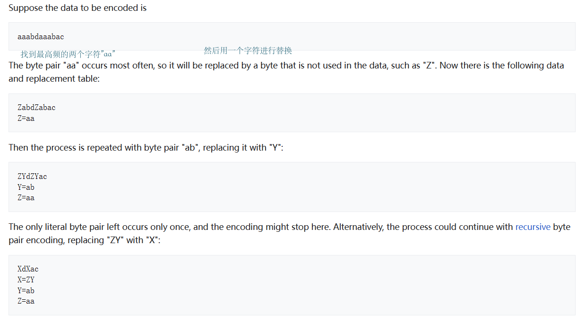
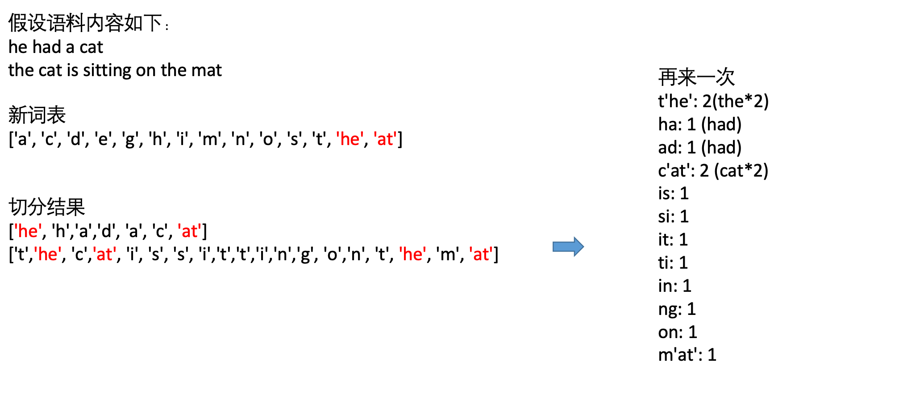
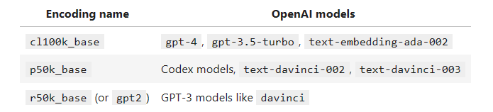
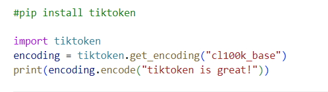

# BPE

### 词表构造问题
为了nlp模型训练，词表（字表）是必要的，统计训练语料中的所有字符（或词）是一种做法，但是容易出现一些问题：
1）测试数据中出现训练数据中没有的词
2）词表过大
3）对于不同语种，切分粒度不好确认（字 or 词）

### bpe(byte pair encoding)压缩算法

### bpe在NLP中的使用
假设语料内容如下：


### bpe在大语言中的使用
请查看[tokenizer_bpe.ipynb](./code/tokenizer_bpe.ipynb)

总结：大模型语言既不是按字也不是按词，而是介于字与词之间的token，根据统计的语料的结果，可能是一个字也可能是两个字捏合成一个。

理解bpe的编码与解码对于 

### tiktoken分词工具
tokenization可视化：[https://www.aitokenizer.xyz/](https://www.aitokenizer.xyz/)

