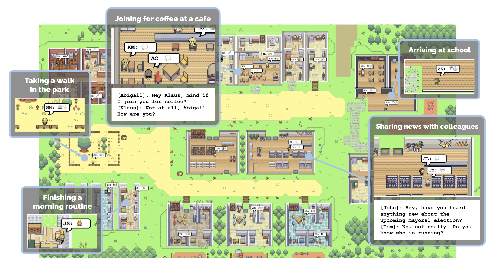
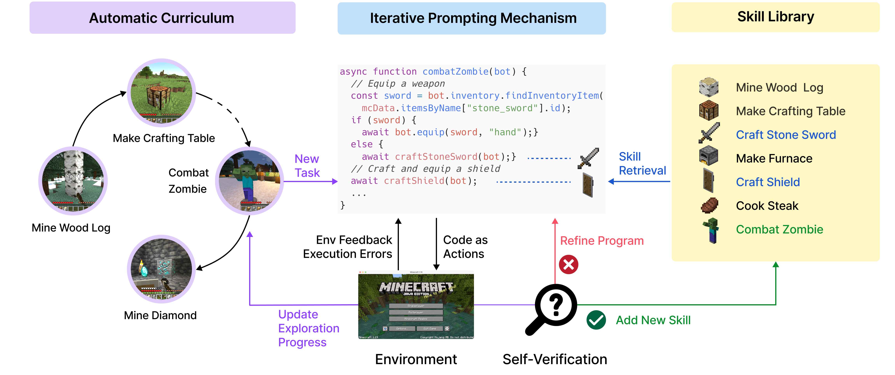

# Agent

### Agent相关工作

### Agent特点

### Agent之间协作


### Agent和人交互


### Agent与环境交互

### 一些Agent应用示例

#### Generative Agents
Agents模仿人类社群
[https://github.com/joonspk-research/generative_agents](https://github.com/joonspk-research/generative_agents)

#### AutoGPT
帮你在线完成任务
[https://github.com/Significant-Gravitas/AutoGPT](https://github.com/Significant-Gravitas/AutoGPT)


#### HuggingGPT
由agent根据任务决定去HuggingFace上用哪个模型
[https://github.com/microsoft/JARVIS](https://github.com/microsoft/JARVIS)

#### MetaGPT
多agent协作代码开发
[https://github.com/geekan/MetaGPT/tree/main](https://github.com/geekan/MetaGPT/tree/main)



#### Voyager
用agent学习玩Minecraft游戏
[https://github.com/MineDojo/Voyager/tree/main](https://github.com/MineDojo/Voyager/tree/main)


#### Character-LLM
agent做角色扮演
[https://github.com/choosewhatulike/trainable-agents/](https://github.com/choosewhatulike/trainable-agents/)



#### ChatDB
Agent与数据库交互
[https://github.com/huchenxucs/ChatDB](https://github.com/huchenxucs/ChatDB)


#### 一个简单示例 - 文章优化agent

代码参考：[passage_optimization_agent.py](./code/passage_optimization_agent.py)

#### 一些关于agent的文章

[Building effective agents](https://www.anthropic.com/engineering/building-effective-agents)

[AI Agent（智能体）技术白皮书](https://arthurchiao.art/blog/ai-agent-white-paper-zh/)

### 章节练习

构建一个基于本专业相关内容的RAG 或 使用bpe统一一份语料，并进行编解码。