# 基于LLM的垂直领域问答方案

### 垂直领域问答
特点：
1、问答内容通常不存在于通用语料
2、回答内容对准确性要求较高，召回要求相对较低（可以转人工处理）
3、扩展性和可控性（可以根据需求，增、删、改特定问题的回答内容、或以特定形式进行回复处理、如进入剧本、非文本回复等）
4、需要确切的评价方式


### 传统方法
知识库 + 文本匹配
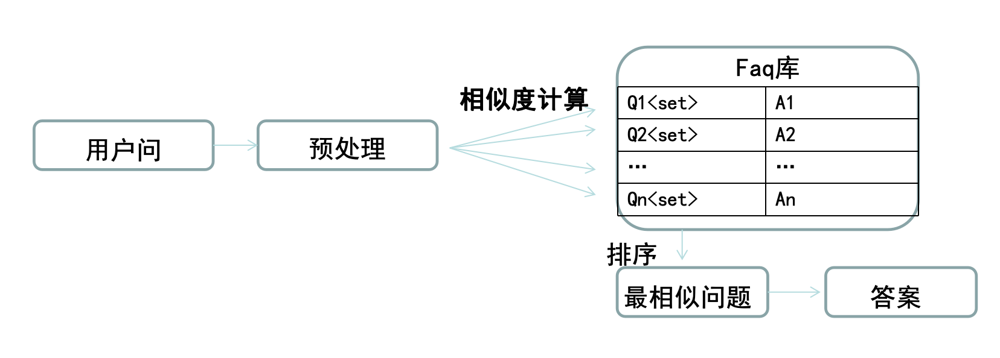
相似度计算方式目前较为常用的是基于神经网络的文本转向量，用向量相似度代表文本相似度


### 基于LLM的方案
1、直接生成
2、段落召回 + 阅读理解 （RAG)
3、基于知识体系

#### 直接生成
利用LLM的生成能力，直接生成回复，类似于SFT
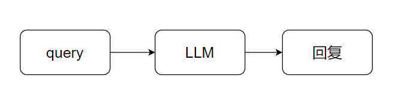
需要使用事先准备的QA数据，对LLM进行fine-tune

缺点：
1. fine-tune的困难（算力需求、数据需求）
2. fine-tune带来的模型泛用性下降或消失
3. 生成答案不完全可控（不正常回复 bad  误导性回复 worse）
4. 不易调整（增加一条新知识、撤掉某条旧知识、某条知识答案要修改）
5. 不易评价效果（所有字正确？大部分字正确？）


#### 段落召回+阅读理解
- langchain集成的思路
- RAG
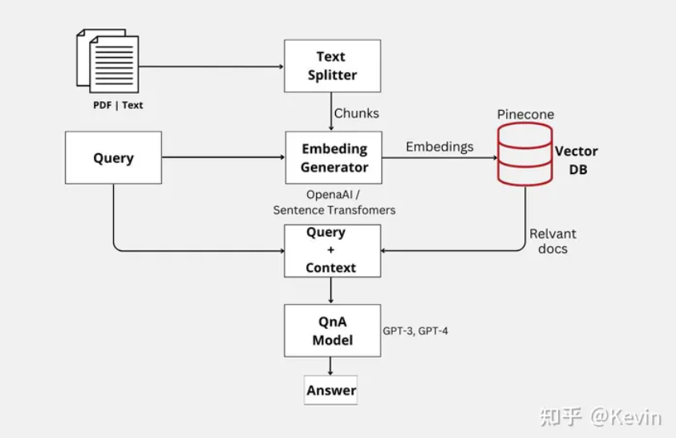

核心步骤：
1.知识文档切分
2.根据query召回相关段落context
3.context+query组成LLM的输入

prompt = """基于以下已知信息，简洁和专业的来回答用户的问题。                                        如果无法从中得到答案，请说 "根据已知信息无法回答该问题" 或 "没有提供足够的相关信息"，不允许在答案中添加编造成分，答案请使用中文。
已知内容:
{context}
问题:
{question}"""


召回部分可以根据情况做，不必完全依赖向量化，随着LLM能力的增强，可以接受的prompt长度越来越长（claude-100k等），对于段落召回的要求会越来越低，所以内容都可以放在输入里，只要LLM的能力够强，不做fine-tune也能直接完成这个流程。

缺点：
1.对基础LLM的能力要求比较高
2.受召回算法限制，如果召回时正确答案已经被舍弃，LLM无法挽回
3.生成结果不完全可控

### 基于知识体系

建立一套知识体系(树形结构)，叶节点是原有的QA对。
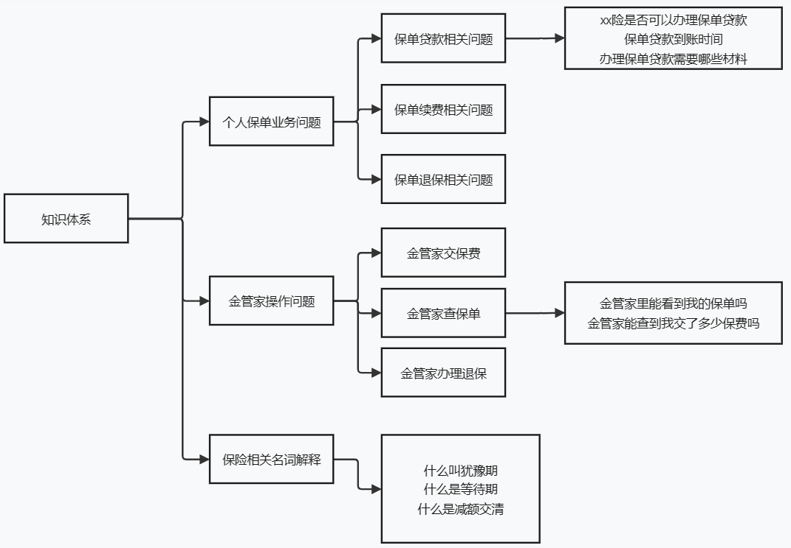

对于每一层级知识体系，设计prompt让LLM做选择题，
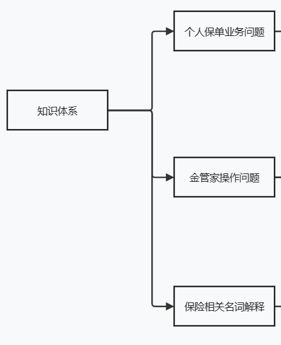

prompt = """你是一个保险公司问答机器人，请根据用户输入的问题，判断该问题属于下列的哪类问题，输出类别序号：
1.个人保单业务相关问题
2.金管家操作问题
3.保险相关名词解释问题
用户问题：
{question}"""

* 这个prompt有很大优化空间

- 讯飞星火
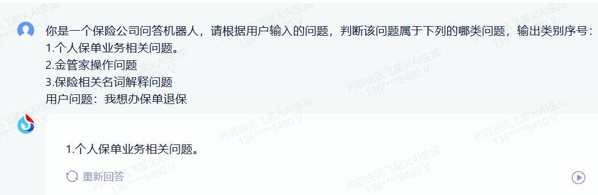

- 通义千问
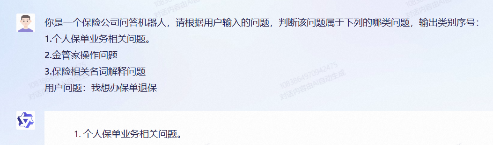

- chatglm
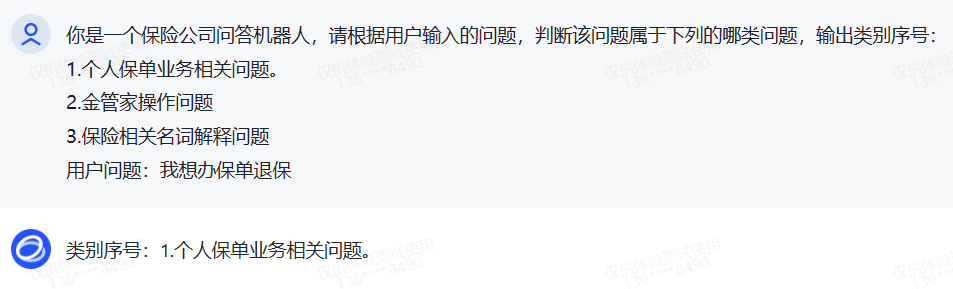

- 文心一言
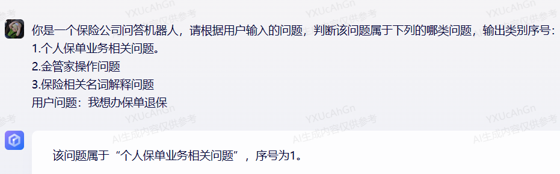

通过多次重复这一过程，在“知识树”上进行多次选择，找到最终对应的问题，<u>答案并不是生成的</u>，而是根据序号找到对应问题，再给出知识库中问题的标准回答。

### 类似做法参考

ceval  清华评测LLM能力项目[https://github.com/SJTU-LIT/ceval](https://github.com/SJTU-LIT/ceval)
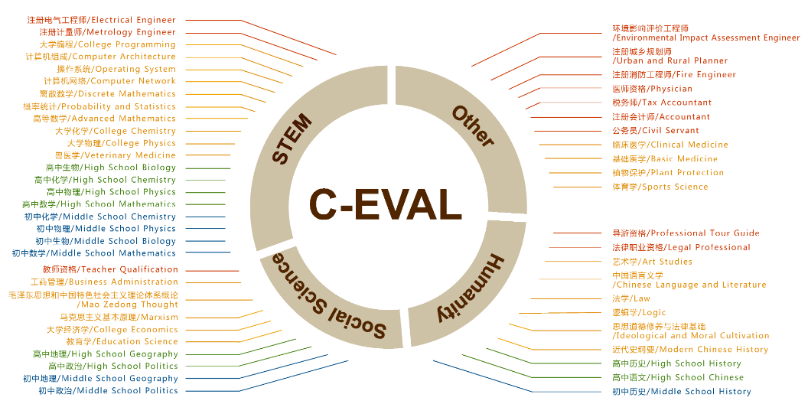

本质上就是通过与prompt的设计，让LLM做选择题（分类问题）,不做`fine-tune`通过正则解析LLM输出的答案。
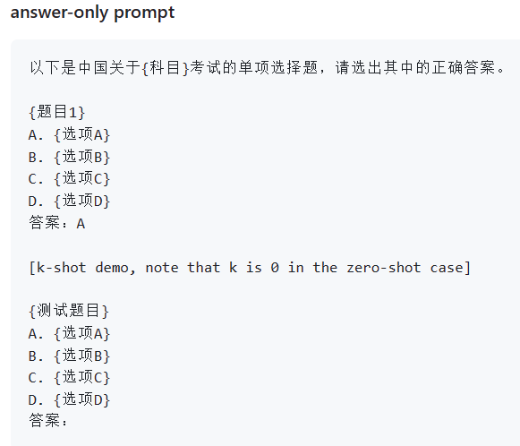
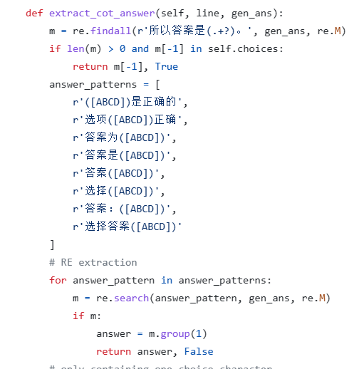

在第二层级、第三层级的判断上，不一定要使用大模型,可以“大带小”提升预测效率

### 综合对比

|           | 传统方法   | 直接生成(SFT) | 召回+阅读(RAG)  | 知识体系  |
|-----------|-----------|---------|:---------|:----------|
| 是否需要微调 | 需要（低成本）| 需要（高成本)   | 可选 | 可选 |
| 数据依赖     | QA对 | QA对  | QA对    | QA对+知识体系（需人工|
| 评价方式     | 易评价acc、p、r、f1  | 困难 | 困难| 易评价acc、p、r、f1 |
| 增删改知识 | 容易直接改知识库 |不容易需要微调| 容易直接改知识库| 容易直接改知识库   |
| 预测效率     | 小模型没问题  | 一次预测 | 召回算法+一次预测  | 需要多次预测   |
| 答案可靠性   | 高，答案为人工编辑话术 | 低，看微调效果| 低，看llm能力      | 高，答案为人工编辑话术      |
| 扩展性 | 高，命中指定q后可接任意动作 | 低，需要微调配合成插件形式 | 低  | 高，命中指定q后可接任意动作 |

