# 知识图谱

### 知识图谱
于2012年5月17日被Google正式提出，初衷是为了提高搜索引擎的能力，增强用户的搜索质量以及搜索体验。


#### 定义
知识图谱是一种揭示实体之间关系的语义网络，可以对现实世界的事物及其相互关系进行形式化地描述。现在的知识图谱已被用来泛指各种大规模的知识库。

#### 知识图谱里存的是什么
**三元组**是知识图谱的一种通用表示方式，**3**种基本形态：

 - 实体 - 关系 - 实体。   示例： 姚明(头实体)–妻子(头实体到尾实体的关系)–叶莉(尾实体)
 - 实体 - 属性 - 属性值。  示例： 姚明–身高–226cm
 - 实体 - 标签-标签值。  示例： 姚明–标签–运动员

说明：足够多的三元组就可能会形成一张图普。

#### 知识图谱的构建
如何决定哪些是实体，哪些是属性，哪些是关系？这取决于**图谱的使用方式**和**想要完成的任务**。

示例：
- 关系查找：xx的老婆的父亲是谁？ 那么对应的知识图谱中应该存储：xxx - 老婆 - yyy ;  yyy - 父亲 - zzz; 但是如果不需要进行关系跳转，那么采用哪种形态是无所谓的。
- 属性对比：xx的身高比xx高多少？

#### 体系架构
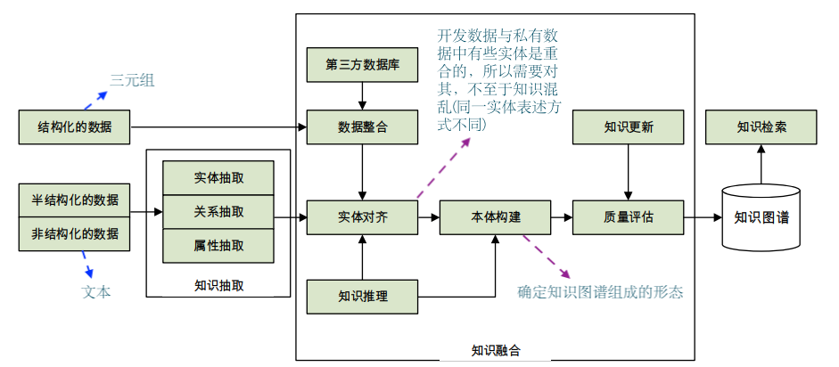

### 关键技术
- 知识抽取:非结构化 -> 结构化
- 知识融合:消歧提升数据质量
- 知识推理:挖掘扩充或补全数据
- 知识表示:向量化
### 知识抽取
面向非结构化数据，过自 动化的技术抽取出可用的知识单元
1. 实体抽取
2. 关系抽取
3. 属性抽取

#### 实体抽取
实体是知识图谱中的最基本元素，其抽取的完整性、准确率、召回率等将直接影响到知识库的质量。命名实体识别：1.基于规则和词典的方法； 2.基于机器学习的模型预测方法(序列标注问题)  

#### 关系抽取
1. 限定领域关系抽取，关系类型<u>有限</u>，<u>已知</u>
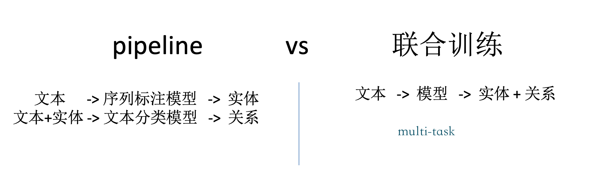 
说明：在限定领域中关系的类型都会明确固定的。在pipeline中第一步：一个文本送入ner中可以抽取中n个实体。第二步：将文本与实体(n选2)两两组合送入文本分类模型(送入分类模型的原因在于：我们定义了关系式数量有限集)，判断关系。如果不在第二部中传入指定的实体，那么对于文本而言判断出的两个实体之间的关系将不再准确。再指定了实体内容之后进行 $C_{n}^2$次判断。
说明：那么输入是相同的文本怎么强调不同的实体，具体实现可以参考[R-bert关系抽取](./code/Rbert/R-bert关系抽取.pdf) 代码部分参考：[model.py](./code/Rbert/model.py)

对于联合训练的实现方式可参考：[model.py](./code/封闭式抽取/model.py)

2. 开放领域关系抽取，基于序列标注，BIO标注
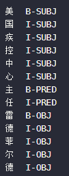
subject：实体1
predict：关系
object：实体2

代码实现可参考：[model.py](./code/开放式抽取/model.py)

#### 属性抽取 
实体的属性可以看成是实体与属性值之间的一种名称性关系。因此可以 将实体属性的抽取问题转换为**关系抽取**问题。可以借鉴大部分关系抽取的方法。


#### 关系抽取
远程监督，通过知识图谱中的三元组数据回标语料。由三元组的数据找到包含三元组数据的语料，用三元组数据的语料训练关系抽取的模型。 再用模型去预测未知的语料。找到更多的三元组。

图谱中：姚明 – 身高 – 226cm
语料中：身高226cm的姚明被称为小巨人。。
      姚明凭借226cm的身高优势。。

将文本标记为指定关系类别，用于训练。

#### 知识融合
由于知识图谱中的知识来源广泛，存在知识质，量良莠不齐、来自不同数据源的知识重复、知识间的关联不够明确等问题，所以必须要进行知识的融合。

- 实体对齐
- 实体消歧
- 属性对齐


##### 实体对齐
- 将不同来源的知识认定为真实世界的同一实体。
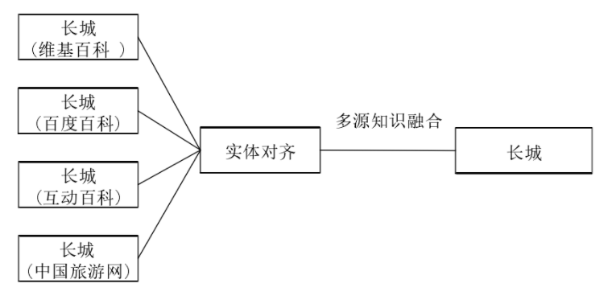

- 依据不同实体所包含的**属性之间的相似度**，来判断实体是否为同一实体。


##### 实体消歧
将同一名称但指代不同事物的实体区分开。
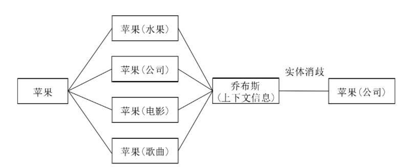

做法：1.基于实体的属性情况 2.基于文本上下文信息寻找属性值，然后把挖掘到的三元组加到正确的实体关系上 

##### 属性对齐
不同数据源对于实体属性的记录可能使用不同的词语。
示例：
x度百科：姚明   -   生日   - 1980年9月12日
搜x百科：姚明   -   出生日期   - 1980年9月12日
wxkx百科：姚明   -   出生年月   - 1980年9月12日
使用属性和属性值做相似度计算。


### 知识推理
在已有的知识库基础上进一步挖掘隐含的知识，从而丰富、扩展知识库。
- 做法：
- 基于规则+句法
    - 示例：
    传递性：A-儿子-B，B-儿子-C， A-?-C
    实例性：A-是-B，B属于C，A-?-C
- 基于模型的知识补全
给出两个实体，推断其关系，h + r  -> t,    h + t -> r ,   (h, r, t) -> {0, 1}。相关论文 [KG-Bert](./code/KG-Bert知识补全.pdf)

### 知识表示

将知识图谱中的实体，关系，属性等转化为向量，利用向量间的计算关系，反映实体间的关联性。
论文参考：[TransE](./code/TransE知识表示.pdf)
对于三元组（h, r, t）
学习其向量表示lh   lr   lt    使其满足 lh + lr ≈ lt


#### 知识表示-融合文本
融合文本的知识表示，将文本表示和知识图谱中的实体关系表示放入同一个空间，使得学习到的实体表示可以在文本相关的任务中使用。

### 图数据库的使用

#### 数据库和SQL语句
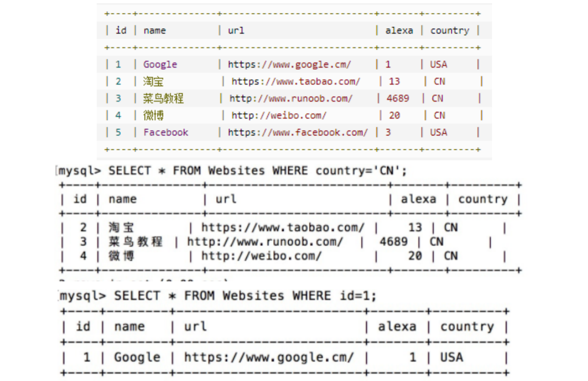

#### 图数据库
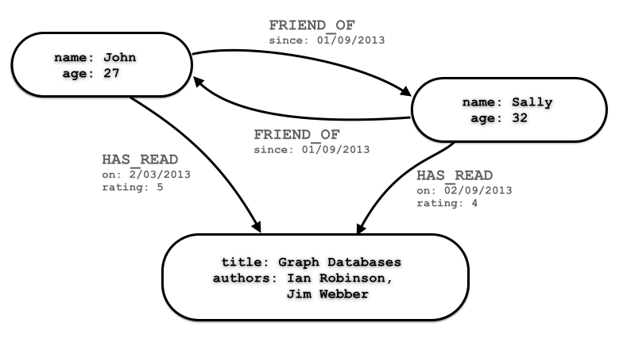
- Neo4j
    - 官网下载 [https://neo4j.com/download-center/](https://neo4j.com/download-center/)
    - 教程 [https://www.w3cschool.cn/neo4j/](https://www.w3cschool.cn/neo4j/)

- 有python接口
```
pip install py2neo
```
连接数据库，执行cypher语句

### 知识图谱应用核心NL2SQL
#### NL2SQL
将文本转化成查询语句
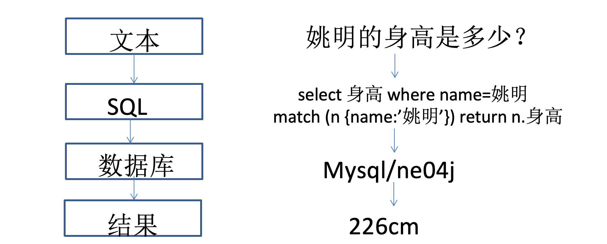

#### 实现方法
- 方法1：基于模板+文本匹配
类似于faq库问答
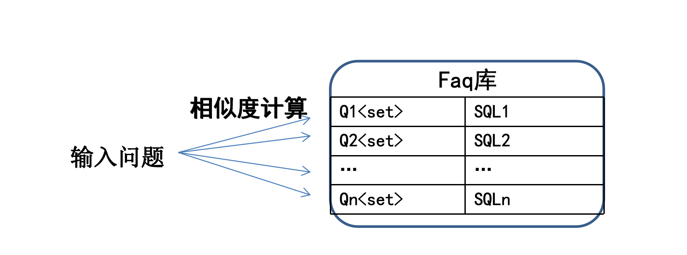
代码实现可以先考：[build_graph.py](./code/kgqa_base_on_sentence_match/build_graph.py)


- 方法2：拆解成多个分类或抽取问题处理
semantic parsing
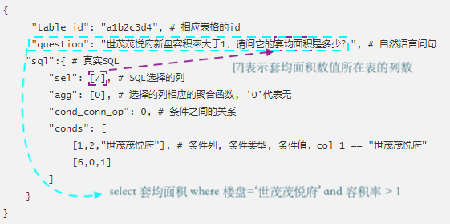
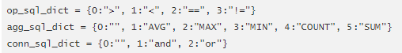

- 方法3：利用LLM的生成能力
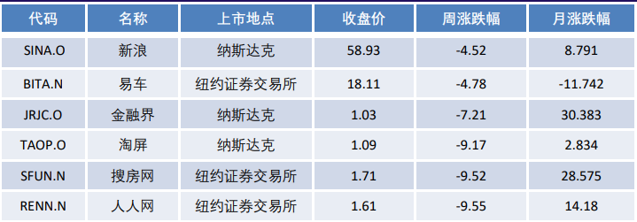
Prompt: 我有一张数据表，表头依次为:{代码、名称...}。
               请对于我下面的问题，给出一条数据查询SQL语句。
               问题：{搜房网和人人网的收盘价是多少？}

LLM： select 收盘价 where 名称=‘人人网’ or 名称=‘搜房网’


- 多表关联

```sql
select T2.中文名 , min ( T1.融资额 ) , T2.法定代表人 from 投资公司 as T1 join 企业 as T2 on 投资公司.企业id == 企业.词条id where T2.注册资本 >= 1000000 group by T1.企业id

select T2.名称 , min ( T1.门店数量 ) , T2.所属公司 from 洗衣机品牌门店 as T1 join 洗衣机品牌 as T2 on 洗衣机品牌门店.品牌id == 洗衣机品牌.词条id where T2.市场份额 <= 0.102 group by T1.品牌id
```

- 嵌套

```sql
select 中文名 , 场上位置 from 篮球运动员 where 词条id not in ( select 球员id from 比赛记录 )

( select 名称 from 参考书 order by 适用年级 desc limit 3 ) union ( select 名称 from 参考书 order by 价格 asc limit 5 )

select a.军用枪支数 / b.军用枪支数 from ( select 军用枪支数 from 国家 where 名称 == '乌拉圭' ) a , ( select 军用枪支数 from 国家 where 名称 == '美国' ) b
```
