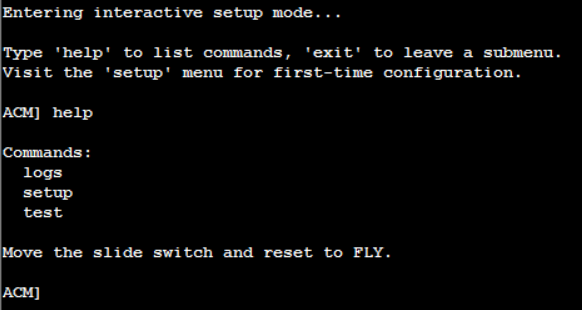
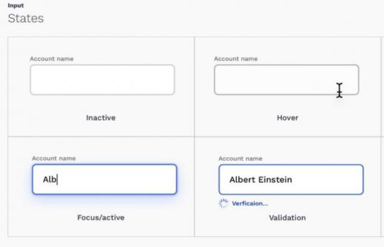
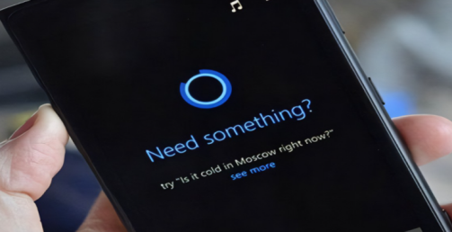
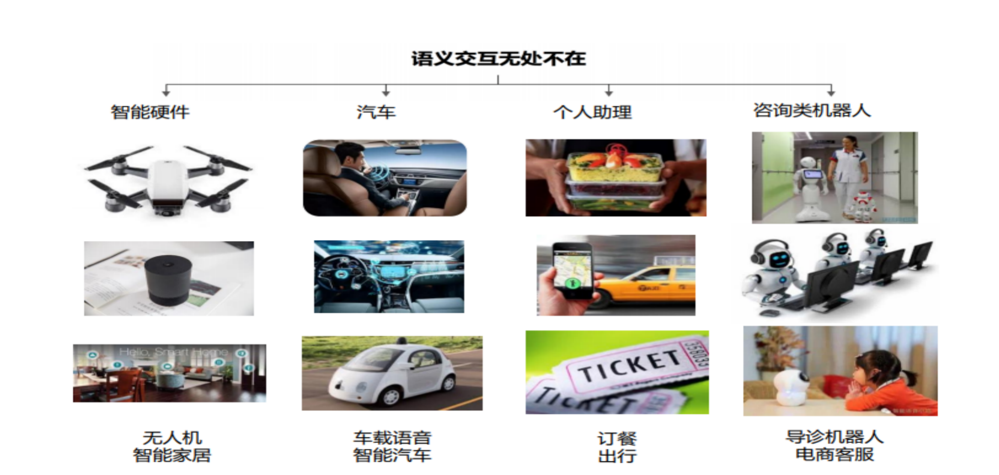
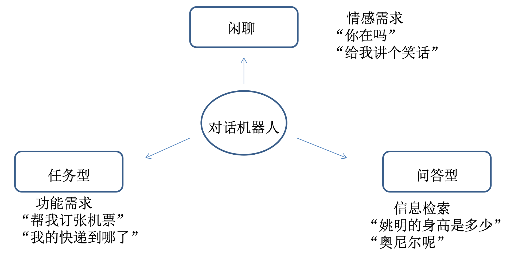

# 对话系统

## 人机交互方式演进

- 命令行交互


- GUI图形界面交互

- GUI+ 触摸、声音等

- 沉浸式

- 语义交互

- 交互需求



### 对话系统

|              | 任务型  | 问答型            | 聊天型    |
|--------------|:-------|------------------|----------|
| 目的         | 完成特定任务  | 回答问题，提供信息 | 闲聊 |
| 领域         | 垂直领域   | 垂直&开放领域     | 开放领域 |
| 以轮数为评价  | 越少越好  | 越少越好          | 越多越好  |
| 应用         | 业务办理，订机票，客户回访，催收催缴等 | 客服、培训、搜索等  | 闲聊、寒暄、情感陪伴等 |

### 任务型对话机器人
