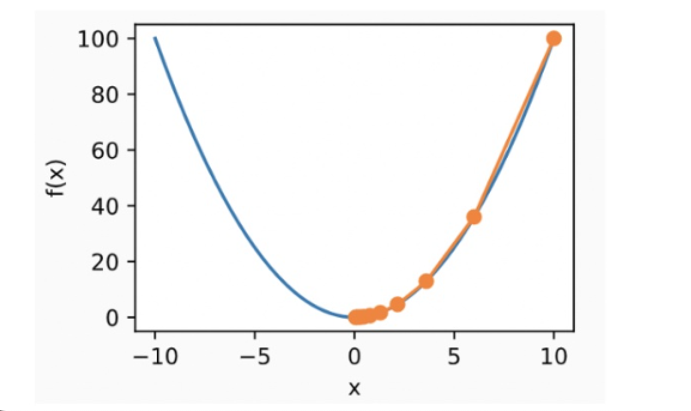

# 梯度下降算法


## 1.找极小值问题

函数f(x)的值受x影响，目标：找到合适的x值，使得f(x)最小。

<div style="display: flex; align-items: flex-start; gap: 10px;">
  
  <div>
    方法：<br>
    1. 任取一点 x₀，计算在这一点的导数值 f(x₀)。  <br>
    2. 根据导数的正负，决定 x₀ 应当调大还是调小。 <br>  
    3. 迭代进行步骤 1 和 2，直到 x 不再变化（或变化极小）。  <br>
  </div>
</div>


原函数为`y = x2`,导函数为`y = 2*x,`在`x = -1`这个点，导数值为`-2`,该点导数为负数，说明在这一点，如果x增大，y会减小,所以f(x)最小值的点应当在-1的右侧（大于-1）


原函数为`y = x2`,导函数为`y = 2*x`,在x = 1这个点，导数值为 2。该点导数为正数，说明在这一点，如果x增大，y会增大，所以f(x)最小值的点应当在-1的左侧（小于1）

## 2.梯度
梯度：可以理解为多元函数的导数，意义与导数基本一致

<div style="display: flex; justify-content: space-around; align-items: center;">

<div style="text-align: left;"> 
  <p>原函数：y = 3x2</p>
  <p>导函数: y = 6x</p>
  <p>在x=1处的导数值：6 </p>
  
</div>

<div style="text-align: left;">
  <p>原函数：y = 3x12 + 4x22 + 5x32 </p>
  <p>导函数：y = {6x1 , 8x2 , 10x3} </p>
  <p>在[1，1，1]处的梯度是[6，8，10] </p>
  <p>梯度是个向量 </p>
  
</div>
</div>

### 2.1 梯度下降法

梯度下降法名称为：SGD(Stochastic gradient descent)，根据梯度，更新权重；学习率控制权更新**幅度**。

- 计算公式如下：

<div style="text-align: center;">
  
$$\theta_{t+1} = \theta_t - \alpha \nabla L(\theta_t)$$

<p>(下一次) 权重&emsp; (当前)权重 &emsp; 学习率 &emsp; 梯度</p>

</div>


## 3.深度学习步骤

 

### 3.1 pytorch

pytorch主页：[https://pytorch.org/](https://pytorch.org/)

pytorch官方文档：[https://pytorch.org/docs/stable/index.html](https://pytorch.org/docs/stable/index.html)

### 3.2 求解目标

ps: x轴表示**模型权重**，图中的曲线f(x)表示**损失函数**的曲线

<div style="display: flex; align-items: center; justify-content: space-around;">

<!-- 左侧插入图像 -->
<div>
  
</div>

<!-- 右侧文本部分 -->
<div style="text-align: left;">
  <p>损失函数越小，模型越好</p>
    <div style="display: flex; justify-content: center;"><span style="font-size: 24px;">⬇️</span></div>
  <p>学习的目标是损失函数最小化</p>
   <div style="display: flex; justify-content: center;"><span style="font-size: 24px;">⬇️</span></div>
  <p>模型权重影响损失函数值</p>
    <div style="display: flex; justify-content: center;"><span style="font-size: 24px;">⬇️</span></div>
  <p>通过梯度下降找到最优权重</p>
</div>

</div>

#### 3.2.1 完整的反向传播过程

- 1.根据输入x和模型当前权重，计算预测值y'

- 2.根据y'和y使用loss函数计算loss

- 3.根据loss计算模型权重的梯度

- 4.使用梯度和学习率，根据优化器调整模型权重

代码示例：


> note
> 对于展示的代码想在vscode中运行的，需要：
> vscode里面选择安装了torch的py环境
> 1、打开命令面板`Ctrl+Shift+P`（Windows）或`Cmd+Shift+P`（Mac
> 2、输入并选择“Python: Select Interpreter”
> 3、在弹出的列表中，你将看到所有可用的Python解释器，包括系统Python和虚拟环境中的Python
> 4、点击你希望使用的解释器。VSCode将会在当前工作区中使用该解释器
>

#### 3.2.2 权重更新方式

- Gradient descent：所有样本一起计算梯度（累加）
- Stochastic gradient descent：每次使用一个样本计算梯度
- Mini-batch gradient descent：每次使用n个样本计算梯度（累加）

### 3.3 网络结构-全连接层

全连接层又称_**线性层**_，计算公式：`y = w * x + b`，`W`和`b`是参与训练的参数，`W`的维度决定了隐含层输出的维度，一般称为隐单元个数（hidden size）。

- 举例：
    - 输入：x (维度 1 x 3)
    - 隐含层1：w（维度 3 x 5）
    - 隐含层2: w (维度 5 x 2)
    
    


### 3.4 激活函数

为模型添加**非线性因素**，使模型具有拟合**非线性函数**的能力，无激活函数时`y = w1(w2(w3 * x + b3) +b2) + b1` 仍然是线性函数。

#### 3.4.1 激活函数-Sigmoid
一种非线性映射，将任意输入映射到0-1之间。

- 缺点：1.计算耗时，包含指数运算；2.非0均值，会导致收敛慢；3.易造成梯度消失。

- 函数图像：


- 公式：
    
    ``f(x) = \frac{1}{1+e^{-x}}``
- 导数：
    ``f^{'}(x) = (-1)(-1)(e^{x}+1)^{-2}e^{x} = (1 + e^{-x})^{-2}e^{-2x}e^{x} = (1 + e ^{-x})^{-1}·\frac{e^{-x}}{1+e^{-x}} 
    = f(x)(1-f(x))``
    
- 代码示例

```
import torch
import torch.nn.functional as F

# 定义输入张量
x = torch.tensor([-2.0, -1.0, 0.0, 1.0, 2.0])

# 计算 Sigmoid 输出
sigmoid_output = torch.sigmoid(x)
print(sigmoid_output)

# 输出
tensor([0.1192, 0.2689, 0.5000, 0.7311, 0.8808])
```    

#### 3.4.2 激活函数-tanh
以0为均值，解决了`sigmoid`的一定缺点,但是依然存在**梯度消失**问题,计算同样非常耗时

- 函数图像：


- 函数公式
```math
tanh(x) = \frac{sinh(x)}{cosh(x)} = \frac{e^{x} - e^{-x}}{e^{x} + e^{-x}}
```
- 与Sigmoid的转化
```math
tanh(x) = \frac{1-e^{-2x}{1+e^{-2x}}} = 2(\frac{1}{1+e^{-2x}})-1 = 2sigmoid(2x)-1
```

- 代码示例

```
import torch
import torch.nn.functional as F

# 定义输入张量
x = torch.tensor([-2.0, -1.0, 0.0, 1.0, 2.0])

# 计算 Tanh 输出
tanh_output = torch.tanh(x)
print(tanh_output)

#输出
tensor([-0.9640, -0.7616,  0.0000,  0.7616,  0.9640])
```

#### 3.4.3 激活函数-Relu
在正区间不易发生梯度消失,计算速度非常快,一定程度上降低过拟合的风险。

- 函数图像


- 函数公式
$Relu = max(0,x)$

- 代码示例

```
import torch
import torch.nn.functional as F

# 定义输入张量
x = torch.tensor([-1.0, 0.0, 1.0, 2.0])

# 计算 ReLU 输出
relu_output = F.relu(x)
print(relu_output)

# 输出
tensor([0., 0., 1., 2.])

```

#### 3.4.5 激活函数-Gelu
`GELU（Gaussian Error Linear Unit）`是一种平滑的激活函数，结合了`ReLU` 和`Sigmoid`的优点。相比于`ReLU`，它在输入为负数时不会直接截断，而是根据概率进行平滑处理。

- 函数公式

$GELU(x) = 0.5 * x * (1 + Tanh(\sqrt\frac{2}{π})*(x + 0.044715 * x^ {3}))$

- 函数图像


- 代码示例

```
import torch
import torch.nn.functional as F

x = torch.tensor([-1.0, 0.0, 1.0])
output = F.gelu(x)
print(output)  # 输出 [-0.1588, 0.0000, 0.8413]

```


#### 3.4.4 激活函数-Softmax

- 场景：用于神经网络的输出层，尤其是在处理多类别分类问题时。
- 功能：将模型输出的原始分数（logits）转换为概率分布，输出每个类别的概率。
- 示例：图像分类（如CIFAR-10），文本分类（如新闻分类）。

- 函数公式

    $y_{k} = \frac{exp(a_{k})}{\sum_{i=1}^n exp(a_{i})}$

<div style="display: flex; justify-content: space-around; align-items: center;">

<div style="text-align: left;"> 
  
</div>

<div style="text-align: left;">
  
</div>
</div>

- 代码示例

```
import torch
import torch.nn.functional as F

# 定义输入张量（logits）
logits = torch.tensor([2.0, 1.0, 0.1])

# 计算 Softmax 输出
softmax_output = F.softmax(logits, dim=0)
print(softmax_output)  # 输出概率分布

# 输出
tensor([0.6590, 0.2424, 0.0986])

```

### 3.5 损失函数

#### 3.5.1 均方差
**均方误差（Mean Squared Error, MSE**）是一种常用的回归问题损失函数，用于衡量模型预测值与真实值之间的差异。其**核心思想**是对预测误差取平方，再计算平均值。

- 优缺点
    - 优点：简单易实现，具有良好的解析性质
    - 缺点：对异常值敏感，容易受到离群点影响 

- 公式
    $\zeta(x,y) = L = \lbrace l_{1},,,,l_{N}\rbrace^T, l_{n}=(x_{n}-y_{n})^{2}$

- 代码示例

```
import torch
import torch.nn as nn

# 定义真实值和预测值
y_true = torch.tensor([3.0, 5.0, 7.0])
y_pred = torch.tensor([2.5, 5.5, 6.8])

# 定义 MSE 损失函数
mse_loss = nn.MSELoss()
loss = mse_loss(y_pred, y_true)
print(loss)  # 输出 MSE 损失值

```


#### 3.5.2 交叉熵
交叉熵损失函数衡量的是实际标签分布与预测标签分布之间的差异。它通常用于**分类问题**，尤其是**多分类问题**。

- 二分类问题，交叉熵的公式为
    - $Cross-Entropy Loss(p,q) = −(ylog(p)+(1−y)log(1−p))$
        - 其中：
            - y 是实际标签（0 或 1），
            - p 是预测概率（预测为类别 1 的概率）
- 多分类问题，交叉熵损失的公式为：
    - $Cross-Entropy Loss(p,q) = - \sum_{i=1}^C y_{i}log(p_{i})$
        - 其中：
            - C 是类别数，
            - $y_{i}$是实际标签（One-hot 编码）
            - $p_{i}$是预测概率（每个类别的概率）

- 实际示例：
    假设一个三分类任务，某样本的正确标签是第一类，则`p = [1, 0, 0]`, 模型预测值假设为`[0.5, 0.4, 0.1]`, 则交叉熵计算如下:
    Cross-Entropy Loss(p=[1,0,0],q=[0.5,0.4,0.1]) = -(1*log0.5+0*log0.4+0*log0.1) ≈ 0.3
                

- 示例代码
    
```
import torch
import torch.nn as nn

# 定义预测的 logits（未经过 Softmax）
logits = torch.tensor([[1.0, 2.0, 0.1], [0.5, 1.2, 0.8]])

# 定义真实标签（每个样本的类别，One-hot 编码不需要）
labels = torch.tensor([1, 2])

# 定义交叉熵损失函数
loss_fn = nn.CrossEntropyLoss()

# 计算损失
loss = loss_fn(logits, labels)
print(f"Cross-Entropy Loss: {loss.item()}")

```


#### 3.5.3 其他

- 指数损失 
     L(Y，f(X)) = exp(-Yf(x))
- 对数损失
     L(Y,P(Y|X)) = -logP(Y|X)
- 0/1损失          
    $L(Y,f(x)) = \begin{cases} 1, &\text {Y!=f(x)} \\ 0,&\text {Y = f(x)} \end{cases}$
    
- Hinge损失(二分类)
    $J_{hinge} = \sum_{i=1}^Nmax(0,1 - sgn(y_{i})\hat{y_{i}})$    

