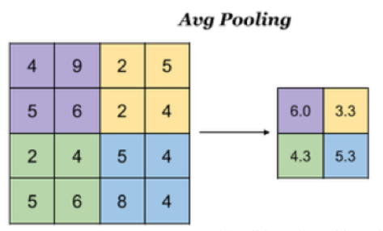
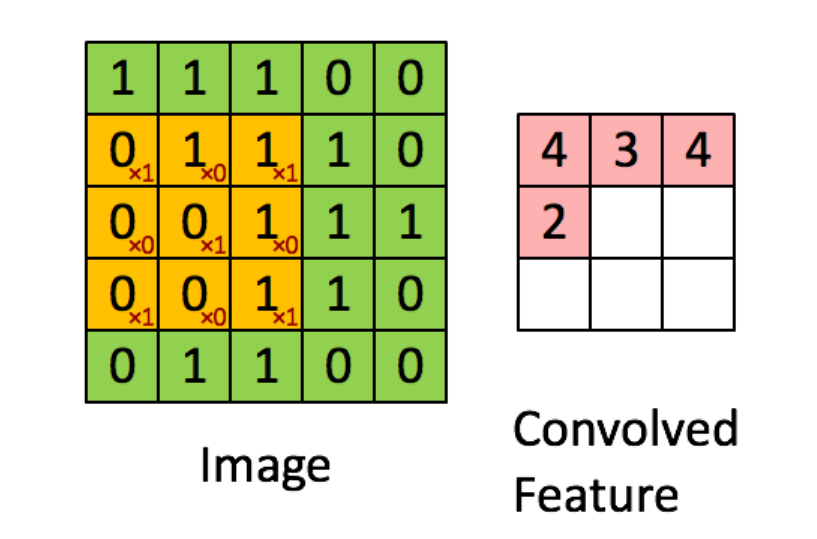

# 深度学习处理文本

## 1. 反向传播

| **网络结构** |  **运算**      |   **形状**          |
| ------------ | --------------------------- | ----------------- |
| 输入         | x        | x.shape = 1×2                 |
| 全连接层     | wx          | w.shape = 2×2, wx.shape = 1×2 |
| sigmoid      |       | sigmoid(wx).shape = 1×2     |
| 均方差损失   |  | y_true.shape = 1×2    |
| loss 值      | loss                     | loss -> float     |


| 网络结构 | 运算过程        |
|----------|-----------------|
| 输入     | x=[x0,x1] (假设x的输入是二维的)  w = [[w11,w12],[w21,w22]] |
|  全连接层   | np.dot(x,w) = [x0*w11 + x1*w21, x0*w12 + x1*w22]   |
|            |  x0*w11 + x1*w21 = wx[0] ; x0*w12 + x1*w22  = wx[1]  |
| sigmoid  | sigmoid(wx) = [sig(x0*w11 + x1*w21), sig(x0*w12 + x1*w22)] --> y_pred |
|           | sig(x0*w11 + x1*w21)= y_pred{0}; sig(x0*w12 + x1*w22)= y_pred[1] |
| 均方差损失 |   |
| loss值   |  d(w11) = 2(y_pred[0] - y[0])/n * y_pred[0]*(1-y_pred[0]) * x0;d(w21) = 2(y_pred[0] - y[0])/n * y_pred[0] * (1-y_pred[0]) * x1 ;d(w12）及d(w22)同样的道理采用链式求导法则对w进行求导|
|          |   均方差导数 * sigmoid导数 * wx[0] 对w11导数        |


在更新w的时候依然采用w-Lr(学习率)*梯度

代码示例可参考：[BackPropagation&adam.py](./code/BackPropagation&adam.py)


## 2.优化器-Adam

- 计算公式如下：


关于公式的解释：

要求: $\alpha$ : Stepsize -> 学习率Lr;  
要求: $\beta1$, $\beta2$ $\in$ [0,1);  
要求: f($\theta$) : 带有 $\theta$ 参数( $\theta$ 相当于wx+b 中的w)的目标函数 -> 模型函数;  
要求: 对 $\theta_{0}$ 进行初始化  
　　　定义 $m_{0}$ -> 0  
        　$v_{0}$ -> 0  
        　t -> 0  
        　while  $\theta_{t}$ 没有收敛之前一直循环  
        　t = t+1  
        　$g_t$ = $\nabla_{\theta} f_{t}(\theta_{t}-1)$    


- 优缺点
1. 实现简单，计算高效，对内存需求少
2. 超参数具有很好的解释性，且通常无需调整或仅需很少的微调
3. 更新的步长能够被限制在大致的范围内（初始学习率）
4. 能够表现出自动调整学习率
5. 很适合应用于大规模的数据及参数的场景
6. 适用于不稳定目标函数
7. 适用于梯度稀疏或梯度存在很大噪声的问题


## 3.利用NLP处理文本任务

- 任务目标：字符串分类-判断字符串中是否出现了指定字符

- 示例：指定字符:a;样本内容：abcd - 正样本; bcde - 负样本;

- 神经网络处理文本的过程分析

  - 当前输入：字符串 如：abcd
  - 期望输出：概率值 正样本=-1，负样本=0，以0.5位分界（这个分界值其实是自定义设定的）
  - X="abcd" Y=1;X="bcde" Y=0;
  - 建模目标：找到一个映射f(x)，使得f("abcd") = 1,f("bcde") = 0

### 3.1 具体实施过程：
#### step1. 字符数值化
  每个字符转化成同维度向量,在下面的转化过程中字符都被转化成了5维向量，其中维度数量是可以自定义的而且这个数据化的过程也是随机的
  a -> [0.32618175 0.20962898 0.43550067 0.07120884 0.58215387]
  b -> [0.21841921 0.97431001 0.43676452 0.77925024 0.7307891 ]
  ...
  z -> [0.72847746 0.72803551 0.43888069 0.09266955 0.65148562]
  对于字符串“abcd”转化后的结果就是 -> 4 * 5的矩阵
  [[0.32618175 0.20962898 0.43550067 0.07120884 0.58215387]
  [0.21841921 0.97431001 0.43676452 0.77925024 0.7307891 ]
  [0.95035602 0.45280039 0.06675379 0.72238734 0.02466642]
  [0.86751814 0.97157839 0.0127658  0.98910503 0.92606296]]
  矩阵形状 = 文本长度 * 向量长度
 
#### step2. 矩阵转化为向量
  对向量求平均值（计算的过程是对向量进行垂直向的相加再除以4，垂直向的相加是因为进行不使水平向的数值计算结果对样本形成锚定关系，而使得不同样本间的存在潜在的数值关系）：
  [[0.32618175 0.20962898 0.43550067 0.07120884 0.58215387]
 [0.21841921 0.97431001 0.43676452 0.77925024 0.7307891 ]
 [0.95035602 0.45280039 0.06675379 0.72238734 0.02466642]
 [0.86751814 0.97157839 0.0127658  0.98910503 0.92606296]]
计算完成以后原来的向量变成->
[0.59061878 0.65207944 0.2379462  0.64048786 0.56591809]
由4*5的矩阵变成了->1*5的向量   形状=1*向量长度

#### step3. 向量到数值
 采用最简单的线性公式y=w*x+b,w维度为1*向量维度，b为实数。
 例如：
 ```math
 w = [1,1],b = -1,x=[1,2];
 [1,1]*\begin{bmatrix} 1 \\ 2 \\ \end{bmatrix} -1 = 1*1 + 1*2 - 1 =2
 ```
 
#### step4. 数值归一化
 利用sigmoid函数：
 ```math
f(x) = \frac{1}{1+e^{-x}}
 ```
 将数值转化到0~1之间
 
#### 整体映射过程
 
 1. “abcd”--每个字符转化成<span style="color: red;">向量</span> -->    4 * 5矩阵
 2. 4 * 5矩阵   ----向量求平均---->                     1 * 5向量
 3. 1 * 5向量   ----<span style="color: red;">w</span>*x + <span style="color: red;">b</span>线性公式 --->                实数
 4. 实数            ----sigmoid归一化函数--->        0-1之间实数
红色部分需要通过训练优化

## 4.Embedding层
Embedding矩阵是可训练的参数，一般会在模型构建时随机初始化，也可以使用预训练的词向量来做初始化，此时也可以选择不训练Embedding层中的参数。输入的整数序列可以有重复，但取值不能超过Embedding矩阵的列数。
- 核心价值：将**离散值**转化为向量，在nlp任务和各类特征工程中应用广泛
- 一般需要搭配**词表文件**来使用，对于中文通常使用**字**，对于英文使用**token**，多个语种和符号可以出现在同一份词表中。
- 使用Embedding层的目的是：“abc" --词表--> 0,1,2  --Embedding层-->  3*n的矩阵  --> model



## 5.池化层
- 降低了后续网络层的输入维度，缩减模型大小，提高计算速度
- 提高了特征的鲁棒性(健壮性)，防止过拟合

池化的方式有两种：1.最大值池化 2.平均值池化；这两种方式如下图所示：

<div style="display: flex; justify-content: space-between;">
    
    
</div>

对于这两种池化方式，需要说明的是，都是一种将数据进行缩减的方式，最大值池化可以看出是将原来的一个4*4的矩阵缩减成2*2的矩阵，对应颜色的值取的的是原颜色中的最大值。均值池化同样的道理，不同的是取的是均值。

## 6.网络结构

### 6.1 网络结构-全连接层

又称线性层，计算公式：y = w * x + b，W和b是参与训练的参数，W的维度决定了隐含层输出的维度，一般称为隐单元个数（hidden size）。对于本部分的知识可以参考[梯度下降算法-3.3 网络结构](../3.梯度下降算法/梯度下降算法)


### 6.2.网络结构-RNN
循环神经网络（recurrent neural network）主要思想：将整个序列划分成多个时间步，将每一个时间步的信息依次输入模型，同时将模型输出的结果传给下一个时间步。


- 计算公式：


h: hidden_size = 128
I: input_size = 256

### 6.3 网络结构-CNN
以卷积操作为基础的网络结构，每个卷积核可以看成一个特征提取器，CNN广泛应用于视频图像的处理过程，因为对于图像和视频而言，附件的像素点之间普遍存在着关联。 卷积网络进行过程如图所示：



结果是将一个原来5*5的矩阵转换插到那个一个3*3的矩阵，黄色方框自左向右自上而下，依次移动一格，每移动一次，都对黄色矩阵内的元素逐项相乘再相加运算，得出的结果作为新矩阵的一项内容。 

### Normalization

<div style="display: flex; justify-content: space-between;">
    
    
</div>

- 计算公式

其中，r,b都是需要学习的参数

### Dropout层
- 作用：减少过拟合，按照指定概率，随机丢弃一些神经元（将其化为零），其余元素乘以 `1 / (1 – p)`进行放大。

示意图如下：


- 如何理解其作用：
    - 1）强迫一个神经单元，和随机挑选出来的其他神经单元共同工作，消除减弱了神经元节点间的联合适应性，增强了泛化能力

    - 2）可以看做是一种模型平均，由于每次随机忽略的隐层节点都不同，这样就使每次训练的网络都是不一样的，每次训练都可以单做一个“新”的模型

- 启示：计算方式并不是越复杂就越好
