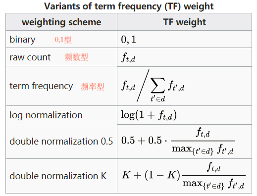
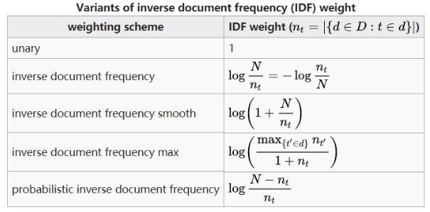

# 新词发现和tfidf

## 新词发现

- 假设没有词表，如何从文本中发现新词？
随着时间推移，新词会不断出现，固有词表会过时，补充词表有利于下游任务。 

## 如何实现新词发现

词相当于一种固定搭配，词的内部应该是稳固的(内部凝固度)——两个字或多个字经常出现在一起，词的外部应该是多变的(左右熵)。

- 内部凝固度：
 
  - p(W):两字搭配或多字搭配在所有两字搭配或多字搭配中出现的频率
  - p(c1):单字在所有字中出现的频率
  - 总结：当p(W)这个值越大，而p(c1)..p(cn)值越小时表示内部稳固度越高，反之则内部稳固度越小

 ```math
 \frac{1}{n}  \log \frac{p\left( w \right)}{p\left(c_{1} \right)\cdots p\left(c_{n} \right)}
 ```
- 左右熵：
    - 对于多字词组，假设abc这个固定词组而言，往往ab与c分开并不会形成一个词组，即ab这种组合并不是一个词，ab组合出现的概率高完全是因为abc这个组合出现的概率高。因此不能将ab归结为一个词，为了区分这种情况，因此引入了左右熵；
    - 说明：为了确认abc是否一种潜在的搭配，我们查看这个搭配的外部，即abc这种搭配出现后，下一个字出现过哪些字，然后对出现过的每个字进行进行`pi * log pi`计算(p为出现概率)，再求和再取负，计算出来的结果即为**右熵**；左熵同理。
    
```math
H\left(U \right) = E\left[- \log p_{i} \right] = - \displaystyle \sum^{x}_{i=1}p_{i} \log p_{i}
```

- 示例说明：
    - 语料：10月11日早上，河北平山县一辆通勤班车涉水倾覆，车上共有51人。截至下午3时，已有40人抢救上岸，其中3人经抢救无效死亡，仍有11人失联。公安机关已对肇事司机进行控制，事故原因正在调查。
    - 操作：根据上面的语料，统计所有2字或多字的组合的内部凝固度以及左右熵，按照从高到低进行排序，内部凝固度高而左右熵低的即表明是新的词。

参考代码： [new_word_detect.py](./code/new_word_detect.py)

## 重要词的发现

- 有了分词能力后，需要利用词来完成对文本的理解
- 从文章中挑选重要词

### 何为重要词

- 假如一个词在某类文本（假设为A类）中出现次数很多，而在其他类别文本（非A类）出现很少，那么这个词是A类文本的重要词（高权重词）。
    - 恒星、黑洞 -》 天文
    - 区块，交易 -》 区块链

-  如果一个词在出现在很多领域，则其对于任意类别的重要性都很差
    - 中国 -》政治、地理、文化/综艺

### 从数学角度刻画

从数学角度进行刻画需要一种nlp的经典统计值：TF·IDF。

- 计算公式：

```math
\log \left( \frac{语料库的文档总数}{包含该词的文档数+1} \right)
```

- **TF**：词频。 
      某个词在某类别中出现的次数/该类别词总数

- **IDF**：逆文档频率。
       N代表文本总数
       dfi代表包含词qi的文本中的总数
       逆文档频率高 -> 该词很少出现在其他文档

### TF · IDF 计算示例

假设有四篇文档，文档中的词用字母代替
- A：a b c d a b c d
- B: b c b c b c
- C: b d b d
- D: d d d d d d d

每个词对于每个文章的重要程度（表1）

| TF | A    | B   | C   | D |
|----|:-----|:----|-----|---|
| a  | 0.25 | 0   | 0   | 0 |
| b  | 0.25 | 0.5 | 0.5 | 0 |
| c  | 0.25 | 0.5 | 0   | 0 |
| d  | 0.25 | 0   | 0.5 | 1 |

这里为计算简单，IDF用N/df代替(N表示文章总数，df表示出现的次数)（表2）

|   | N/df |
|---|------|
| a | 4/1  |
| b | 4/3  |
| c | 4/2  |
| d | 4/3  |

然后将表2，乘以log分别乘到表1的每一列中，即(a-A)项乘log(4/1)即为a词对于A文档的重要程度。(a-B)项乘log(4/1)即为a词对于B文档的重要程度。

### TFIDF其他计算公式



### 算法特点

1. tf-idf的计算非常依赖分词结果，如果分词出错，统计值的意义会大打折扣

2. 每个词，对于每篇文档，有不同的tf-idf值，所以不能脱离数据讨论tfidf

3. 假如只有一篇文本，不能计算tf-idf

4. 类别数据均衡很重要

5. 容易受各种特殊符号影响，最好做一些预处理

代码参考：[calculate_tfidf.py](./code/calaulate_tfidf.py)


### TFIDF应用

#### 搜索引擎

1. 对于已有的所有网页（文本），计算每个网页中，词的TFIDF值
2. 对于一个输入query进行分词
3. 对于文档D，计算query中的词在文档D中的TFIDF值总和，作为query和文档的相关性得分

代码参考：[search_engine_based_on_tfidf](./code/search_engine_based_on_tfidf.py)

### 文本摘要
1. 通过计算TFIDF值得到每个文本的关键词。
2. 将包含关键词多的句子，认为是关键句。
3. 挑选若干关键句，作为文本的摘要。

代码参考：[document_abstract_based_on_tfidf.py](./code/document_abstract_based_on_tfidf.py)

### 文本相似度
1. 对所有文本计算tfidf后，从每个文本选取tfidf较高的前n个词，得到一个词的集合S。
2. 对于每篇文本D，计算S中的每个词的词频，将其作为文本的向量。
3. 通过计算向量夹角余弦值，得到向量相似度，作为文本的相似度。

- 向量夹角余弦值计算：
```math
cos\theta = \frac{\sum^{n}_{i=1}\left( A_{i} x B_{i} \right)}{\sqrt {\sum^{n}_{i=1}\left( A_{i} \right)^2}  * \sqrt{\sum^{n}_{i=1}\left( B_{i} \right)^2}} = \frac{A*B}{\left| A \right| * \left| B \right|}
```

代码参考：[document_similarity_based_on_tfidf.py](./code/document_similarity_based_on_tfidf.py)


## TFIDF的优缺点

### 优点
1. 可解释性好
    - 可以清晰地看到关键词
    - 即使预测结果出错，也很容易找到原因
2. 计算速度快
    - 分词本身占耗时最多，其余为简单统计计算
3. 对标注数据依赖小
    - 可以使用无标注语料完成一部分工作
4. 可以与很多算法组合使用
    - 可以看做是词权重

### 缺点
1. 受分词效果影响大
2. 词与词之间没有语义相似度
3. 没有语序信息（词袋模型）
4. 能力范围有限，无法完成复杂任务，如机器翻译和实体挖掘等
5. 样本不均衡会对结果有很大影响
6. 类内样本间分布不被考虑(对于一份语料信息，有的标题较短，这个关键词对于所属标题而言是重要的，但是在整体中出现次数较少，因为被忽略或TFIDF值不够贴合)
    
### 练习题

词典，每个词后方存储的是其词频，仅为示例，也可自行添加
Dict = {"经常":0.1,
        "经":0.05,
        "有":0.1,
        "常":0.001,
        "有意见":0.1,
        "歧":0.001,
        "意见":0.2,
        "分歧":0.2,
        "见":0.05,
        "意":0.05,
        "见分歧":0.05,
        "分":0.1}


根据上方词典，对于输入文本，构造一个存储有所有切分方式的信息字典
学术叫法为有向无环图，DAG（Directed Acyclic Graph），不理解也不用纠结，只当是个专属名词就好

代码参考：[week4_answer.py](./code/week4_answer.py)
