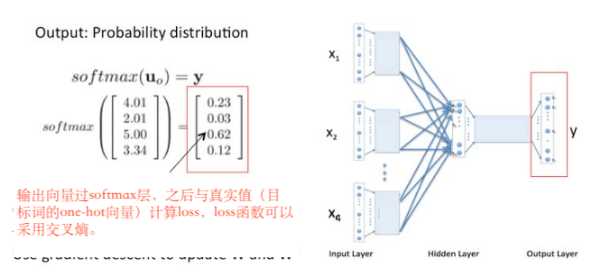

# 词的向量化

## 向量化
向量对于机器学习非常重要，大量的算法都需要基于向量来完成


### 文本向量化
对于机器来说，字符是没有含义的，只是有区别；只使用字符无法去刻画字与字、词与词、文本与文本之间的关系；文本转化为向量可以更好地刻画文本之间的关系，向量化后，可以启用大量的机器学习算法，具有很高的价值。

文本是由词和字组成的，想将文本转化为向量，首先要能够把词和字转化为向量，所有向量应该有同一维度n，我们可以称这个n维空间是一个语义空间。

我               [0.78029002 0.77010974 0.07479124 0.4106988 ]
爱               [0.14092194 0.63690971 0.73774712 0.42768218]
北京           [0.95780568 0.51903789 0.76615855 0.6399924 ]
天安门       [0.73861383 0.49694373 0.13213538 0.41237077]


#### one-hot编码
- 一个1或干个零组成的向量。首先统计一个字表或词表，选出n个字或词，比如：

| 字、词 | 向量            |
|-------|-----------------|
| 今天  | [1, 0, 0, 0, 0] |
| 天气  | [0, 1, 0, 0, 0] |
| 真    | [0, 0, 1, 0, 0] |
| 不错  | [0, 0, 0, 1, 0] |
| 。     | [0, 0, 0, 0, 1] |

今天 不错  -> [1, 0, 0, 1, 0]            今天 真 不错 -> [1, 0, 1, 1, 0]

- 在对文本向量化时，也可以考虑词频，比如
不错  ->  [0, 0, 0, 1, 0]
不错 不错 -> [0, 0, 0, 2, 0]

- 有时也可以不事先准备词表，临时构建,如做文本比对任务，成对输入，此时维度可随时变化,比如：
    - 例1：         你好吗心情         
    A: 你好吗  ->  [1, 1, 1, 0, 0]        
    B: 你心情好吗 -> [1, 1, 1, 1, 1]  
    - 例2：          我不知道谁呀
    A:我不知道 -> [1, 1, 1, 1, 0, 0]
    B:谁知道呀 -> [0, 0, 1, 1, 1, 1]
    
##### one-hot编码缺点
- 如果有很多词，编码向量维度会很高，而且向量十分稀疏（大部分位置都是零），计算负担很大（维度灾难）
- 编码向量不能反映字词之间的语义相似性，只能做到区分


### 词向量 - word2vec
我们希望得到一种词向量，使得向量关系能反映语义关系，比如：
- cos（你好， 您好） >  cos(你好，天气），即词义的相似性反映在向量的相似性。
- 国王 - 男人 = 皇后 - 女人，即向量可以通过数值运算反映词之间的关系(类比关系)
- 同时，不管有多少词，向量维度应当是固定的

#### Word embedding与Word vector的区别
- 本质上是一样的，都是以向量代表字符
- 一般说Word Embedding是指随机初始化的词向量或字向量
- Word2Vec一般指一种训练Word Embedding的方法，使得其向量具有一定的性质（向量相似度反映语义相似度）

#### Onehot编码 -> word vectors
将整个embedding矩阵看作一个线性层，Onehot 编码作为输入
```math
\left[ 0,0,0,1,0 \right] * \begin{bmatrix} 17&24&1\\23&5&7\\4&6&13\\10&12&19\\11&18&25\\ \end{bmatrix} = \left[10,12,19\right]
```
```math
\left[ 0,0,0,1,0 \right] : 1 * 5的矩阵  
```
```math
\begin{bmatrix} 17&24&1\\23&5&7\\4&6&13\\10&12&19\\11&18&25\\ \end{bmatrix}: 5 * 3 的矩阵
```

## 如何实现训练word embadding使得两个近义词可以实现向量夹角余弦值接近于1

### 基于语言模型
- **做出假设**：每段文本中的某一个词，由它前面n个词决定
    - 例如：
    今天 天气 不错 我们 出去 玩
    今天 -> 天气  -》 有一个模型可以由输入今天来输出结果天气
    今天 天气 -> 不错  -》 与上面意思相同 
    今天 天气 不错 -> 我们
    今天 天气 不错 我们 -> 出去
 


- 论文参考：[《A Neural Probabilistic Language Model》- Bengio et al. 2003 ](./code/A_Neural_Probabilistic_Language_Model.pdf)


参考代码：[language_model.py](./code/language_model.py)

**PS**:相关论文资源可在[https://arxiv.org](https://arxiv.org)上进行搜索

### 基于窗口
- **做出假设**：如果两个词在文本中出现时，它的前后出现的词相似，则这两个词语义相似。比如
    - 你想<u>明白</u>了吗 / 你想<u>清楚</u>了吗 ->  窗口长度 = 5, 目标词=明白/清楚   
    - 今天<u>北京</u>很热 /今天<u>南京</u>很热 -> 窗口长度 = 3,目标词=北京/南京

#### 如何训练

##### CBOW模型：:基于前述思想，我们尝试用窗口中的词（或者说周围词）来表示（预测）中间词

- 示例：
    - 窗口：你想<u>明白</u>了吗
    - 输入：你/想/了/吗
    - 输出：明白


假设我们的语言里只有这四个单词




参考代码：[cbow.py](./code/cbow.py)

##### SkipGram模型 -- 用中间词来表示周围词

- 示例：
    - 窗口：你想<u>明白</u>了吗
    - (输入,输出)：（明白,你）/（明白,想）/（明白,了）/（明白,吗）
 

- 面临的问题
    - 1.输出层使用one-hot向量会面临维度灾难，因为词表可能很大。
    - 2.收敛速度缓慢


### 加速词向量训练(基于以前机器性能受限的前提)的技巧

#### Huffman树
对所有词进行二进制编码，使其符合以下特点：
1. 不同词编码不同
2. 每个词的编码不会成为另一个词编码的前缀
      即如果某个词编码为011，则不能有词的编码是0111或0110或011001等
3. 构造出的词编码总体长度最小，且越高频词编码越短

**示例如下**：假设有如下几个词，及其词频；

| 词/字 | 词频 |
|-------|------|
| 你    | 50   |
| 我    | 10   |
| 他    | 8    |
| 你们  | 7    |
| 我们  | 6    |
| 他们  | 3    |
| 它们  | 2    |

1. 对这些词构建huffman树，首先对词按词频排序,选取词频最低的两个节点,词频更低的放在左侧，较低的放在右侧，形成一个二叉树，顶点的值记录为二者频率之和。
 


2. 选择剩余词中词频最小的，将其与前两个词之和对比，仍然是小的放在左边，形成树

| 词/字 | 词频 |
|-------|------|
| 你    | 50   |
| 我    | 10   |
| 他    | 8    |
| 你们  | 7    |
| 我们  | 6    |
| 他们/它们  | 5   |


3. 以此类推

| 词/字 | 词频 |
|-------|------|
| 你    | 50   |
| 我们/他们/它们  | 11   |
| 我    | 10   |
| 他    | 8    |
| 你们  | 7    |


4. 同上

| 词/字 | 词频 |
|-------|------|
| 你    | 50   |
| 你们/他  | 15    |
| 我们/他们/它们  | 11   |
| 我    | 10   |


5. 进一步合并

| 词/字 | 词频 |
|-------|------|
| 你    | 50   |
| 你们/他  | 15    |
| 我 /我们/他们/它们  | 21   |


6. 最终编码

| 词/字 | 最终编码 |
|-------|------|
| 你    | 1   |
| 我    | 010   |
| 他    | 001   |
| 你们  | 000   |
| 我们  | 0111   |
| 他们  | 01101   |
| 它们  | 01100   |


参考代码：[huffman_tree.py](./code/huffman_tree.py)

- 每个词编码不同
- 每个词编码不会成为其他词编码前缀
- 词频越高，编码长度越短
                        
这么做对词向量训练的意义：这么做了以后会使得每个词都成为叶子结点，如果要训练词向量，可以将最终的输出层变成多次的二分类任务（按照编码进行二分类，例如，想计算“你”这个lost,就计算一次二分类的lost;“我”就三次二分类的lost）                         

#### 负采样-negative sampling

不再计算所有词的概率，只挑选某些词计算其概率,负样本随机选取，而正样本保留进行训练的方式。


以固定窗口进行训练样本，比如窗口从`y3~yj`,一直将窗口向后移动直到`yv`，且需要保障每个窗口内都要有正样本。这样就将从`y1~yv`的数据量降到窗口大小的数据量。

- 如何选取保留那些单词？
    - 按照词频进行随机采样
    - 论文给出了一个经验公式：
    ```math
    P \left( \omega_{i} \right) = \frac {f \left( \omega_{i} \right)^{3/4}}{ \sum_{j=0}^{n} \left( f \left( \omega_{j} \right)^{3/4} \right) }
    ``` 

ps: 代码中使用到的是`gensim`专门用来训练词向量的框架，需要通过`pip install gensim`来下载

代码参考：[word2vec_train.py](./code/word2vec_train.py)

##### Glove 基于共现矩阵

词j在词i周围共同出现的情况的矩阵

- 示例如下：基于共现矩阵，选取窗口长度1

- 语料：
今天、天气、不错
今天、天气、很、好
天气、很、好
天气、不错

共现矩阵
|       | 今天 | 天气 | 很 | 好 | 不错 |
|-------|------|:-----|:---|:---|:-----|
| 今天  | 0    | 2    | 0  | 0  | 0    |
| 天气  | 2    | 0    | 2  | 0  | 2    |
| 很    | 0    | 2    | 0  | 2  | 0    |
| 好    | 0    | 0    | 2  | 0  | 0    |
| 不错  | 0    | 2    | 0   | 0  | 0    | 

###### 共现概率 
词j出现在词i周围的概率，被称为词i和词j的共现概率。(在共现矩阵的基础上除以词出现的总次数)

- 计算公式：

```math
P_{ij} = P_{\left( j|i \right)} = \frac {x_{ij}}{x_{i}} 
```

- P(天气|今天) = 2/2 = 1

|       | 今天 | 天气 | 很 | 好 | 不错 |
|-------|------|:-----|:---|:---|:-----|
| 今天  | 0    | 2/2   | 0  | 0  | 0    |
| 天气  | 2/4  | 0     | 2/4  | 0  | 2/4  |

###### 共现概率比
两个共现概率的比值。

如果词A与词B的相关性，大于词A与词C的相关性，则共享概率比 P(A|B)/P(A|C) 会较高，反之亦然。

- 问题转化：
    给定三个词的词向量，Va, Vb, Vc三者通过某个函数映射后，其比值应接近ABC的共现概率比，即目标为找到向量使得`f(Va, Vb, Vc) = P(A|B)/P(A|C)`预测数值，属于回归问题, 损失函数使用均方差。

### 词向量训练总结

1. 根据词与词之间关系的某种假设，制定训练目标
2. 设计模型，以词向量为输入
3. 随机初始化词向量，开始训练
4. 训练过程中词向量作为参数不断调整，获取一定的语义信息
5. 使用训练好的词向量做下游任务

### 词向量存在的问题
1. 词向量是“静态”的。每个词使用固定向量，没有考虑前后文
2. 一词多义的情况。西瓜 - 苹果 - 华为
3. 影响效果的因素非常多
       维度选择、随机初始化、skip-gram/cbow/glove、分词质量、词频截断、未登录词、窗口大小、迭代轮数、停止条件、语料质量等
4. 没有好的直接评价指标。常需要用下游任务来评价
 
### 词向量的应用

#### 寻找近义词
**注意**：依赖分词正确,与A最接近的词是B，不代表B最接近的是A;有时也会有反义词很相似,总会有很多badcase

#### 句向量或文本向量
1. 将一句话或一段文本分成若干个词
2. 找到每个词对应的词向量
3. 所有词向量<u>加和求平均或通过各种网络模型</u>，得到文本向量
4. 使用文本向量计算相似度或进行聚类等

#### 聚类-KMeans

针对的是语料的分类问题。利用词向量转化成句向量，再利用KMeans算法进行聚类，得到若干个类别，每个类的向量都是相似的。

KMeans计算流程：
随机选择k(类别数量)个点作为初始质心，
repeat 
　　将每个点指派到最近的质心，形成k个簇 
　　重新计算每个簇的质心 
until 
　　质心不发生变化

图片中的黑色线条的轨迹变化即是质心通过计算变化位置的过程。

- KMeans优点：
速度很快，可以支持很大量的数据；样本均匀特征明显的情况下，效果不错；
 
- KMeans缺点：
 人为设定聚类数量；初始化中心影响效果，导致结果不稳定；对于个别特殊样本敏感，会大幅影响聚类中心位置；不适合多分类或样本较为离散的数据

- KMeans一些使用技巧：
    1. 先设定较多的聚类类别(样本数量开方个类别数)
    2. 聚类结束后计算类内平均距离 
    3. 排序后，舍弃类内平均距离较长的类别，计算距离时可以尝试欧式距离、余弦距离或其他距离
    4. 短文本的聚类记得先去重，以及其他预处理

代码参考：[kmeans.py](./code/kmeans.py)

- 欧氏距离（Euclidean Distance）
    - 计算公式

    
    - 代码实现
```
def __distance(self, p1, p2):
    # 计算两点间距（欧氏距离）
    tmp = 0
    for i in range(len(p1)):              # 遍历每个维度
        tmp += pow(p1[i] - p2[i], 2)      # 累加各维度差值的平方
    return pow(tmp, 0.5)                  # 返回平方根，即欧氏距离  
   
或者


def eculid_distance(vec1, vec2):
             # 开根号   # 求和   ##差值的平方
    return np.sqrt((np.sum(np.square(vec1 - vec2))))    
    
```

- 余弦距离(Cosine Distance)
    余弦距离（Cosine Distance）用于衡量两个向量在方向上的差异，忽略它们的绝对长度。其核心思想是通过计算向量夹角的余弦值来表征相似性。
    
    - 计算公式：
    余弦相似度（Cosine Similarity）定义为： similarity=cos(θ) = A·B/||A||*||B||
    
        其中：
        - A⋅B 是向量点积。
        - ∥A∥ 和 ∥B∥ 是向量的模长。
        余弦距离则是相似度的补数：distance=1−cos(θ)
    
    - 代码实现：

    ```python
    import numpy as np

    def cosine_distance(a, b):
        # 计算点积
        dot_product = np.dot(a, b)
        # 计算模长
        norm_a = np.linalg.norm(a)
        norm_b = np.linalg.norm(b)
        # 处理零向量（避免除以零）
        if norm_a == 0 or norm_b == 0:
            return 1.0  # 零向量与任何向量的余弦距离为1（最大不相似）
        # 计算余弦相似度
        cosine_sim = dot_product / (norm_a * norm_b)
        # 余弦距离 = 1 - 余弦相似度
        return 1 - cosine_sim
    ```

**示例**：根据一个语料信息，对语料进行归类示例：
实现步骤：1.训练词向量。 2.标题转向量。 3.聚类计算。

[word2vec_kmeans.py](./code/word2vec_kmeans.py)

## 最后总结
1. 质变：将离散的字符转化为连续的数值
2. 通过向量的相似度代表语义的相似度
3. 词向量的训练基于很多不完全正确的假设，但是据此训练的词向量是有意义的
4. 使用无标注的文本是一种好方法



### 章节练习
改造[word2vec_kmeans.py](./code/word2vec_kmeans.py)代码，按照类内平均距离进行排序，按照从小到大进行排序。

参考代码：[word2vec_kmeans_cluster_density.py](./code/word2vec_kmeans_cluster_density.py)