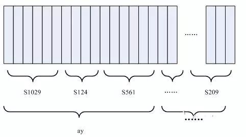
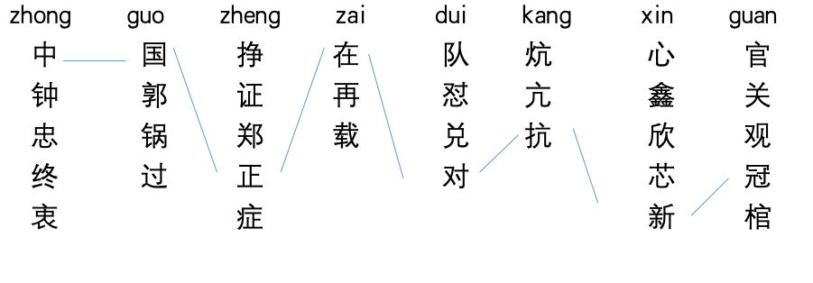
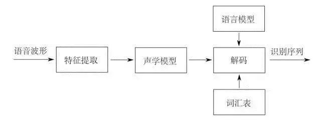
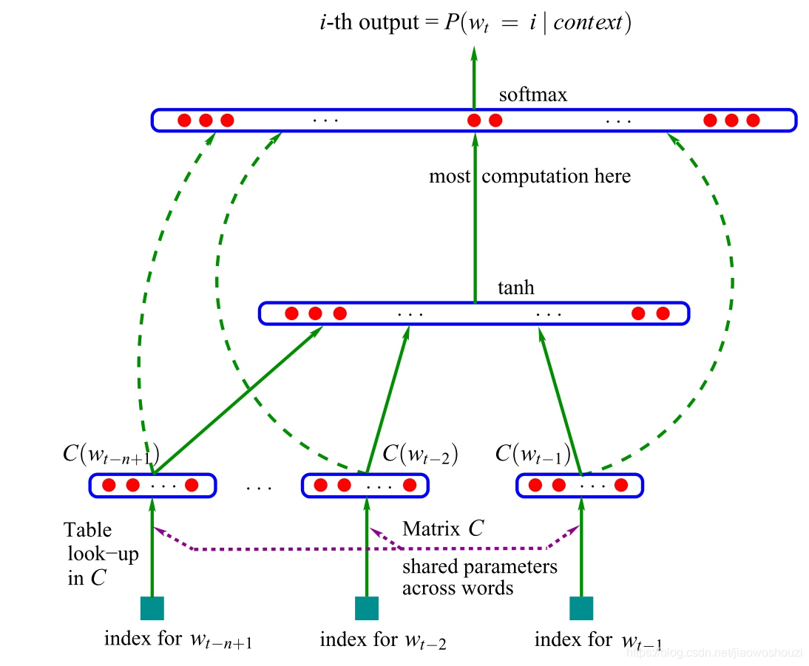
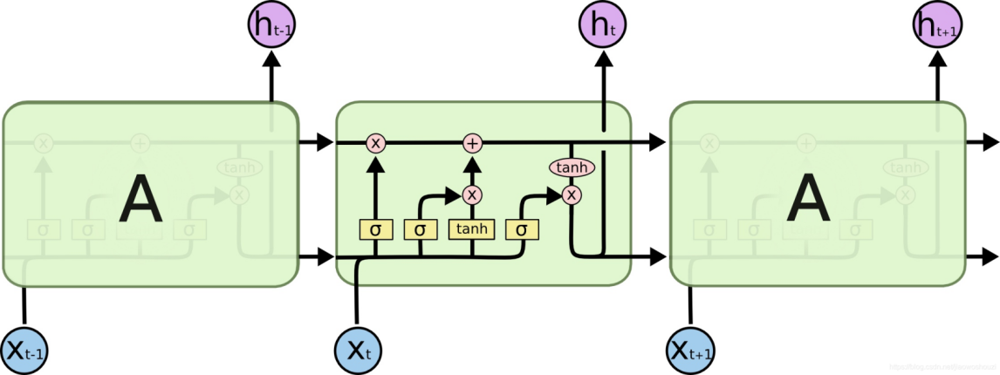
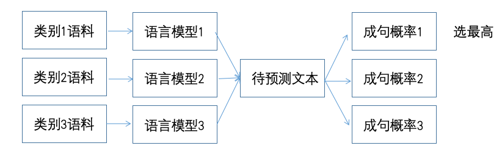

# 语言模型

1.什么是语言模型
2.语言模型有哪些种类
3.如何构造和评价语言模型
4.语言模型的应用场景


### 1.什么是语言模型

语言是灵活的，语言也是有规律的，了解一门语言的人可以判断一句话是否”合理”。比如：1.今天天气不错。这是合理的；2.今错不天气天。这是不合理的。
基于上面的例子，通俗来讲语言模型评价一句话是否“合理”或“是人话”。数学上讲P(今天天气不错) > P(今错不天天气)语言模型用于计算文本的**成句概率**。

 
#### 1.1 语言模型的应用
##### 语音识别
语音识别：声音  ->  文本
声音本质是一种波，将波按时间段切分很多帧，如25ms一段，之后进行声学特征提取，将每一帧转化成一个向量，以声学特征提取后的向量为输入，经过声学模型，预测得到**音素**，音素与拼音类似，但要考虑声调。


音素序列对应多条文本序列，由**语言模型**挑选出**成句概率**最高的序列,使用`beam search`或维特比的方式解码。

语音识别成句示例：

语音识别示意图
##### 手写识别
识别模型将图片中文字转化为候选汉字（一般分定位和识别两步），再有**语言模型**挑选出成句概率最高的序列。

##### 输入法
输入即为拼音序列，每个拼音自然的有多个候选汉字，根据**语言模型**挑选高概率序列，输入法是一个细节繁多的任务，在语言模型这一基础算法上，需要考虑常见的打字手误，常见误读，拼音缩略，中英混杂，输出符号，用户习惯等能力，手写输入法，语音输入法同理


### 2. 语言模型的分类
由易到难进行排列：

1. 统计语言模型  （SLM）    S = Statistics
        ngram语言模型等
2. 神经语言模型（NLM）      N = Neural
        rnn语言模型等
3. 预训练语言模型（PLM)     P = Pre-train
        Bert、GPT等
4. 大语言模型（LLM)        L = Large
         ChatGPT等

#### 语言模型的分类
1. 自回归（auto regressive）语言模型
  在训练时由上文预测下文（或反过来）
  单向模型，仅使用单侧序列信息
  代表：N-gram，ELMO,  GPT

2. 自编码（auto encoding）语言模型
   在训练时预测序列中任意位置的字符
   双向模型，吸收上下文信息
   代表：BERT


##### N-gram语言模型
- 如何计算成句概率：
用S代表句子，w代表单个字或词
```math
S = w_{1}w_{2}w_{3}w_{4}w_{5}…w_{n} 
```
```math
P(S) = P(w_{1},w_{2},w_{3},w_{4},w_{5}…w_{n})
```
成句概率 -> 词W1~Wn按顺序出现的概率:
```math
P(w_{1},w_{2},w_{3},w_{4},w_{5}…w_{n}) = P(w_{1})P(w_{2}|w_{1})P(w_{3}|w_{1},w_{2})…P(w_{n}|w_{1},…,w_{n-1})
```
- 以字为单位
P(今天天气不错) = P(今)*P(天|今) *P(天|今天) *P(气|今天天) *P(不|今天天气) *P(错|今天天气不)
- 以词为单位
P(今天/天气/不错) = P(今天)*P(天气|今天) *P(不错|今天  天气)

**说明：** `P(天|今)`表示的是条件概率，即`天`出现在`今`字之前的概率，其他的以此类推

- 如何计算`P(今天)`？
P(今天)  = Count(今天) / Count_total(语料总词数)      
P(天气|今天) = Count(今天 天气) / Count(今天)   说明：`Count(今天 天气)`表示`今天天气`在预料中连续出现的次数
P(不错|今天 天气) = Count(今天 天气 不错)/Count(今天 天气)

二元组：今天/天气          2 gram
三元组：今天/天气/不错      3 gram


##### N-gram面临的困难 
对任意一门语言，N-gram数量都非常庞大，无法穷举，需要简化

- 解决办法：马尔科夫假设
P(wn|w1,…,wn-1) ≈ P(wn|wn-3,wn-2,wn-1)
假设第n个词出现的概率，仅受其前面有限个词影响
P(今天天气不错) = P(今)*P(天|今) *P(天|今天) *P(气|天天) *P(不|天气) *P(错|气不)

- 马尔科夫假设的**缺陷**：
1. 影响第n个词的因素可能出现在前面很远的地方
   long distance dependency
   例：我读过关于马尔科夫的生平的书
       我看过关于马尔科夫的生平的电影
       我听过关于马尔科夫的生平的故事
2. 影响第n个词的因素可能出现在其后面
3. 影响第n个词的因素可能并不在文中
但是，马尔科夫假设下依然可以得到非常有效的模型

示例：
语料：
今天/天气/不错             P(今天) = 3 / 12 = 1/4
明天/天气/不错             P(天气|今天)  = 2 / 3 
今天/天气/不行             P(不错|今天  天气)  = 1 / 2
今天/是/晴天               P(不错|天气) =  2/3
3 gram模型
P(今天/天气/不错) = P(今天)*P(天气|今天) *P(不错|今天  天气) = 1 / 12
2 gram模型
P(今天/天气/不错) = P(今天)*P(天气|今天) *P(不错|天气) = 1 / 9

**问题**：如何给出语料中没出现过的词或ngram概率？
P(今天  天气  糟糕) = P(今天)*P(天气|今天) * <u>P(糟糕|天气)</u>

理论上说，任意的词组合成的句子，概率都不应当为零,如何给没见过的词或ngram分配概率即为**平滑问题（smoothing）**。也称**折扣问题（discounting）**

###### N-gram语言模型 - 平滑方法

1. 回退（backoff）
当三元组a b c不存在时，退而寻找bc二元组的概率，`P(c | a b) = P(c | b) * Bow(ab)`
`Bow(ab)`称为二元组ab的**回退概率**，回退概率有很多计算方式，甚至可以设定为**常数**
回退可以迭代进行，如序列 a b c d
P(d | a b c) = P(d | b c) * Bow(abc)
P(d | bc) = P(d | c) * Bow(bc)
P(d | c ) = P(d) * Bow(c)

2.  P(word)不存在如何处理
- 加1平滑(add-one smooth)
  对于1gram概率`P(word) = Count(word)+1/Count(total_word)+V`,V为词表大小,对于高阶概率同样可以
```math
P_{add1}(W_{i} | W_{i1}) \hat{A} \frac {c(w_{i1},w_{i}) 1}{c(w_{i1})V}
```

- 将低频词替换为`<UNK>`
预测中遇到的未见过的词，也用<UNK>代替，这是一种nlp处理未登录词（OOV）的常见方法；示例：一语成谶->一语成`<UNK>`，P(`<UNK>`|一语成)。

- 插值
受到回退平滑的启发，在计算高阶ngram概率是同时考虑低阶的ngram概率值，以插值给出最终结果。实践证明，这种方式效果有提升，λ可以在验证集上调参确定；
```math
\sum_{i} \lambda_{i} = 1
```
```math
\hat{P}(w_{n} | w_{n-1}w_{n-2}) = \lambda_{1}P(w_{n}|w_{n-1}w_{n-2}) + \lambda_{2}P(w_{n}|w_{n-1}) + \lambda_{3}P(w_{n})
```

### 语言模型的评价指标

#### 困惑度 perplexity

一般使用**合理的目标文本**来计算PPL，若PPL值低，则说明成句概率高，也就说明由此语言模型来判断，该句子的合理性高，这样是一个好的语言模型。

- 计算公式
```math
PP(S) = P(w_{1}w_{2}...w_{N})^{-\frac {1}{N}} = \sqrt[N]{\frac {1}{p(w_{1}w_{2}...w_{N})}} = \sqrt[N]{\prod_{i=1}^{N} \frac{1}{p(w_{i}|w_{1} w_{2}...w_{i-1})}}
```

PPL值与成句概率成反比。


#### 另一种 ppl（使用较多）
用对数求和代替小数乘积,本质是相同的，与成句概率呈反比。

- 计算公式
```math
PP(S) = 2^{-\frac {1}{N} log(P(w_{i}))}
```

**思考：** PPL越小，语言模型效果越好，这一结论是否正确？  
**答案：** 不是的，因为成句概率是个相对值，ppl并不能严格的区分对于有些成句概率高ppl低；有些句子成句概率低，ppl高；针对于一个语言模型成句概率都很高，ppl值都很低，但是并不能说明这个语言模型就是个好模型。（以语音识别成句示例举例来说，我们要在那个场景下，使用ppl来计算真正的合理答案要低于其他备选的ppl值。但是这样是很难做到的）一般会拿词向量，根据词向量去做下游任务，根据下游任务来判断这个成句概率或这个模型好不好。

对于N-gram的实现代码可参考：[ngram_language_model.py](./code/ngram/ngram_language_model.py)


### 神经网络模型

与ngram模型相似使用前n个词预测下一个词，神经网络语言模型输出的是下一个字在字表上的概率分布，并且得到了词向量这一副产品。相较于ngram模型，神经网络的概率自带平滑，而且并不会受训练语料大小的影响，模型体积不会膨胀，且可以保存前面输入的信息。

- Bengio et al.  2003


随着相关研究的发展，隐含层模型结构的复杂度不断提升，DNN  ->  CNN/RNN  ->  LSTM/GRU ->  transformer。

- Devlin et al.  2018   BERT 诞生
**主要特点：** 不再使用预测下一个字的方式训练语言模型，转而预测文本中被随机遮盖的某个字。
示例： 
```
我   去  天  [MASK]  门  看  升  旗
              |
              v
              安
```

这种方式被称为**MLM(masked language model)**，实际上这种方式被提出的时间非常早，并非bert原创。

- **自回归语言模型：** 用前n个字预测下一个字；单向，从左向右预测，或反向使用；有利于生成式任务。

- **自编码语言模型：** 用整段文本，预测文本中的某一个字（完形填空）；双向，更好的利用文本信息；引入了`[mask]`，在fine-tune中不出现。

关于神经网络的代码实现可参考：

- 训练神经网络（重要） [nnlm.py](./code/nnlm/nnlm.py) 

- 使用`./code/nnlm/corpus`文件夹中的领域文本来训练专属领域的语言模型， 使用神经网络来做一些文本分类任务[implementation.py](./code/nnlm/implementation.py)


##### 两类语言模型的对比

|                   | Ngram语言模型 | NN语言模型 |
|-------------------|---------------|------------|
| 解码速度          | 快            | 慢         |
| 消耗内存          | 大            | 小         |
| 是否需要调参      | 不需要(很少)  | 需要       |
| 模型大小(一般而言) | 大            | 小         |
| 长距离依赖        | 无法处理(使用了马尔科夫假设) | 相对有效   |
| 词义关系          | 无            | 有         |
| 泛化能力          | 较弱          | 较强       |


### 语言模型的应用

#### 话者分离
- 根据说话内容判断说话人。
常用于语言识别系统中，判断录音对话中角色，如客服对话录音，判断坐席或客户。
- 根据不同腔调判断说话人。
如：港台腔：你这个人怎么可以这个样子；东北味：我不稀得说你那些事儿就拉倒了。

- 操作步骤：
本质上为文本分类任务：
1. 对于每个类别，使用类别语料训练语言模型
2. 对于一个新输入的文本，用所有语言模型计算成句概率
3. 选取概率最高的类别为预测类别

 
相比一般文本分类模型，如贝叶斯，rf，神经网络等

- 优势：
1. 每个类别模型互相独立，样本不均衡或样本有错误对其他模型没有影响
2. 可以随时增加新的类别，而不影响旧的类别的效果

- 效果上讲：一般不会有显著优势

- 效率上讲：一般会低于统一的分类模型

#### 文本纠错
纠正文本中的错误。错误可能是同音字或形近字等。
如：我今天去了天<u>暗</u>门看人民英雄<u>记</u>念碑 -> 我今天去了天<u>安</u>门看人民英雄<u>纪</u>念碑

- 操作步骤：
1. 对每一个字建立一个混淆字集合
2. 计算整句话成句概率
3. 用混淆字集合中的词替代原句中的字，重新计算概率
4. 选取得分最高的一个候选句子，如果这个句子比原句的得分增长超过一定的阈值
5. 对下一个字重复步骤3-4，直到句子末尾
 
备注：同音字有完整字表；形似字可以通过ocr收集；也可以依照实际情况手动添加一些

这种方式有一些**缺陷**：
1. 无法解决多字少字问题
2. 阈值的设置非常难把握，如果设置过大，达不到纠错效果；如果设置过小，造成大量替换，有可能改变句子的原意
3. 混淆字字表难以完备
4. 语言模型的领域性会影响修改结果
5. 连续的错字会大幅提升纠错难度

示例：今天<u>上午</u>要过来办事 -> 今天<u>商务</u>要过来办事

**一般工业做法：** 限定一个修改<u>白名单</u>，只判断特定的字词是否要修改；如限定只对所有发音为<u>shang wu</u>的片段，计算是否修改为“商务”，其余一概不做处理；对于深度学习模型而言，错别字是可以容忍的，所以纠错本身的重要性在下降，一般只针对展示类任务。

#### 数字化归一
将一个文本中的数字部分转化成对读者友好的样式，常见于语言识别系统后，展示文本时使用。

示例1：提升可读性
秦皇岛港煤炭库存量在<u>十一</u>月初突然激增，从<u>四百五十四点九万</u>吨增加到<u>七百七十三点四万</u>吨，打破了<u>一九九九</u>年以来的记录。
秦皇岛港煤炭库存量在<u>11</u>月初突然激增，从<u>454.9</u>万吨增加到<u>773.4</u>万吨，打破了<u>1999</u>年以来的记录。

示例2：部分转数字
<u>十一</u>届<u>三</u>中全会、“<u>十二五</u>”规划、<u>一</u>贫如洗、<u>二</u>龙戏珠

- 操作步骤：
1. 找到数字形式符合规范的文本作为原始语料
2. 用正则表达式找到数字部分（任意形式）
3. 将数字部分依照其格式替换为<阿拉伯数字><汉字数字><汉字连读>等token
4. 使用带token文本训练语言模型
5. 对于新输入的文本，同样使用正则表达式找到数字部分，之后分别带入各个token，使用语言模型计算概率
6. 选取概率最高的token作为最终数字格式，按照规则转化后填入原文本

- 具体示例：
中国共产党第十五次全国代表大会于一九九七年九月十二日召开，各地方代表一一发言。
中国共产党第<u><汉字数字></u>次全国代表大会于<u><阿拉伯数字></u>年<u><阿拉伯数字></u>月<u><阿拉伯数字></u>日召开，各地方代表<u><汉字连续></u>发言。

- 训练时
    将<token>当成一个字训练语言模型
- 预测时
    中国共产党第<u>十五</u>次全国代表           <-  原句
    中国共产党第<u><汉字数字></u>次全国代表  -->  语言模型判断最高概率?
    中国共产党第<u><阿拉伯数字></u>次全国代表 ->  语言模型判断最高概率?
    中国共产党第<u><汉字连续></u>次全国代表  -->  语言模型判断最高概率?
若需要转化格式则通过规则完成，模型只起到判断作用。

#### 文本打标
给文本添加标点或语气停顿等。可以理解为一种粗粒度的分词，常用于语音合成任务中，辅助做出发音的停顿。
- 示例：

我最近/抽了点时间/读了一本/关于/马尔可夫生平/的书

- 操作过程 
需要有标注数据，在停顿处添加token: `<s>`
如：
我最近`<s>`抽了点时间`<s>`读了一本`<s>`关于`<s>`马尔可夫生平`<s>`的书
带token训练语言模型

- 预测过程：
选定一个窗口长度，首先预测第一次停顿位置
我`<s>`最近抽了点时间   ppl:10
我最`<s>`近抽了点时间   ppl:20
我最近`<s>`抽了点时间   ppl:5   <- 选择此处作为第一次停顿
。。。
之后从“抽了点时间”开始向后重复此过程

本质为序列标注任务；可以依照类似方式，处理分词、文本加标点、文本段落切分等任务；分词或切分段落只需要一种token；打标点时，可以用多种分隔token，代表不同标点。


### 总结
1. 语言模型的核心能力是计算成句概率，依赖这一能力，可以完成大量不同类型的NLP任务。
2. 基于统计的语言模型和基于神经网络的语言模型各有使用的场景，大体上讲，基于统计的模型优势在于解码速度，而神经网络的模型通常效果更好。
3. 单纯通过PPL评价语言模型是有局限的，通过下游任务效果进行整体评价更好。
4. 深入的理解一种算法，有助于发现更多的应用方式。
5. 看似简单（甚至错误）的假设，也能带来有意义的结果，事实上，这是简化问题的常见方式。

### 练习题

计算Bert参数量。
