## 预训练语言模型

### 概述
1. 预训练思想
2. transformer结构
3. 预训练技术的发展

### 预训练方法

#### 预训练与传统方法的比较

- 传统方法Fine-tune
    1. 设计模型结构
    2. 收集/标注训练数据
    3. 使用标注数据进行模型训练
    4. 真实场景模型预测
- 预训练方法Pre-train + Fine-tune
    1. 收集海量无标注文本数据
    2. 进行模型预训练，并在任务模型中使用
    3. 设计模型结构
    4. 收集/标注训练数据
    5. 使用标注数据进行模型训练
    6. 真实场景模型预测
#### 预训练方式
##### 1.完形填空  
依照一定概率，用`[mask]`掩盖文本中的某个字或词
   - Mask Language Model
   - Bidirectional Language Model

  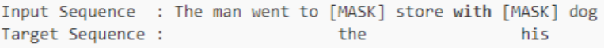
 
##### 2.句子关系预测 -(逐渐被遗弃)
    
- Next Sentence Prediction 
[CLS] 师徒四人历经艰险[SEP] 取得真经[SEP]  -> True
[CLS] 师徒四人历经艰险[SEP] 火烧赤壁[SEP]  -> False 

**说明：** `[CLS]`，`[SEP]`是bert模型在预训练的时候增加的特殊的token,`[CLS]`看成一个特殊的字符，他固定的加在了所有训练数据的前面。`[SEP]`也是一个特殊的字符，他加在了所有完整句子的后面。

### BERT - context representation
BERT的本质是一种文本表征（context representation）,是在做：文本-> 矩阵(max length x  hidden size)；文本->向量(1  x  hidden size)的事情。`word2vec`也可以做到同样的事，但word2vec是<u>静态</u>的，而BERT是<u>动态</u>的。

- Bert的论文可参考：[BERT](./code/BERT.pdf)

**说明：** 对于`word2vec`是静态的，`word2vec`训练完成以后输出的词向量与所代表的词往往是深度绑定的，这也代表了同一个词在不同的语境中并不能很好的区分以及表现；而在`bert`模型中存在很多网络层，完全可以根据不同的语义以及语境将词与向量的对应有所区分。举例说明：我喜欢吃<u>苹果</u>；<u>苹果</u>和华为哪个牌子好；这两句话中的苹果，在`word2vec`中词向量是相同的，而在`bert`中则是不同的。

#### Bert预训练模型强大的原因
- bert之所以强大的原因之一在于，使用预训练模型，最终对于每一个词的表示，跟所在的整句话相关，做到了词义与语境将相结合来判断。
- 另一个原因就在于，使用了Transformer结构。在原始的Bert版本中使用的Transformer使用了12层。


#### Bert结构 - Encoder
BERT的模型主体结构使用Google自己在17年提出的`Transformer`结构。
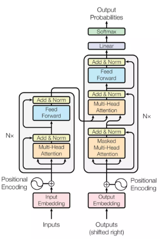
一层`Transformer`结构的组成如图示：
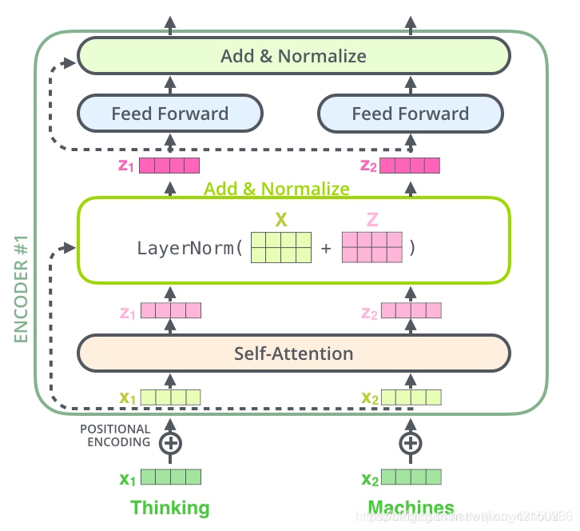

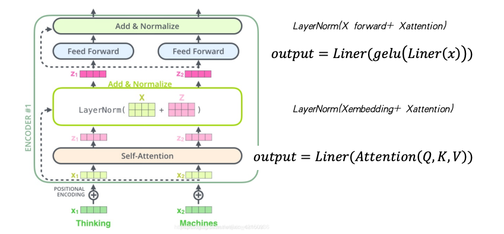


##### BERT结构 - Embedding
加入`[CLS]`,`[SEP]`来标记文本起始位置,`Segment embedding`判断来源语句;`Position embedding`带入语序信息,加和后会做`Layer Normalization`。

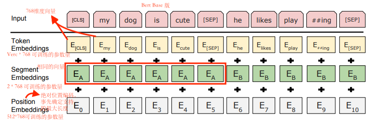

最后的embedding是三层的总和，即Token Embeddings + Segment Embeddings + Position Embeddings --> L(文本长度) * 768
 
##### BERT结构 - self-attention

计算句子自己内部的相关性。关于attention的文章：[attention is all you need](./code/attention_is_all_you_need.pdf)

- 计算公式：
```math
Attention(Q,K,V) = sofemax( \frac {QK^T}{\sqrt{d_{k}}} )V
```

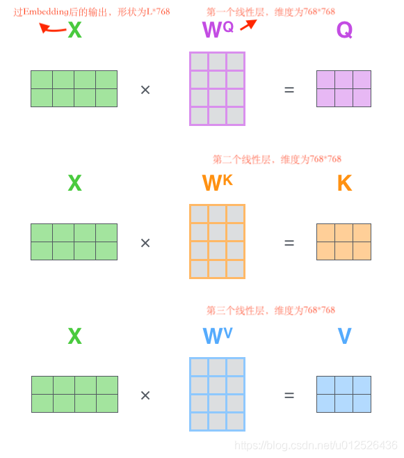

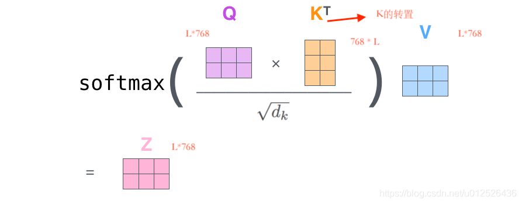
**说明：** 在公示中`V`的作用并不只是为了让`Q * K.T`结果的形状从`L*L`在变成`L*768`而凑的数，`Q * K.T`结果可以看成是文本对于自身的注意力，这个注意力还是要施加到一个东西上面，是就是这个注意力还需要乘到每个句子的向量上，这个值才比较有意义；`Q * K.T`仅仅是文本自身的注意力权重。 因此乘`V`就是将文本对自身的注意力乘到<u>词对应的向量</u>上。最后的结果才能代表语义的表示。

其中`Q * K.T`的具体细节，可参考下图：
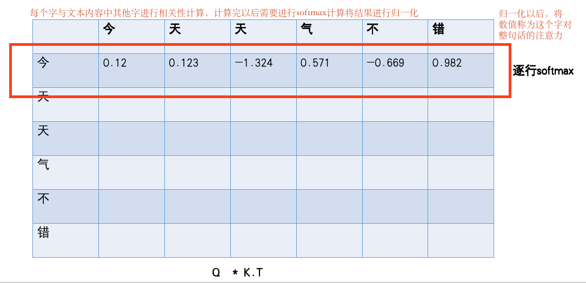

**说明：** 以上面的示图来说，经过计算以后，假设`今`字对于其他字的最后结果在数值上表现假设为`今`-`天`-> 0.8,其余的平分剩下的0.2，能够说明的是，`今`-`天`这两个字的相关性比较高。但并不能说明`今`-`天`就是一个词。Transformer模型结构天生优于`RNN`的地方就在于，Transformer可以在整个文本长度上计算字的相关性。根问原因在于对文本进行文本长度*文本长度的矩阵运算。  
 
###### BERT结构 - Multi-Head（多头机制）

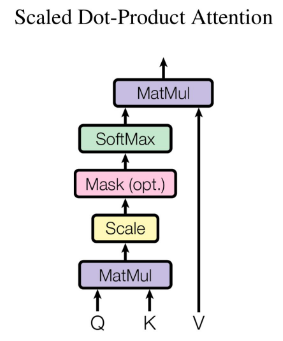
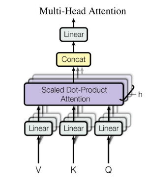

针对于多头机制需要说明的是，在上一步计算出`Q`和`K`之后并不是直接进行`Q * K.T`的计算，而是将`Q`和`K`分成若干段，假设分成了12段，那么每一段就是`L*64`；然后将每一小段的`Q`乘以对应的小段的`K.T`。`V` 也是需要分成同样的若干块。然后再将若干乘完的结果重新拼装起来，就又变回了`L*768`。
过程如图所示：
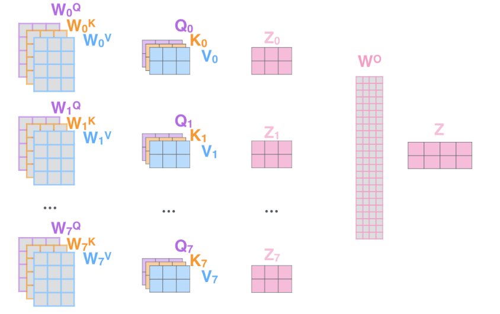

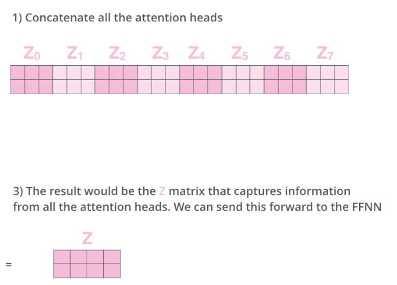

**说明：** 其中计算公式中的`dk`为768除以头的数量（分成的段数)，`Q*K.T`的结果除以根号下dk的原因在于，我们不希望在对`Q*K.T`进行softmax计算之前，其self-attention值的分布极不均匀，即部分内容数据极小，部分数据内容较大。这样不均匀的数据在通过softmax（指数函数的特性，随着x增加y之变化越剧烈，`softmax`是以e为底的指数函数）以后数值的差距会被更加的放大，除以根号下dk是为了将x缩小进而缩小归一化以后的值之间的差值。乘以`softmax`是为了将输入向量转换为概率分布，使得所有元素的值介于 0 和 1 之间，且总和为 1。这种归一化处理确保了模型在聚合信息时，能够根据不同单词的重要性分配适当的权重。计算完了self-attention之后

##### BERT - ADD & Normalize(残差)
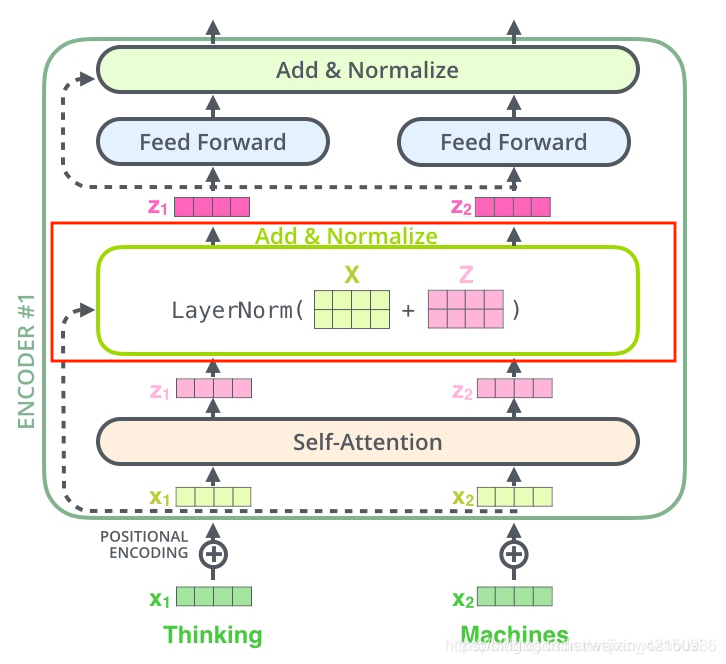
**说明：** 这个步骤做的事就是将输入`x1`,`x2`与经过`self-attention`计算之后的结果`z1`,`z2`相加后再做归一化。相加的原因在于，虽然`z1`，`z2`是经过计算与提炼的数据，但是不可避免的也会同样丢失一些信息，相加即使是对丢失信息的补足。这一步对训练深层网络尤其的重要。

##### BERT - Feed Forward
`Feed Forward`是有两个线性层加一个激活层组成的，经过线性层以后向量会从原来的`L*768`变成`L*3072`，再然后会过一个激活函数，激活函数在早期是`relu`后来变成了`gelu`，然后再过一个线性层，就会从`L*3072`变回`L*768`。 
 
Bert代码手动实现参考：[diy_bert.py](./code/diy_bert.py)  
 
#### BERT的优势
1. 通过预训练利用了海量无标注文本数据
2. 相比词向量，BERT的文本表示结合了语境
3. Transformer模型结构有很强的拟合能力，词与词之间的距离不会造成关系计算上的损失
4. 效果大幅提升

#### BERT的劣势
1. 预训练需要数据，时间，和机器（开源模型缓解了这一问题）
2. 难以应用在生成式任务上
3. 参数量大，运算复杂，满足不了部分真实场景性能需求
4. 没有下游数据做fine-tune，效果依然不理想

### Bert 下游任务中的使用
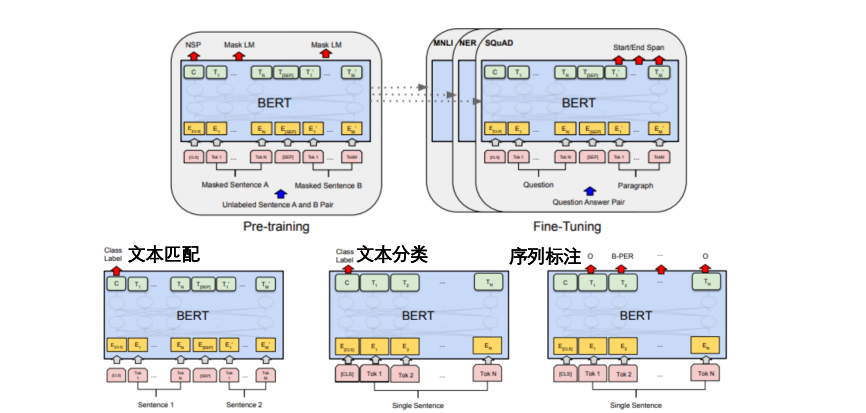


bert的基本使用：[tokenizer.py](./code/tokenizer.py)

## 章节练习
一个Bert12层总共有多少参数。 

代码参考：[model_parameters.py](./code/model_parameters.py)