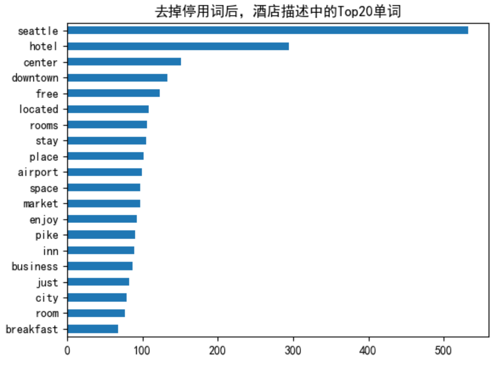

# Embedding与向量数据库

## 学习方法
- Thinking：behind the theory, original from the real problem
- Action：solve problems by tools, present the results


## 1. 学习目标

### 1.1 什么是Embedding
 - CASE：基于内容的推荐
     - 什么是N-Gram
     - 余弦相似度计算
     - 为酒店建立内容推荐系统
- Word Embedding
     - 什么是Embedding
     - Word2Vec进行词向量训练

### 1.2 向量数据库的使用
- 什么是向量数据库
    - FAISS, Milvus, Pinecone的特点
    - 向量数据库与传统数据库的对比
- Faiss工具使用
    - Case: 文本抄袭自动检测分析
    - 使用DeepSeek + Faiss搭建本地知识库检索

### 2.基于内容的推荐

基于内容的推荐：
- 依赖性低，不需要动态的用户行为，只要有内容就可以进行推荐
- 系统不同阶段都可以应用
    - 系统冷启动，内容是任何系统天生的属性，可以从中挖掘到特征，实现推荐系统的冷启动。一个复杂的推荐系统是从基于内容的推荐成长起来的
    - 商品冷启动，不论什么阶段，总会有新的物品加入，这时只要有内容信息，就可以帮它进行推荐


- 物品表示 Item Representation：
    为每个item抽取出features
- 特征学习Profile Learning：
    利用一个用户过去喜欢（不喜欢）的item的特征数据，来学习该用户的喜好特征（profile）；
- 生成推荐列表Recommendation Generation：
    通过用户profile与候选item的特征，推荐相关性最大的item。

### 为酒店建立内容推荐系统

- 西雅图酒店数据集：
    - 下 载 地 址 ：[https://github.com/susanli2016/MachineLearning-with-Python/blob/master/Seattle_Hotels.csv](https://github.com/susanli2016/MachineLearning-with-Python/blob/master/Seattle_Hotels.csv)
    - 字段：name, address, desc
    - 基于用户选择的酒店，推荐相似度高的Top10个其他酒店
    - 方法：计算当前酒店特征向量与整个酒店特征矩阵的余弦相似度，取相似度最大的`Top-k`个

    
    
    
### 余弦相似度：
- 通过**测量两个向量的夹角**的**余弦值来度量它们之间的相似性**。
- 判断**两个向量⼤致**方向是否相同，**方向相同**时，**余弦相似度为1**；两个向量**夹角为90°**时，**余弦相似度的值为0**，方向**完全相反时**，**余弦相似度的值为-1**。
- **两个向量之间夹角的余弦值为[-1, 1]** 

给定属性向量A和B，A和B之间的夹角θ余弦值可以通过**点积和向量长度**计算得出

```math
a · b = |a|·|b|cos\theta => similarity =cos(\theta) = \frac {A · B}{|A||B|} = \frac {\sum_{i=1}^n A_{i} ✖️ B_{i}}{\sqrt{\sum_{i=1}^n (A_{i})^2} ✖️ \sqrt{\sum_{i=1}^n (B_{i})^2}}  
``` 

#### 计算A和B的余弦相似度：
- 句子A：这个程序代码太乱，那个代码规范
- 句子B：这个程序代码不规范，那个更规范
- Step1，分词
句子A：这个/程序/代码/太乱，那个/代码/规范
句子B：这个/程序/代码/不/规范，那个/更/规范
- Step2，列出所有的词
这个，程序，代码，太乱，那个，规范，不，更
- Step3，计算词频
句子A：这个1，程序1，代码2，太乱1，那个1，规范1，不0，更0
句子B：这个1，程序1，代码1，太乱0，那个1，规范2，不1，更1
- Step4，计算词频向量的余弦相似度
句子A：（1，1，2，1，1，1，0，0）
句子B：（1，1，1，0，1，2，1，1）

```math
cos(\theta) = \frac {1*1+1*1+2*1+1*0+1*1+1*2+0*1+0*1}{\sqrt{1^2+1^2+2^2+1^2+1^2+1^2+0^2+0^2}*\sqrt{1^2+1^2+1^2+0^2+1^2+2^2+1^2+1^2}} = 0.738
```
结果接近1，说明句子A与句子B是相似的


#### 什么是N-Gram（N元语法）：
- 基于一个假设：第n个词出现与前n-1个词相关，而与其他任何词不相关.
- N=1时为unigram，N=2为bigram，N=3为trigram
- N-Gram指的是给定一段文本，其中的N个item的序列,比如文本：A B C D E，对应的Bi-Gram为A B, B C, C D, D E
- 当一阶特征不够用时，可以用N-Gram做为新的特征。比如在处理文本特征时，一个关键词是一个特征，但有些情况不够用，需要提取更多的特征，采用N-Gram => 可以理解是相邻两个关键词的特征组合

```python
plt.rcParams['font.sans-serif'] = ['SimHei'] # 用来正常显示中文标签
df = pd.read_csv('Seattle_Hotels.csv', encoding="latin-1")
# 得到酒店描述中n-gram特征中的TopK个
def get_top_n_words(corpus, n=1, k=None):
    # 统计ngram词频矩阵
    vec = CountVectorizer(ngram_range=(n, n),stop_words='english').fit(corpus)
    bag_of_words = vec.transform(corpus)
    sum_words = bag_of_words.sum(axis=0)
    words_freq = [(word, sum_words[0, idx]) for word, idx in vec.vocabulary_.items()]
# 按照词频从大到小排序
    words_freq =sorted(words_freq, key = lambda x: x[1], reverse=True)
    return words_freq[:k]
## 1 grum
common_words = get_top_n_words(df['desc'], 1, 20)

# Bi-Gram
# c o m m o n _ w o r d s = get_top_n_words(df['des
# c'], 2, 20)

# Tri-Gram
# c o m m o n _ w o r d s = get_top_n_words(df['des
# c'], 3, 20)


df1 = pd.DataFrame(common_words, columns = ['desc' , 'count'])
df1.groupby('desc').sum()['count'].sort_values().plot(kind='barh', title='去掉停用词后，酒店描述中的Top20单词')
plt.show()
```
具体代码参看：[hotel_rec.py](./code/hotel_recommendation/hotel_rec.py)




```python
vec = CountVectorizer(ngram_range=(n, n), stop_words='english').fit(corpus)
bag_of_words = vec.transform(corpus)
print('feature names:')
print(vec.get_feature_names())
print('bag of words:')
print(bag_of_words.toarray())
```

- CountVectorizer：
    - 将文本中的词语转换为词频矩阵
    - `fit_transform`：计算各个词语出现的次数
    - `get_feature_names` ： 可获得所有文本的关键词
    - `toarray()`：查看词频矩阵的结果。


#### TF-IDF：
- TF：Term Frequency，词频
一个单词的重要性和它在文档中出现的次数呈正比。
计算公式：TF = 单词次数 / 文档中总单词数

- IDF：Inverse Document Frequency，逆向文档频率一个单词在文档中的区分度。这个单词出现的文档数越少，区分度越大，IDF越大 
计算公式：IDF = log * (文档总数/单词出现的文档数+1)

```python
# 使用TF-IDF提取文本特征
tf = TfidfVectorizer(analyzer='word', ngram_range=(1, 3), min_df=0, 
stop_words='english')
tfidf_matrix = tf.fit_transform(df['desc_clean'])
print(tfidf_matrix)
print(tfidf_matrix.shape)
```

- TfidfVectorizer:
    - 将文档集合转化为tf-idf特征值的矩阵
构造函数
    - analyzer：word或者char，即定义特征为词（word）或n-gram字符
    - ngram_range: 参数为二元组(min_n, max_n)，即要提取的n-gram的下限和上限范围
    - max_df：最大词频，数值为小数`[0.0, 1.0]`,或者是整数，默认为1.0
    - min_df：最小词频，数值为小数`[0.0, 1.0]`,或者是整数，默认为1.0
    - stop_words：停用词，数据类型为列表
功能函数：
    - fit_transform ：进 行 tf-idf 训 练 ，学习到一个字典，并返回Documentterm的矩阵，也就是词典中的词在该文档中出现的频次


#### 基于内容的推荐流程：
- Step1，对酒店描述（Desc）进行特征提取
    - N-Gram，提取N个连续字的集合，作为特征
    - TF-IDF，按照(min_df, max_df)提取关键词，并生成TFIDF矩阵
- Step2，计算酒店之间的相似度矩阵
    - 余弦相似度
- Step3，对于指定的酒店，选择相似度最大的Top-K个酒店进行输出

代码参考：[hotel_rec.py](./code/hotel_recommendation/hotel_rec.py)

### 什么是Embedding
一种降维方式，将不同特征转换为维度相同的向量，离线变量转换成`one-hot` => 维非常高，可以将它转换为固定size的embedding向量
- 任何物体，都可以将它转换成为向量的形式，从Trait #1到 #N
- 向量之间，可以使用相似度进行计算
- 当我们进行推荐的时候，可以选择相似度最大的

#### 将Word进行Embedding
如果我们将King这个单词，通过维基百科的学习，进行GloVe向量化，可以表示成：

这50维度的权重大小在[-2,2]，按照颜色的方式来表示即为**热力图**：


 将Word进行Embedding：
- 我们将King与其他单词进行比较，可以看到Man和Woman更相近
- 同样有了向量，我们还可以进行运算`king-man+woman`与`queen`的相似度最高

##### Word2Vec：
- 通过Embedding，把原先词所在空间映射到一个新的空间中去，使得语义上相似的单词在该空间内距离相近。
- Word Embedding => 学习隐藏层的权重矩阵
- 输入测是one-hot编码
- 隐藏层的神经元数量为`hidden_size（Embedding Size`）
- 对于输入层和隐藏层之间的权值矩阵W,大小为`[vocab_size, hidden_size]`
- 输出层为`[vocab_size]`大小的向量，每一个值代表着输出一个词的概率


##### 对于输入的one-hot编码：
- 在矩阵相乘的时候，选取出矩阵中的某一行，而这一行就是输入词语的`word2vec`表示
- 隐含层的节点个数 = 词向量的维数
- 隐层的输出是每个输入单词的`Word Embedding`
- word2vec，实际上就是一个查找表


##### Word2Vec的两种模式：
- Skip-Gram，给定input word预测上下文

- CBOW，给定上下文，预测input word（与Skip-Gram相反）


### Word2Vec工具
#### Gensim工具
- pip install gensim
- 开源的Python工具包
- 可以从非结构化文本中，无监督地学习到隐层的主题向量表达
- 每一个向量变换的操作都对应着一个主题模型
- 支持TF-IDF，LDA, LSA, word2vec等多种主题模型算
法

- 使用方法：
    - 建立词向量模型：word2vec.Word2Vec(sentences) window,句子中当前单词和被预测单词的最大距离
    - min_count,需要训练词语的最小出现次数，默认为5
    - size,向量维度，默认为100
    - worker,训练使用的线程数，默认为1即不使用多线程
    - 模型保存 model.save(fname)
    - 模型加载 model.load(fname)

##### 示例：
数据集：西游记
- [journey_to_the_west.txt](./code/)
- 计算小说中的人物相似度，比如孙悟空与猪八戒，孙悟空与孙行者
- 方案步骤：
    - Step1，使用分词工具进行分词，比如NLTK,JIEBA
    - Step2，将训练语料转化成一个sentence的迭代器
    - Step3，使用word2vec进行训练
    - Step4，计算两个单词的相似度
代码参考：[word_similarity.py](./code/CASE-vectorDatabase/word2vec/word_similarity.py)