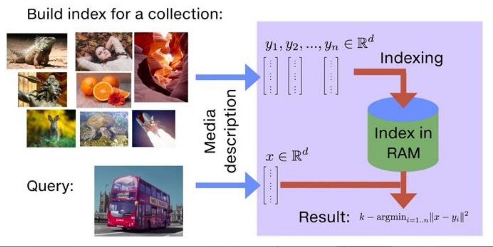
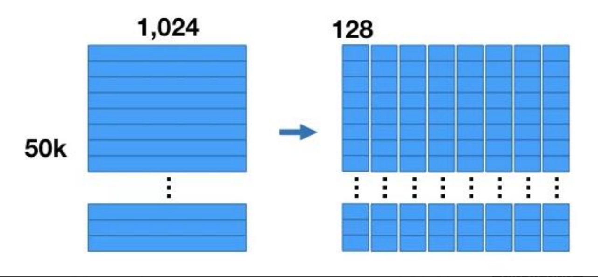
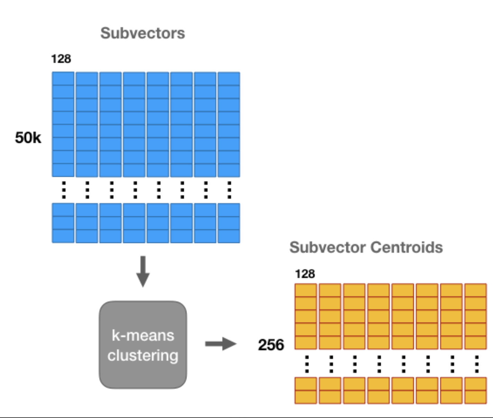
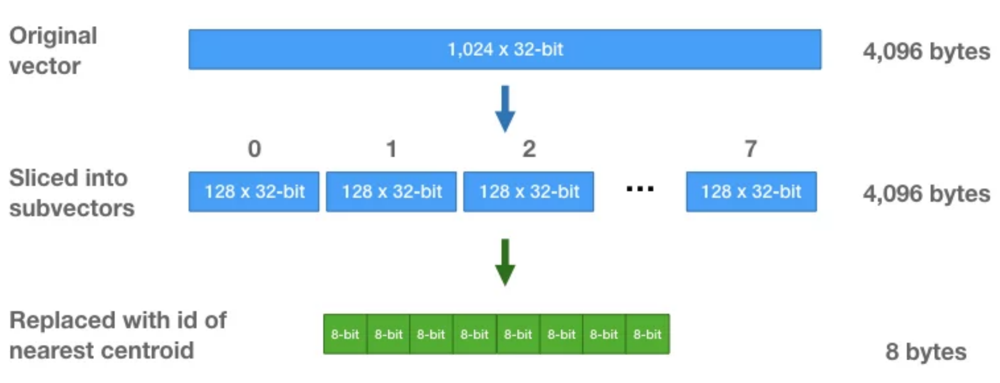

# 向量数据库

- 什么是向量数据库
- FAISS, Milvus, Pinecone的特点
- 向量数据库与传统数据库的对比
- Faiss工具使用
- Case: 文本抄袭自动检测分析
- 使用DeepSeek + Faiss搭建本地知识库检索


### 什么是向量数据库
一种专门用于存储和检索高维向量数据的数据库。它将数据（如文本、图像、音频等）通过嵌入模型转换为向量形式，并通过高效的索引和搜索算法实现快速检索。
向量数据库的核心作用是实现相似性搜索，即通过计算向量之间的距离（如欧几里得距离、余弦相似度等）来找到与目标向量最相似的其他向量。它特别适合处理非结构化数据，支持语义搜索、内容推荐等场景。

#### 如何存储和检索嵌入向量？
- 存储：向量数据库将嵌入向量存储为高维空间中的点，并为每个向量分配唯一标识符（ID），同时支持存储元数据。
- 检索：通过近似最近邻（ANN）算法（如PQ等）对向量进行索引和快速搜索。比如，FAISS和Milvus等数据库通过高效的索引结构加速检索。

### 常见的向量数据库
1. FAISS
    - 特点：由Facebook开发，专注于高性能的相似性搜索，适合大规模静态数据集。
    - 优势：检索速度快，支持多种索引类型。
    - 局限性：主要用于静态数据，更新和删除操作较复杂
    
2. Milvus
    - 特点：开源，支持分布式架构和动态数据更新。
    - 优势：具备强大的扩展性和灵活的数据管理功能。

3. Pinecone
    - 特点：托管的云原生向量数据库，支持高性能的向量搜索。
    - 优势：完全托管，易于部署，适合大规模生产环境。

#### 向量数据库与传统数据库的对比
1. 数据类型
    传统数据库：存储结构化数据（如表格、行、列）。向量数据库：存储高维向量数据，适合非结构化数据。
2. 查询方式
    传统数据库：依赖精确匹配（如=、<、>）。向量数据库：基于相似度或距离度量（如欧几里得距离、余弦相似度）。

3. 应用场景
    传统数据库：适合事务记录和结构化信息管理。
    向量数据库：适合语义搜索、内容推荐等需要相似性计算的场景

#### Faiss工具
 FAIR（Facebook AI Research）团队开发的AI相似性搜索工具，处理大规模d维向量近邻检索的问题
- 使用Faiss，Facebook 在十亿级数据集上创建的最邻近搜索（nearest neighbor search），速度提升了 8.5 倍
- Faiss 只支持在 RAM 上搜索
- Faiss 用 C++ 实现，支持 Python

```
pip install faiss-cpu
pip install faiss-gpu
```



#### Faiss使用
常用的功能包括：索引Index，PCA降维、PQ乘积量化,有两个基础索引类Index、IndexBinary

- 索引选择：
    - 精度高，使用`IndexFlatL2`，能返回精确结果
    - 速度快，使用`IndexIVFFlat`，首先将数据库向量通过聚类方法分割成若干子类，每个子类用类中心表示，当查询向量来临时，选择距离最近的类中心，然后在子类中应用精确查询方法，通过增加相邻的子类个数提高索引的精确度
    - 内存小，使用`IndexIVFPQ`，可以在聚类的基础上使用PQ乘积量化进行处理
代码参考：[faiss1.py](./code/text_similarity/faiss1.py)

原理：
- IndexIVFFlat：
    - IndexFlatL2为暴力搜索，速度慢
    - IndexIVFFlat的目的是提供更快的搜索，首先将数据库向量通过聚类方法分割成若干子类，每个子类用类中心表示
    - IndexIVFFlat需要一个训练的阶段，与另外一个索引quantizer有关，通过quantizer来判断属于哪个cell
    - 当进行查询向量计算时，选择距离最近的类中心，然后在子类中应用精确查询方法，通过增加相邻的子类个数提高索引的精确度
    - nlist，将数据库向量分割为多少了维诺空间
    - quantizer = faiss.IndexFlatL2(d) # 量化器
    - index.nprobe，选择n个维诺空间进行索引
    - 通过改变nprobe的值，调节速度与精度；nprobe较小时，查询可能会出错，但时间开销很小；nprobe较大时，精度逐渐增大，但时间开销也增加nprobe=nlist时，等效于IndexFlatL2索引类型。
- IndexIVFPQ：
    - IndexFlatL2和IndexIVFFlat在index中都保存了完整的数据库向量，在数据量非常大的时候会占用太多内存（IndexFlatL2 和IndexIVFFlat都要存储所有的向量数据）
    - 对于超大规模数据集来说，可能会内存溢出，可以使用IndexIVFPQ索引来压缩向量
    - 采用乘积量化方法（PQ，Product Quantizer，压缩算法）保存原始向量的有损压缩形式，所以查询结果是近似的
    - nlist，将数据库向量分割为多少了维诺空间
    - quantizer = faiss.IndexFlatL2(d) # 量化器
    - index.nprobe，选择n个维诺空间进行索引
    - 通过改变nprobe的值，调节速度与精度；nprobe较小时，查询可能会出错，但时间开销很小；nprobe较大时，精度逐渐增大，但时间开销也增加；nprobe=nlist时，等效于IndexFlatL2索引类型。

- 乘积量化PQ（Product quantization）：
    - PQ是一种建立索引的方式
    - 假设原始向量是1024维，可以把它拆解成8个子向量，每个子向量128维
    - 对于这8组子向量的每组子向量，使用 KMeans 方法聚成k=256类。也就是每个子向量有256个中心点(centroids)
    
    

 
 
每组子向量有256个中心点，我们可以中心点的 ID 来表示每组子向量中的每个向量。中心点的 ID只需要位来保存即可。这样，初始一个由32位浮点数组成的1024维向量，可以转化为8个8位整数组成 $log_{2}256 = 8$


#### 练习项目
##### 文本抄袭自动检测分析
如果你是某新闻单位工作人员（这里假设source=新华社），为了防止其他媒体抄袭你的文章，你打算做一个抄袭自动检测分析的工具：
1）定义可能抄袭的文章来源
2）与原文对比定位抄袭的地方
- 原始数据：[sqlResult.csv](./code/text_similarity/sqlResult.csv)，共计89611篇，从数据库导出的文章，字段包括：id, author, source, content, feature, title, url
- 常用中文停用词：[chinese_stopwords.txt](./code/text_similarity/chinese_stopwords.txt)

##### 实现方法：
- 原有方法：分类+聚类
    - 预测文章风格是否和自己一致 => 分类算法
    - 根据模型预测的结果来对全量文本进行比对，如果数量很大，=> 可以先聚类降维，比如将全部文档自动聚成k=25类
    - 文本特征提取 => 计算TF-IDF
    - TopN相似 => TF-IDF相似度矩阵中TopN文档
    - 编辑距离editdistance => 计算句子或文章之间的编辑距离

代码参考:[text_similarity.py](./code/text_similarity/text_similarity.py)

- 现在方法：Faiss向量相似度
    使用Embedding相似查找工具Faiss：
    - 文本特征提取 => 计算TF-IDF
    - 使用Faiss精确查找IndexFlatL2
    - 向index添加数据index.add(data) 
    - 指定cpindex=3352，查找相似的TopN篇文章   
代码参考：[text_faiss.py](./code/text_similarity/text_faiss.py)