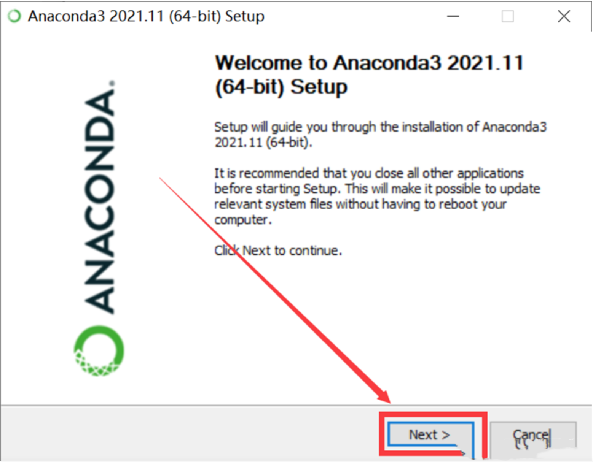
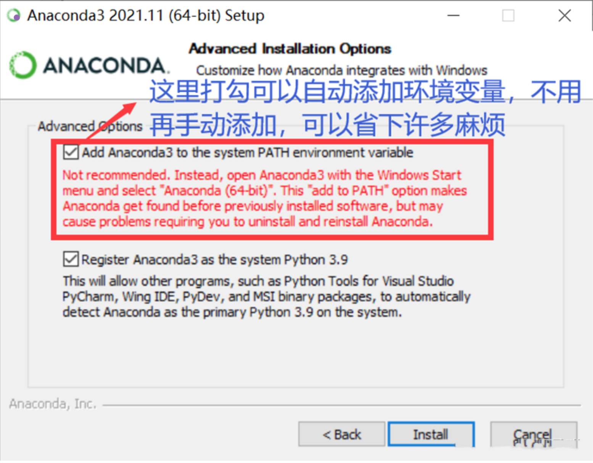
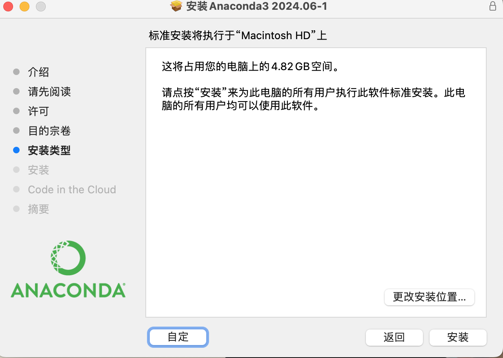
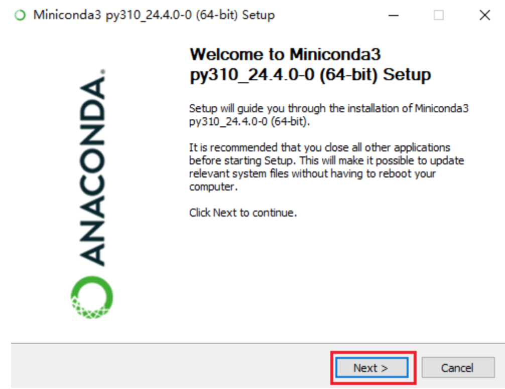
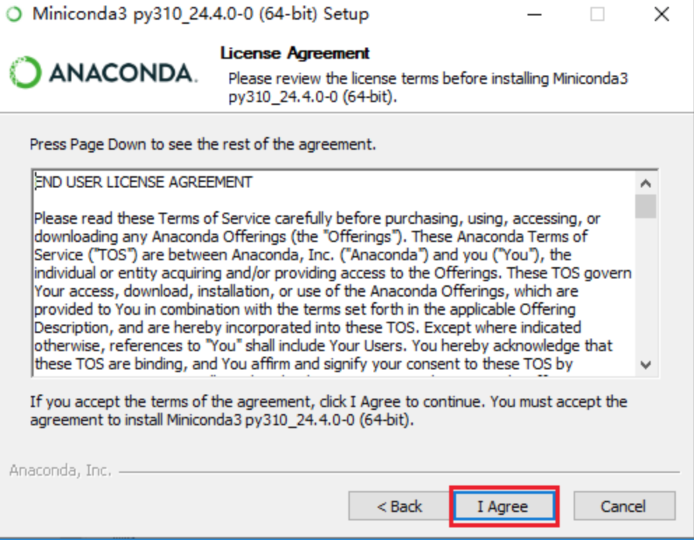
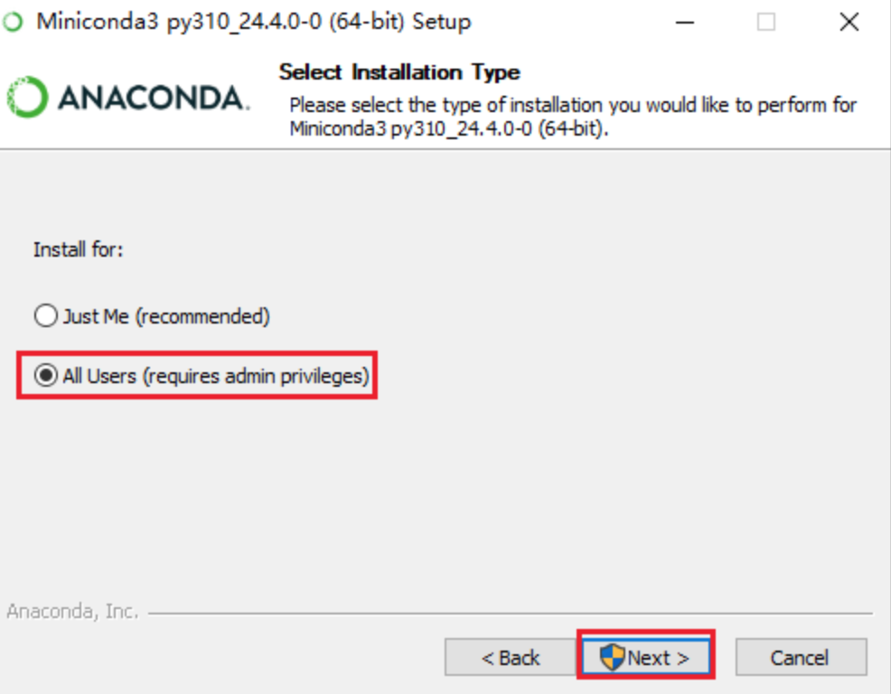
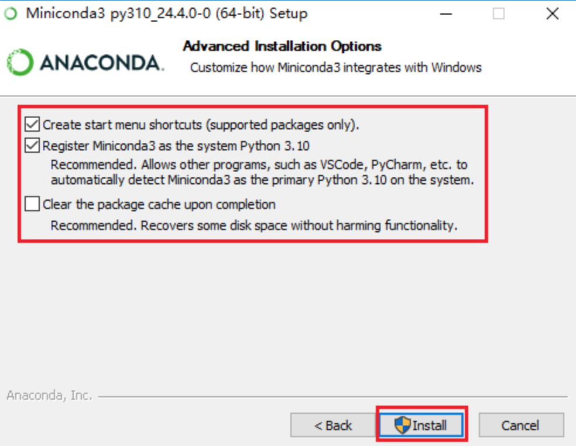
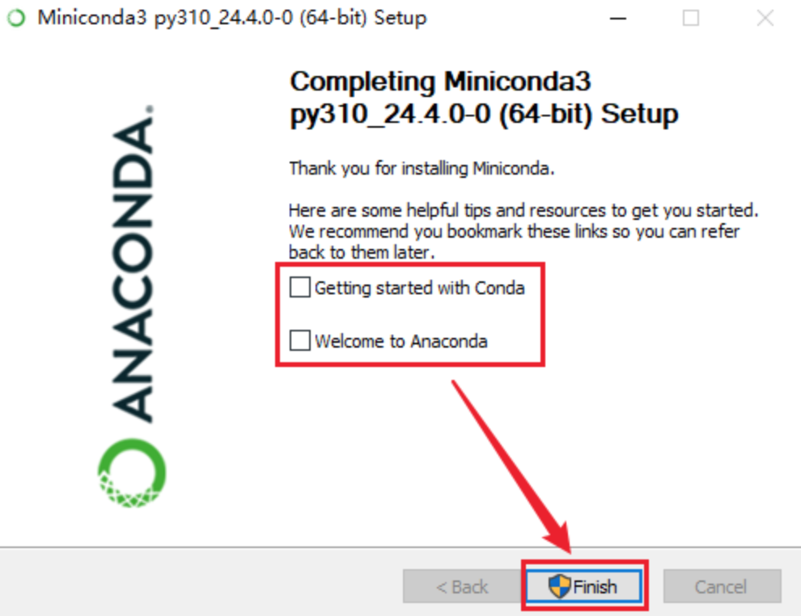

# env-conda

## Anaconda是什么

`Anaconda`是一个开源的`Python`和`R`编程语言发行版，专为科学计算和数据科学设计.
它简化了包管理和部署，提供了一个方便的环境来进行数分析、机器学习以及科学计算.
自身包含了`python`解释器，不需要额外的安装`Python SDK`

### 主要特点
- Conda：`Anaconda`包含了`Conda`包管理器，可以轻松安装、更新、管理和卸载`Python`包和依赖项
- 多版本支持：可以在同一系统上管理和切换不同版本的`Python`和包

### 优点
- 默认安装了大量常用的包，适合需要快速搭建数据科学和机器学习环境的用户
- 提供了`Anaconda Navigator`图形界面，用户可以轻松管理包和环境，启动`Jupyter Notebook`、`Spyder`等工具

### 缺点
- 安装包大：`Anaconda` 的安装包较大（几百兆到几个GB），占用较多的磁盘空间
- 包版本更新：由于包含了大量的包，更新和维护所有包的版本不如手动安装的方式灵活

## Miniconda是什么
`Miniconda` 是 `Anaconda` 的一个精简版本，与`Anaconda`一样，但它仅包含`Conda`包管理器及其依赖项，用户可以根据需要安装其他包。
`Miniconda`的目标是提供一个最小化的安装选项，以便用户可以自定义自己的包环境。

### 优点
- 轻量级：安装包小，安装速度快，占用磁盘空间少
- 灵活性：用户可以根据自己的需求安装需要的包，而不是安装一大堆可能用不到的包

### 缺点
a.初始安装后需要手动安装所需的包，适合有一定经验的用户
b.不包含 Anaconda Navigator 图形界面，所有操作需要通过命令行完成

**总结**：`Miniconda`提供了与`Anaconda`同样的功能，但以更轻量和灵活的方式实现，所以安装`Anaconda`和`Miniconda`都是可行的。


## 安装
### Anaconda的安装
#### Windows系统安装Anaconda
- 1.首先打开[anaconda官网](https://www.anaconda.com/)并下载所需要的版本。

- 2.完成下载之后，双击下载文件，启动安装程序。

- 3.选择`“Next”`。
    

- 4.阅读许可证协议条款，然后勾选`“I Agree”`并进行下一步。

- 5.勾选`“All Users”`并点击`“Next”`。

- 6.在`“Choose Install Location”`界面中选择安装`Anaconda`的目标路径，然后点击`“Next”`。
   - 注意：
    ① 目标路径中不能含有空格
    ② 尽量不要安装到C盘

- 7.在`“Advanced Installation Options”`中勾选`“Add Anaconda to my PATH environment variable.”`
然后点击`“Install”`开始安装。如果想要查看安装细节，则可以点击`“Show Details”`。


- 8.点击`“Next”`。

- 9.进入`“Thanks for installing Anaconda!”`界面则意味着安装成功，点击`“Finish”`完成安装。

- 10.验证安装结果。可选以下任意方法：
① `“开始 → Anaconda3（64-bit）→ Anaconda Navigator”`，若可以成功启动`Anaconda Navigator`则说明安装成功。
② `“开始 → Anaconda3（64-bit）→ 右键点击Anaconda Prompt → 以管理员身份运行”`，在`Anaconda Prompt`中输入 `conda list`，可以查看已经安装的包名和版本号。若结果可以正常显示，则说明安装成功


#### macOS系统安装Anaconda

- 1.首先打开[anaconda](https://www.anaconda.com/)官网并下载所需要的版本。

- 2.完成下载之后，双击下载文件，在对话框中直接点击`继续`

- 3.一直点击`继续`进行安装

- 4.在`Installation Type(安装类型)`，可以点击“`Change Install Location”（改变安装位置）`来改变安装位置。标准的安装路径是在用户的`home`目录下。


- 5.在安装结束后，若在`“Summary（摘要）”`部分若看到`“The installation was completed successfully.”`则安装成功，直接点击`“Close”`关闭对话框。

- 6.打开`Anaconda-Navigator`，若`“Anaconda-Navigator”`成功启动，则说明真正成功地安装了`Anaconda`；如果未成功，请重新安装


#### Linux系统安装Anaconda

- 1.首先打开[anaconda](https://www.anaconda.com/)官网并下载所需要的版本。

- 2.启动终端，进入下载的文件夹，输入：

```
sh Anaconda3-2019.07-Linux-x86_64.sh
1
```

- 3.安装过程中，看到提示`“In order to continue the installation process, please review the license agreement.”`（“请浏览许可证协议以便继续安装。”），点击“Enter”查看“许可证协议”。

- 4.在`“许可证协议”`界面将屏幕滚动至底，输入`“yes”`表示同意许可证协议内容。然后进行下一步。

- 5.安装过程中，提示`“Press Enter to accept the default install location, CTRL-C to cancel the installation or specify an alternate installation directory.”`（“按回车键确认安装路径，按`’CTRL-C’`取消安装或者指定安装目录。”）如果接受默认安装路径，则会显示 `PREFIX=/home//anaconda<2 or 3>` 并且继续安装。安装过程大约需要几分钟的时间。
建议：直接接受默认安装路径。

- 6.安装器若提示`“Do you wish the installer to prepend the Anaconda<2 or 3> install location to PATH in your /home//.bashrc ?”`（“你希望安装器添加Anaconda安装路径在 /home//.bashrc 文件中吗？”），建议输入“yes”。

- 7.当看到`“Thank you for installing Anaconda<2 or 3>!”`则说明已经成功完成安装。

- 8.关闭终端，然后再打开终端以使安装后的`Anaconda`启动。或者直接在终端中输入`source ~/.bashrc `也可完成启动。

- 9.验证安装结果。可选用以下任意一种方法：

    - ① 在终端中输入命令 `condal list` ，如果`Anaconda`被成功安装，则会显示已经安装的包名和版本号。

    - ② 在终端中输入 `python` 。这条命令将会启动`Python`交互界面，如果`Anaconda`被成功安装并且可以运行，则将会在`Python`版本号的右边显示`“Anaconda custom (64-bit)”`。退出`Python`交互界面则输入 `exit()` 或 `quit()` 即可。

    - ③ 在终端中输入 `anaconda-navigator` 。如果`Anaconda`被成功安装，则`Anaconda Navigator`将会被启动。

### Miniconda的安装

#### 下载Miniconda

- 【Win】：[https://mirrors.tuna.tsinghua.edu.cn/anaconda/miniconda/Miniconda3-py310_24.4.0-0-Windows-x86_64.exe](https://mirrors.tuna.tsinghua.edu.cn/anaconda/miniconda/Miniconda3-py310_24.4.0-0-Windows-x86_64.exe)
- 【Mac intel芯片】：[https://mirrors.tuna.tsinghua.edu.cn/anaconda/miniconda/Miniconda3-py310_24.4.0-0-MacOSX-x86_64.pkg](https://mirrors.tuna.tsinghua.edu.cn/anaconda/miniconda/Miniconda3-py310_24.4.0-0-MacOSX-x86_64.pkg)
- 【Mac M芯片】：[https://mirrors.tuna.tsinghua.edu.cn/anaconda/miniconda/Miniconda3-py310_24.4.0-0-MacOSX-arm64.pkg](https://mirrors.tuna.tsinghua.edu.cn/anaconda/miniconda/Miniconda3-py310_24.4.0-0-MacOSX-arm64.pkg)
- 【注意】：Mac系统安装Miniconda，使用pkg格式安装包一步步按照给出的提示安装即可

#### Win安装Miniconda

- 1.双击打开安装包，直接点`Next`：


- 2.使用协议，直接点`I Agree`：


- 3.默认`All User`，点击`Next`：


- 4.选择安装位置（注意安装路径中不要有空格、中文等特殊字符），选择好之后，点击`Next`：

- 5.安装参数设置，点击`Install`：


- 6.安装完成，点击`Next`：

- 7.取消勾选，点击`Finish`：



## Conda创建python虚拟环境

[参考链接](https://note.youdao.com/ynoteshare/index.html?id=9946c5c95f5ecd930b56591cc883ca3e&type=note&_time=1728614148936)

